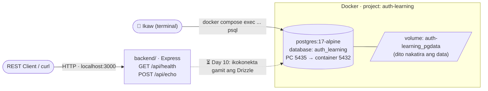
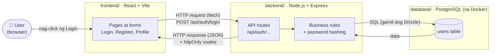
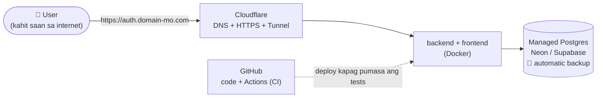

# 00 — Architecture (ang malaking larawan)

> Paano nag-uusap ang mga bahagi ng system. Ang bawat kahon ay isang role/folder.
> Tingnan sa Chrome: `node docs/diagrams/build.mjs`, tapos buksan ang `index.html`.
> Kusa rin itong nire-render sa GitHub at sa VS Code Markdown Preview.

## Ngayon: ano na ang totoong mayroon

> 📅 in-update sa Day 07 · Phase 3 · **Code:** `backend/src/`, `devops/docker-compose.yml`

**Pansinin:** tumatakbo na ang database, pero **hindi pa ito kilala ng backend**.
Magkahiwalay pa sila hanggang Day 10.

## Habang nagde-develop (sa sarili mong PC)

**Paano basahin:**
1. Nag-click ang user ng "Login" sa **frontend**.
2. Nagpapadala ang frontend ng **HTTP request** sa **backend**.
3. Tinatanong ng backend ang **database** kung may ganitong user at tama ang password.
4. Sumasagot ang backend (JSON), at nagse-set ng **cookie** na nagpapatunay na naka-login ka.

## Kapag naka-deploy na (Phase 8)

> Babalikan at ia-update natin ang mga diagram na ito habang nabubuo ang project —
> dapat laging tugma ang diagram sa totoong code.
