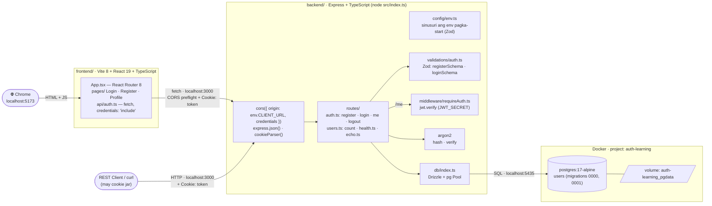
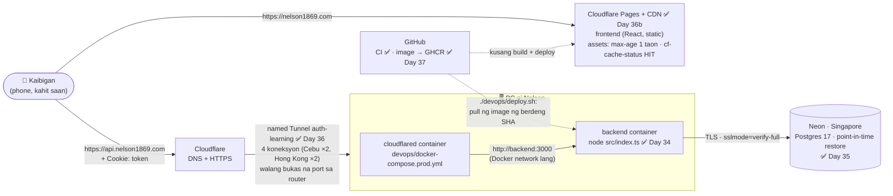

# 00 — Architecture (ang malaking larawan)

> Paano nag-uusap ang mga bahagi ng system. Ang bawat kahon ay isang role/folder.
> Tingnan sa Chrome: `node docs/diagrams/build.mjs`, tapos buksan ang `index.html`.
> Kusa rin itong nire-render sa GitHub at sa VS Code Markdown Preview.

## Ngayon: ano na ang totoong mayroon

> 📅 in-update sa Day 32b · Phase 7 (TypeScript na ang frontend at backend) · **Code:** `frontend/src/`, `backend/src/`, `devops/docker-compose.yml`
> **Subukan:** `backend/http/01`–`07`

**Pansinin:** dalawang server — frontend sa **:5173** (Vite), backend sa **:3000**
(Express). Nag-uusap na sila (Day 22): pinapayagan ng `cors()` ang `CLIENT_URL` lang,
at ang cookie na `token` ay itinatago ng browser para sa `localhost:3000`.

## Habang nagde-develop (sa sarili mong PC)

**Paano basahin:**
1. Nag-click ang user ng "Login" sa **frontend**.
2. Nagpapadala ang frontend ng **HTTP request** sa **backend**.
3. Tinatanong ng backend ang **database** kung may ganitong user at tama ang password.
4. Sumasagot ang backend (JSON), at nagse-set ng **cookie** na nagpapatunay na naka-login ka.

## Kapag naka-deploy na (Phase 8 — hybrid, D-020)

> 📅 in-update sa Day 36b · ✅ domain, Dockerfile, Neon, Tunnel, **Pages (live — https://nelson1869.com)** · **CD (Day 37, manual pull)**
> **Subukan:** `backend/http/prod/01-production.http`

> Babalikan at ia-update natin ang mga diagram na ito habang nabubuo ang project —
> dapat laging tugma ang diagram sa totoong code.
