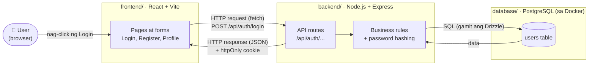
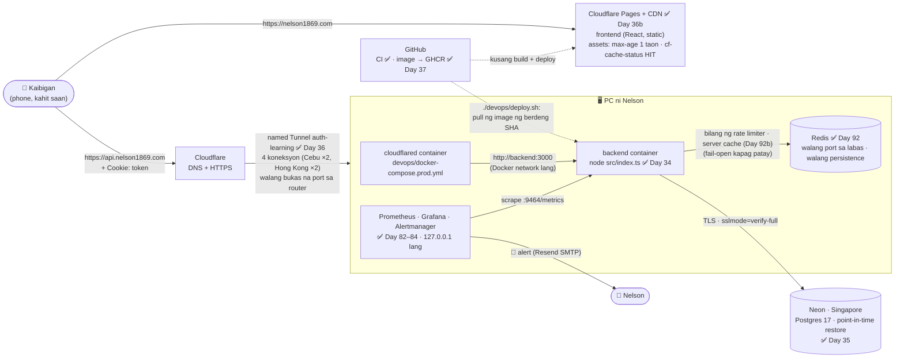
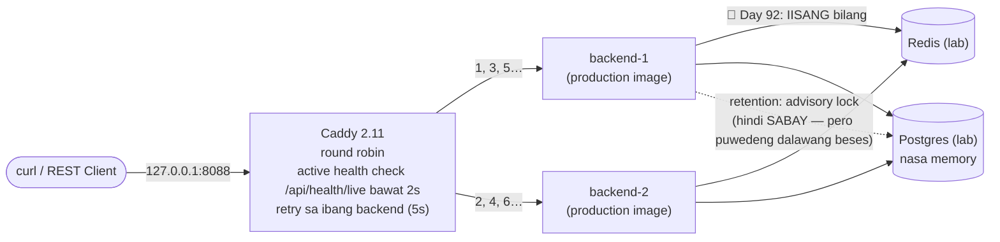

# 00 — Architecture (ang malaking larawan)

> Paano nag-uusap ang mga bahagi ng system. Ang bawat kahon ay isang role/folder.
> Tingnan sa Chrome: `node docs/diagrams/build.mjs`, tapos buksan ang `index.html`.
> Kusa rin itong nire-render sa GitHub at sa VS Code Markdown Preview.

## Ngayon: ano na ang totoong mayroon

> 📅 in-update sa Day 32b · Phase 7 (TypeScript na ang frontend at backend) · Day 39 (`helmet()`) · Day 42 (logging) · Day 44 (CSRF) · Day 46–49 (admin, audit log, admin page) · Day 51 (refresh token) · Day 56 (RS256) · Day 58 (email) · **Code:** `frontend/src/`, `backend/src/`, `devops/docker-compose.yml`
> **Subukan:** `backend/http/01`–`20`

```mermaid
flowchart LR
    Browser(["🌐 Chrome<br/>localhost:5173"]) -->|"HTML + JS"| FE
    subgraph FEG["frontend/ · Vite 8 + React 19 + TypeScript"]
        FE["App.tsx — React Router 8<br/>pages/ Login · Register · Profile · Admin (Day 49) · Sessions (Day 54) · ChangePassword (Day 55) · Passkeys (Day 95)<br/>ForgotPassword · ResetPassword · VerifyEmail (Day 61) · hooks/useHashToken<br/>api/auth.ts · api/admin.ts — apiFetch: 401 → refresh isang beses → ulit"]
    end
    FE -->|"fetch · localhost:3000<br/>CORS preflight + Cookie: token"| MW
    Client(["REST Client / curl<br/>(may cookie jar)"]) -->|"HTTP · localhost:3000<br/>+ Cookie: token"| MW
    subgraph BE["backend/ · Express + TypeScript (node src/index.ts)"]
        MW["requestLogger — log + X-Request-Id<br/>helmet() — security headers<br/>cors({ origin: env.CLIENT_URL, credentials })<br/>requireSameOrigin — CSRF (Day 44)<br/>express.json() · cookieParser()"]
        Env["config/env.ts<br/>sinusuri ang env pagka-start (Zod)"]
        Routes["routes/ — ROUTING LANG (Day 76)<br/>auth.ts · admin.ts · users.ts · health.ts · echo.ts<br/>URL → rate limit · requireAuth · requireRole → controller"]
        Auth["middleware/requireAuth.ts<br/>lib/jwt.ts: RS256 · PUBLIC key · iss/aud"]
        Role["middleware/requireRole.ts<br/>role mula sa DB → 403 kung hindi admin"]
        Ctrl["controllers/ — HTTP LANG (Day 74–76)<br/>http.ts: cookies · parseOr400 · deviceOf<br/>auth · admin · users controllers<br/>input → service → status · body · cookies"]
        Val["validations/<br/>Zod: auth.ts · pagination.ts"]
        Svc["services/ — LOGIC, walang Express (Day 74–76)<br/>auth/: registration · login · session · password · verification<br/>admin · users<br/>tumatanggap ng plain na input + audit → maliit na resulta"]
        Lib["lib/<br/>loginLockout · trustedDevices · session · jwt ·<br/>verificationTokens · email · background · audit"]
        Hash["argon2<br/>hash · verify"]
        DB["db/index.ts<br/>Drizzle + pg Pool"]
        MW --> Routes
        Routes -->|"/me · /sessions · /change-password · /admin/*"| Auth
        Auth -->|"/admin/*"| Role
        Role --> DB
        Routes --> Ctrl
        Ctrl --> Val
        Ctrl -->|"parsed na input + auditFor(req)"| Svc
        Svc --> Hash
        Svc --> Lib
        Svc --> DB
        Lib --> DB
    end
    DB -->|"SQL · localhost:5435"| PG
    Mail -->|"HTTPS · Resend API<br/>SPF · DKIM · DMARC"| Resend(["📧 Resend (Tokyo)<br/>no-reply@nelson1869.com"])
    subgraph Docker["Docker · project: auth-learning"]
        PG[("postgres:17-alpine<br/>users (may role) · audit_logs · refresh_tokens ·<br/>verification_tokens · trusted_devices ·<br/>unknown_login_attempts · passkeys · webauthn_challenges (Day 95) · migrations 0000–0014")]
        Vol[/"volume: auth-learning_pgdata"/]
        PG --- Vol
    end
```

**Pansinin:** dalawang server — frontend sa **:5173** (Vite), backend sa **:3000**
(Express). Nag-uusap na sila (Day 22): pinapayagan ng `cors()` ang `CLIENT_URL` lang,
at ang cookie na `token` ay itinatago ng browser para sa `localhost:3000`.

## Habang nagde-develop (sa sarili mong PC)

```mermaid
flowchart LR
    User(["👤 User<br/>(browser)"])

    subgraph FE["frontend/ · React + Vite"]
        Pages["Pages at forms<br/>Login, Register, Profile"]
    end

    subgraph BE["backend/ · Node.js + Express"]
        API["API routes<br/>/api/auth/..."]
        Logic["Business rules<br/>+ password hashing"]
    end

    subgraph DB["database/ · PostgreSQL (sa Docker)"]
        Users[("users table")]
    end

    User -->|"nag-click ng Login"| Pages
    Pages -->|"HTTP request (fetch)<br/>POST /api/auth/login"| API
    API --> Logic
    Logic -->|"SQL (gamit ang Drizzle)"| Users
    Users -->|"data"| Logic
    API -->|"HTTP response (JSON)<br/>+ httpOnly cookie"| Pages
```

**Paano basahin:**
1. Nag-click ang user ng "Login" sa **frontend**.
2. Nagpapadala ang frontend ng **HTTP request** sa **backend**.
3. Tinatanong ng backend ang **database** kung may ganitong user at tama ang password.
4. Sumasagot ang backend (JSON), at nagse-set ng **cookie** na nagpapatunay na naka-login ka.

## Kapag naka-deploy na (Phase 8 — hybrid, D-020)

> 📅 in-update sa Day 36b · Day 82–84 (monitoring sa PC) · ✅ domain, Dockerfile, Neon, Tunnel, **Pages (live — https://nelson1869.com)** · **CD (Day 37, manual pull)**
> **Subukan:** `backend/http/prod/01-production.http`

```mermaid
flowchart LR
    User(["👤 Kaibigan<br/>(phone, kahit saan)"]) -->|"https://nelson1869.com"| Pages["Cloudflare Pages + CDN ✅ Day 36b<br/>frontend (React, static)<br/>assets: max-age 1 taon · cf-cache-status HIT"]
    User -->|"https://api.nelson1869.com<br/>+ Cookie: token"| Edge["Cloudflare<br/>DNS + HTTPS"]
    Edge -->|"named Tunnel auth-learning ✅ Day 36<br/>4 koneksyon (Cebu ×2, Hong Kong ×2)<br/>walang bukas na port sa router"| PC
    subgraph PC["🖥️ PC ni Nelson"]
        CFD["cloudflared container<br/>devops/docker-compose.prod.yml"] -->|"http://backend:3000<br/>(Docker network lang)"| BE["backend container<br/>node src/index.ts ✅ Day 34"]
        Prom["Prometheus · Grafana · Alertmanager<br/>✅ Day 82–84 · 127.0.0.1 lang"] -->|"scrape :9464/metrics"| BE
        BE -->|"bilang ng rate limiter · server cache (Day 92b)<br/>(fail-open kapag patay)"| Redis[("Redis ✅ Day 92<br/>walang port sa labas · walang persistence")]
    end
    Prom -->|"📧 alert (Resend SMTP)"| Me(["👤 Nelson"])
    BE -->|"TLS · sslmode=verify-full"| Neon[("Neon · Singapore<br/>Postgres 17 · point-in-time restore<br/>✅ Day 35")]
    GH["GitHub<br/>CI ✅ · image → GHCR ✅ Day 37"] -.->|"./devops/deploy.sh:<br/>pull ng image ng berdeng SHA"| BE
    GH -.->|"kusang build + deploy"| Pages
```

## Lab: load balancing (Day 91b — HINDI production)

> 📅 Day 91b · in-update sa Day 92 (Redis) · **Code:** `devops/lab/docker-compose.lb.yml` · `devops/lab/Caddyfile` · **Subukan:** `backend/http/36-load-balancing.http` · **Desisyon:** D-034

```mermaid
flowchart LR
    Client(["curl / REST Client"]) -->|"127.0.0.1:8088"| Caddy["Caddy 2.11<br/>round robin<br/>active health check /api/health/live bawat 2s<br/>retry sa ibang backend (5s)"]
    Caddy -->|"1, 3, 5…"| B1["backend-1<br/>(production image)"]
    Caddy -->|"2, 4, 6…"| B2["backend-2<br/>(production image)"]
    B1 -->|"🧮 Day 92: IISANG bilang"| RD[("Redis (lab)")]
    B2 --> RD
    B1 --> PG[("Postgres (lab)<br/>nasa memory")]
    B2 --> PG
    B1 -.->|"retention: advisory lock<br/>(hindi SABAY — pero puwedeng dalawang beses)"| PG
```

| Sinukat | Resulta |
|---|---|
| Pagkakahati | 4/4 sa 8 request |
| Patayin ang isang backend (`docker stop` o `docker kill`) habang 20 req/s | **0 error** sa ~525 request — ang health check at retry ng Caddy |
| Request na nasa **kalagitnaan** sa backend na SIGKILL | **502** (kaya mahalaga pa rin ang graceful shutdown, Day 85) |
| Rate limiter ng login | **20** maling login bago ang 429, hindi 10 — may sariling bilang ang bawat backend (**→ Day 92**) |
| **Day 92 — may Redis** (parehong lab, parehong pagsubok) | **10** bago ang 429, salitan ang dalawang backend · patay ang Redis → fail-open (kahit ang naka-block na IP ay pinapasok) · pagbalik: 10 ulit |
| IP na nakikita ng app | ang IP ng **Caddy** para sa lahat ng user → iisang bilang para sa lahat (kailangang pagkatiwalaan ang `X-Forwarded-For` ng proxy) |

> Babalikan at ia-update natin ang mga diagram na ito habang nabubuo ang project —
> dapat laging tugma ang diagram sa totoong code.
