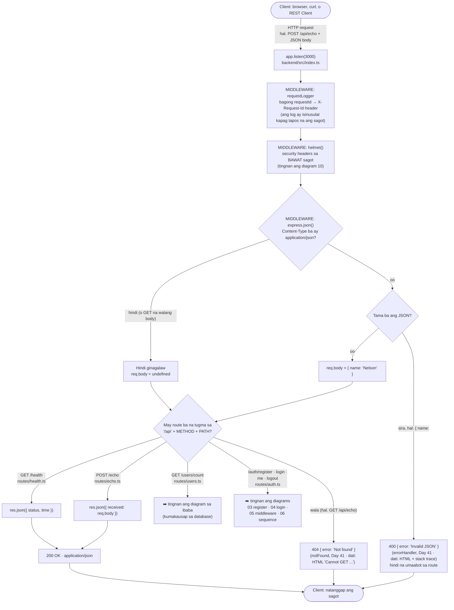
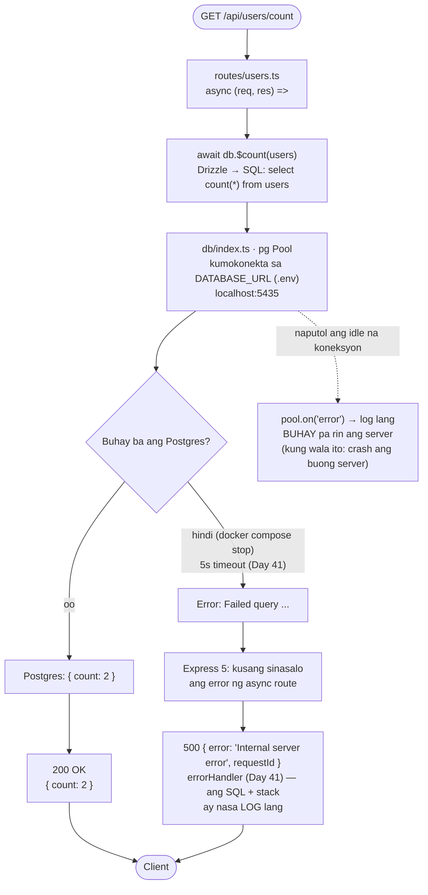
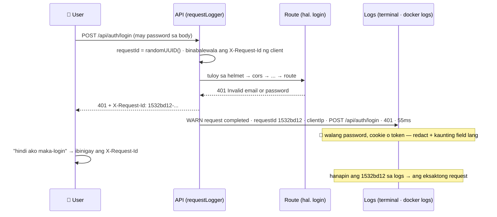

# 01 — Request Lifecycle (ang buhay ng isang request)

> 📅 Day 04 · Phase 2 (Unang API) · in-update sa Day 05 (`time`), Day 06 (`express.json()`, `routes/`, POST na may body) Day 10 (database), Day 19 (auth routes), Day 39 (`helmet()`), Day 42 (logging) at Day 41 (error handler)
>
> **Code:** `backend/src/index.ts`, `backend/src/routes/health.ts`, `backend/src/routes/echo.ts`, `backend/src/routes/users.ts`, `backend/src/db/index.ts`
> **Subukan:** `backend/http/01-health.http`, `backend/http/02-echo.http`, `backend/http/03-users-count.http`

## Paano sinasagot ng server ang isang request

## Mga dapat pansinin

- **Ang middleware ay dinadaanan BAGO ang route.** Kaya nauuna ang
  `app.use(express.json())` sa pagkabit ng routers: kapag nahuli ito, wala
  pang `req.body` pagdating sa route.
- **Walang `Content-Type: application/json` → walang `req.body`.** Hindi
  hinuhulaan ng `express.json()` kung JSON ang ipinadala. Ang
  `{ received: undefined }` ay nagiging `{}` sa JSON.
- **Sirang JSON → 400 `{ "error": "Invalid JSON" }`.** Bago ang Day 41: HTML na may stack
  trace at mga file path ng PC (sa dev). Ngayon ay JSON na ang lahat ng error. Tingnan ang
  diagram 11 (middleware pipeline).
- **Ang route ay METHOD + PATH.** Kaya 404 ang `GET /api/echo`: `router.post`
  lang ang mayroon.
- **Kailangang SUMAGOT ang bawat route function.** Kapag walang `res.json()`
  o `res.send()`, hindi 404 ang mangyayari. **Nakabitin** ang request hanggang
  mag-timeout ang client. Nangyari ito noong Day 06.

## Kapag kailangan ang database: `GET /api/users/count`

> 📅 Day 10 · Phase 3 (Unang database) · **Code:** `backend/src/routes/users.ts`,
> `backend/src/db/index.ts` · **Subukan:** `backend/http/03-users-count.http`

- **`await`**: naghihintay ang route sa database bago sumagot. Habang naghihintay,
  puwedeng sumagot ang server sa ibang request.
- **Dalawang magkaibang error:** ang *query na nabigo* ay nagiging 500 (sinasalo
  ng Express 5). Ang *koneksyon na naputol habang idle* ay walang request na
  kasama, kaya `pool.on('error')` ang sumasalo. Kung wala iyon, namamatay ang
  buong server (nangyari ito sa Day 10).
- **Live ang sagot:** kapag nag-INSERT ka sa psql, magbabago ang bilang nang
  walang restart ng server.

## Logging at request ID (Day 42)

> 📅 Day 42 · Phase 9 (Pangunahing hardening) · **Code:** `backend/src/lib/logger.ts`,
> `backend/src/middleware/requestLogger.ts`, `backend/src/lib/clientIp.ts`
> **Subukan:** `backend/http/10-logging.http`

- **Isang linya ng JSON bawat request** (sa production): `level` 30 = info, 40 = warn (4xx),
  50 = error (5xx). Sa dev, pino-pretty ang nagpapaganda (may kulay).
- **`clientIp`** ay ang totoong IP (`CF-Connecting-IP` sa likod ng tunnel), hindi ang IP ng
  cloudflared container — pareho ng patakaran ng rate limiter (`lib/clientIp.ts`).
- **Hindi itinatala ang `/api/health`** — tinatawag ito ng Docker HEALTHCHECK nang paulit-ulit.
- **Pareho ang `requestId`** ng lahat ng log ng isang request (hal. `Rate limit hit` + ang 429),
  kaya madaling pagdugtungin.
