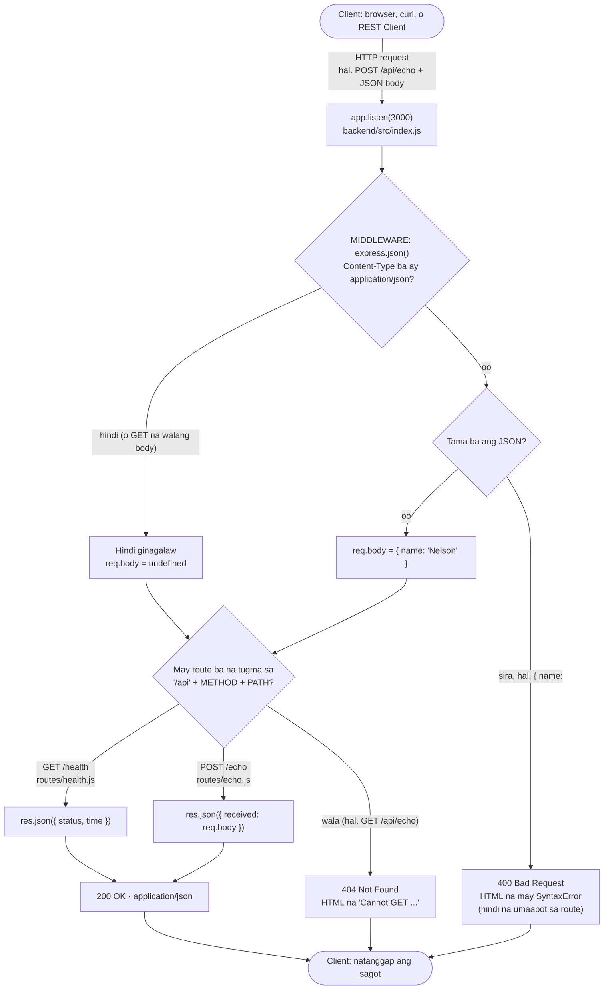

# 01 — Request Lifecycle (ang buhay ng isang request)

> 📅 Day 04 · Phase 2 (Unang API) · in-update sa Day 05 (`time`) at Day 06 (`express.json()`, `routes/`, POST na may body)
>
> **Code:** `backend/src/index.js`, `backend/src/routes/health.js`, `backend/src/routes/echo.js`
> **Subukan:** `backend/http/01-health.http`, `backend/http/02-echo.http`

## Paano sinasagot ng server ang isang request

## Mga dapat pansinin

- **Ang middleware ay dinadaanan BAGO ang route.** Kaya nauuna ang
  `app.use(express.json())` sa pagkabit ng routers: kapag nahuli ito, wala
  pang `req.body` pagdating sa route.
- **Walang `Content-Type: application/json` → walang `req.body`.** Hindi
  hinuhulaan ng `express.json()` kung JSON ang ipinadala. Ang
  `{ received: undefined }` ay nagiging `{}` sa JSON.
- **Sirang JSON → 400, at may stack trace sa HTML.** Sa development lang
  lumalabas ang stack trace (tinatago kapag `NODE_ENV=production`). Aayusin
  natin sa Phase 9 (error handler, JSON na lahat ng error).
- **Ang route ay METHOD + PATH.** Kaya 404 ang `GET /api/echo`: `router.post`
  lang ang mayroon.
- **Kailangang SUMAGOT ang bawat route function.** Kapag walang `res.json()`
  o `res.send()`, hindi 404 ang mangyayari. **Nakabitin** ang request hanggang
  mag-timeout ang client. Nangyari ito noong Day 06.
