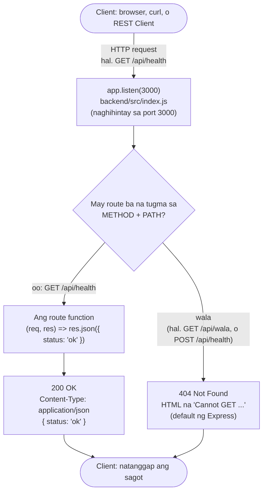

# 01 — Request Lifecycle (ang buhay ng isang request)

> 📅 Day 04 · Phase 2 (Unang API) — ia-update sa Day 06 (POST at request body)
>
> **Code:** `backend/src/index.js` · **Subukan:** `backend/http/01-health.http`

## Paano sinasagot ng server ang isang request

## Mga dapat pansinin

- **Ang route ay METHOD + PATH.** Kahit tama ang path (`/api/health`), 404 ang
  `POST` dahil walang `app.post('/api/health')` sa code.
- **Default na 404 ng Express ay HTML**, hindi JSON — aayusin natin sa Phase 9
  (error handling), para JSON na ang lahat ng sagot ng API.
- **Laging may sagot** — kahit walang tugmang route, sumasagot pa rin ang
  server (404). Hindi ito nag-a-"ignore".
