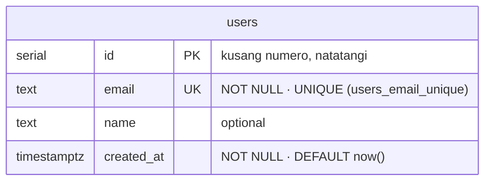
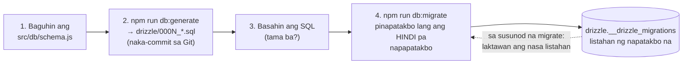

# 02 — ER Diagram (ang hugis ng database)

> 📅 Day 11 · Phase 3 (Unang database) · ia-update tuwing may bagong table o column
>
> **Source of truth:** `backend/src/db/schema.js` → `npm run db:generate` →
> `backend/drizzle/0000_*.sql` → `npm run db:migrate`
> **Subukan:** `backend/http/03-users-count.http` · `npm run db:studio`

**ER diagram** (Entity-Relationship) = mapa ng mga table, ng mga column nila, at
kung paano sila magkakaugnay. Isa pa lang ang table ngayon; sa Phase 4 at pataas,
dadami ito at makikita ang mga linya ng relasyon.

## Paano basahin

| Marka | Ibig sabihin |
|---|---|
| **PK** | Primary key — ang "ID card" ng row: natatangi at hindi puwedeng walang laman |
| **UK** | Unique key — bawal ang doble |
| `serial` / `text` / `timestamptz` | ang type ng column |

## Paano nagbabago ang database (mula Day 11)

- **Huwag nang baguhin ang table gamit ang kamay sa psql** — hindi ito malalaman
  ng migrations, ng teammate mo, o ng production server.
- **Huwag baguhin ang lumang migration file** na napatakbo na. Gumawa ng bago.

## Kailan ia-update ang diagram na ito
Tuwing may bagong migration: idagdag ang table/column dito, at ikumpara sa
`schema.js` — hindi lang proofread. (Sa reference project, may 4 na mali ang unang
ER diagram dahil hindi ito ikinumpara sa totoong schema.)
