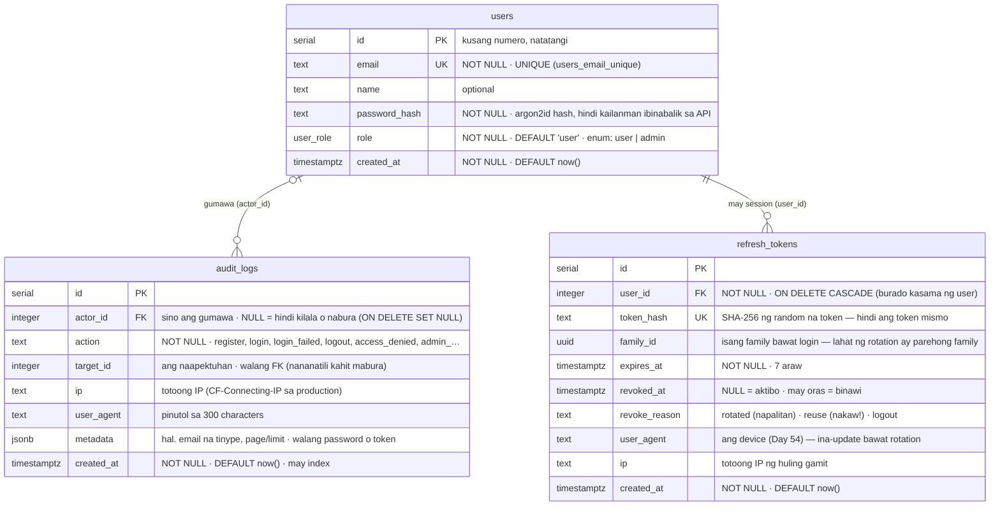
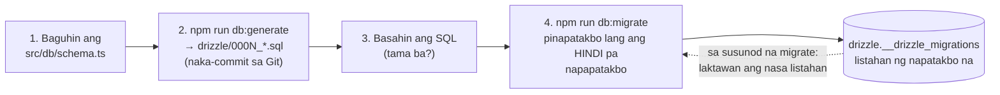

# 02 — ER Diagram (ang hugis ng database)

> 📅 Day 11 · Phase 3 (Unang database) · in-update sa Day 13 (`password_hash`, migration 0001) Day 45 (`role`, migration 0002) at Day 48 (`audit_logs`, migration 0003) at Day 51 (`refresh_tokens`, migration 0004) at Day 52 (`revoke_reason`, migration 0005) at Day 54 (`user_agent`, `ip`, migration 0006) · ia-update tuwing may bagong table o column
>
> **Source of truth:** `backend/src/db/schema.ts` → `npm run db:generate` →
> `backend/drizzle/000N_*.sql` → `npm run db:migrate`
> **Subukan:** `backend/http/03-users-count.http` · `npm run db:studio`

**ER diagram** (Entity-Relationship) = mapa ng mga table, ng mga column nila, at
kung paano sila magkakaugnay. Isa pa lang ang table ngayon; sa Phase 4 at pataas,
dadami ito at makikita ang mga linya ng relasyon.

```mermaid
erDiagram
    users {
        serial id PK "kusang numero, natatangi"
        text email UK "NOT NULL · UNIQUE (users_email_unique)"
        text name "optional"
        text password_hash "NOT NULL · argon2id hash, hindi kailanman ibinabalik sa API"
        user_role role "NOT NULL · DEFAULT 'user' · enum: user | admin"
        timestamptz created_at "NOT NULL · DEFAULT now()"
    }
    audit_logs {
        serial id PK
        integer actor_id FK "sino ang gumawa · NULL = hindi kilala o nabura (ON DELETE SET NULL)"
        text action "NOT NULL · register, login, login_failed, logout, access_denied, admin_…"
        integer target_id "ang naapektuhan · walang FK (nananatili kahit mabura)"
        text ip "totoong IP (CF-Connecting-IP sa production)"
        text user_agent "pinutol sa 300 characters"
        jsonb metadata "hal. email na tinype, page/limit · walang password o token"
        timestamptz created_at "NOT NULL · DEFAULT now() · may index"
    }
    refresh_tokens {
        serial id PK
        integer user_id FK "NOT NULL · ON DELETE CASCADE (burado kasama ng user)"
        text token_hash UK "SHA-256 ng random na token — hindi ang token mismo"
        uuid family_id "isang family bawat login — lahat ng rotation ay parehong family"
        timestamptz expires_at "NOT NULL · 7 araw"
        timestamptz revoked_at "NULL = aktibo · may oras = binawi"
        text revoke_reason "rotated (napalitan) · reuse (nakaw!) · logout"
        text user_agent "ang device (Day 54) — ina-update bawat rotation"
        text ip "totoong IP ng huling gamit"
        timestamptz created_at "NOT NULL · DEFAULT now()"
    }
    users |o--o{ audit_logs : "gumawa (actor_id)"
    users ||--o{ refresh_tokens : "may session (user_id)"
```

## Paano basahin

| Marka | Ibig sabihin |
|---|---|
| **PK** | Primary key — ang "ID card" ng row: natatangi at hindi puwedeng walang laman |
| **UK** | Unique key — bawal ang doble |
| `serial` / `text` / `timestamptz` | ang type ng column |
| **FK** | Foreign key — tumuturo sa `id` ng ibang table (Day 48: `audit_logs.actor_id` → `users.id`) |
| `\|o--o{` | "zero o isa" sa "zero o marami": ang user ay puwedeng may maraming audit row; ang row ay puwedeng walang user (hindi kilala o nabura) |
| `jsonb` | JSON na naka-save bilang binary sa Postgres — puwedeng hanapin (hal. `metadata->>'email'`) |
| `user_role` | **enum** (Day 45) — sariling type sa Postgres; `user` o `admin` lang ang tinatanggap. Sinubukan: ang `'superadmin'` ay tinanggihan ng **database** mismo |

**Paano nagiging admin (Day 45):** hindi kailanman mula sa request. Ang register ay laging `user`,
at binabalewala ang `"role"` sa body. Ang admin ay itinatakda ng script:
`npm run db:set-role -- <email> admin` (`backend/src/db/set-role.ts`).

## Paano nagbabago ang database (mula Day 11)

```mermaid
flowchart LR
    Schema["1. Baguhin ang<br/>src/db/schema.ts"] --> Gen["2. npm run db:generate<br/>→ drizzle/000N_*.sql<br/>(naka-commit sa Git)"]
    Gen --> Review["3. Basahin ang SQL<br/>(tama ba?)"]
    Review --> Mig["4. npm run db:migrate<br/>pinapatakbo lang ang HINDI pa<br/>napapatakbo"]
    Mig --> Journal[("drizzle.__drizzle_migrations<br/>listahan ng napatakbo na")]
    Journal -.->|"sa susunod na migrate:<br/>laktawan ang nasa listahan"| Mig
```

- **Huwag nang baguhin ang table gamit ang kamay sa psql** — hindi ito malalaman
  ng migrations, ng teammate mo, o ng production server.
- **Huwag baguhin ang lumang migration file** na napatakbo na. Gumawa ng bago.

## Kailan ia-update ang diagram na ito
Tuwing may bagong migration: idagdag ang table/column dito, at ikumpara sa
`schema.js` — hindi lang proofread. (Sa reference project, may 4 na mali ang unang
ER diagram dahil hindi ito ikinumpara sa totoong schema.)
