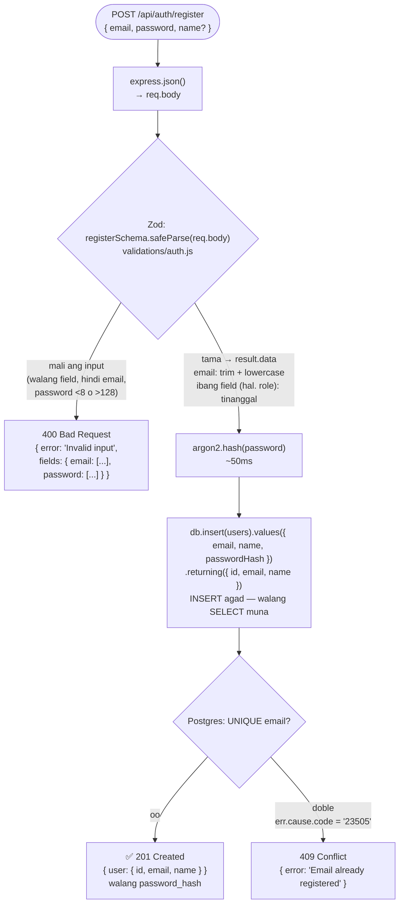
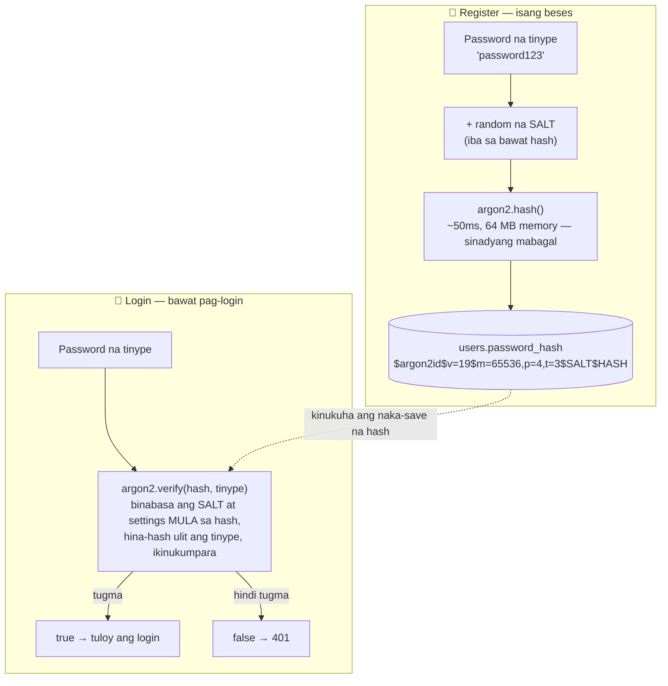

# 03 — Register flow (at password hashing)

> 📅 Day 12 · Phase 4 (Register at login) · in-update sa Day 13 (`POST /api/auth/register`) at Day 14 (validation)
>
> **Code:** `backend/src/routes/auth.js` · `backend/src/validations/auth.js` · `backend/playground/01-hash.js` (practice)
> **Subukan:** `backend/http/04-register.http` · **Library:** `argon2` (Argon2id)

## `POST /api/auth/register`



- **Zod muna, bago ang lahat.** Hindi na umaabot sa argon2 o sa database ang
  maling input — kaya wala nang 500, at hindi na lumalabas ang hash sa error (Day 13).
- **`result.data`, hindi `req.body`:** ang nalinis na data lang ang ginagamit.
  Nawawala ang mga dagdag na field (depensa laban sa mass assignment).
- **Lowercase ang email:** `Nelson@X.com` at `nelson@x.com` ay iisang account na → 409.
- **Bakit INSERT agad?** Ang `UNIQUE` ng database pa rin ang huling bantay kapag
  sabay ang mga request. Sinubukan (Day 14): 5 sabay → isang 201, apat na 409.
- **Bakit may `NOT NULL`/`UNIQUE` pa kung may Zod?** Ang Zod ay para sa magandang
  sagot (400); ang database ay para sa katotohanan — kahit may bug ang code, o
  may ibang code na sumulat sa database.

## Ano ang naka-save: hash, hindi password (Day 12)



## Basahin ang hash

```
$argon2id $v=19 $m=65536,p=4,t=3 $vbi+qlULs0ApkwXFys08pQ $TVJFbEcsFLwWdkOEKdYH...
 algorithm version  settings       salt (random)          ang hash mismo
```
`m=65536` = 64 MB na memory · `p=4` = 4 na thread · `t=3` = 3 ikot. **Kasama sa
hash ang salt at settings** — kaya iisang column lang ang kailangan.

## Mga dapat pansinin

- **One-way:** walang paraan para ibalik ang hash sa password — kahit tayo.
  Kaya ang "forgot password" ay laging *reset*, hindi *ipadala ang luma*.
- **Magkaibang hash, parehong password** (dahil sa salt) — walang silbi ang
  pre-computed na listahan ng hash, at hindi makikita kung sino ang may parehong password.
- **Mabagal, sinadya** (~50ms sa PC na ito, Day 12): hindi ramdam ng user, pero
  1 bilyong hula × 50ms ≈ 1.6 taon sa isang CPU core — para sa isang user lang.
