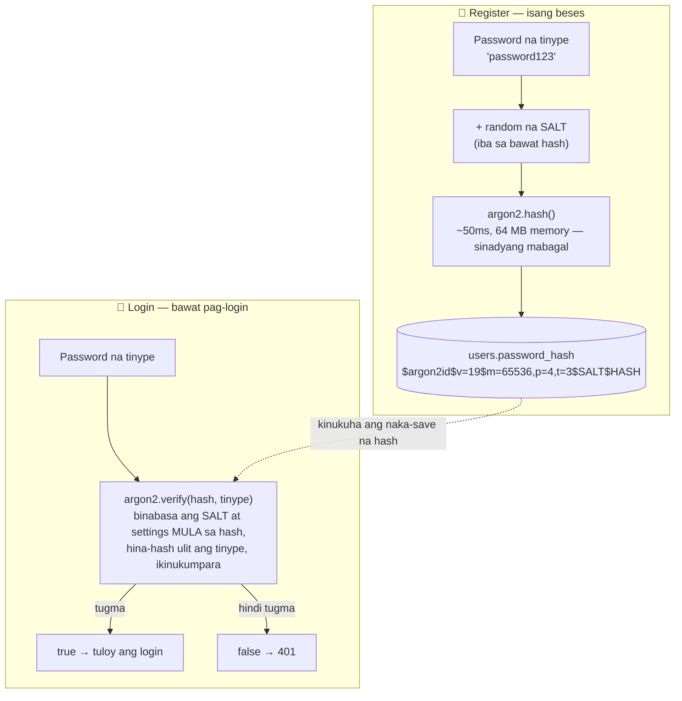

# 03 — Register flow (at password hashing)

> 📅 Day 12 · Phase 4 (Register at login) · **Bahagi 1: password hashing** —
> dadagdagan sa Day 13 ng buong `POST /api/auth/register`
>
> **Code:** `backend/playground/01-hash.js` (practice) · **Library:** `argon2` (Argon2id)

## Ano ang naka-save: hash, hindi password



## Basahin ang hash

```
$argon2id $v=19 $m=65536,p=4,t=3 $vbi+qlULs0ApkwXFys08pQ $TVJFbEcsFLwWdkOEKdYH...
 algorithm version  settings       salt (random)          ang hash mismo
```
`m=65536` = 64 MB na memory · `p=4` = 4 na thread · `t=3` = 3 ikot. **Kasama sa
hash ang salt at settings** — kaya iisang column lang ang kailangan.

## Mga dapat pansinin

- **One-way:** walang paraan para ibalik ang hash sa password — kahit tayo.
  Kaya ang "forgot password" ay laging *reset*, hindi *ipadala ang luma*.
- **Magkaibang hash, parehong password** (dahil sa salt) — walang silbi ang
  pre-computed na listahan ng hash, at hindi makikita kung sino ang may parehong password.
- **Mabagal, sinadya** (~50ms sa PC na ito, Day 12): hindi ramdam ng user, pero
  1 bilyong hula × 50ms ≈ 1.6 taon sa isang CPU core — para sa isang user lang.
