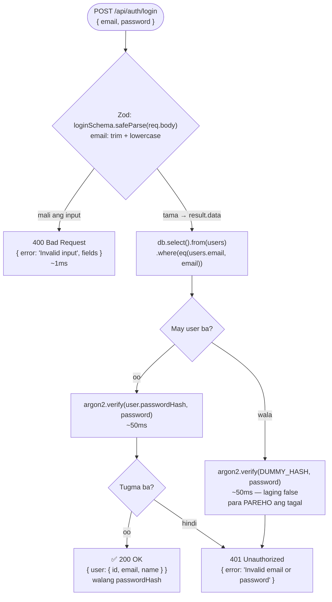

# 04 — Login flow

> 📅 Day 15 · Phase 4 (Register at login) · dadagdagan sa Day 16 (JWT + cookie)
>
> **Code:** `backend/src/routes/auth.js` · `backend/src/validations/auth.js`
> **Subukan:** `backend/http/05-login.http`

## `POST /api/auth/login`

## Mga dapat pansinin

- **Iisang mensahe, iisang status (401)** para sa maling password at sa walang
  account. Kung magkaiba, malalaman ng attacker kung sino ang may account
  (**user enumeration**) — at iyon lang ang aatakihin, o gagamitin sa phishing.
- **Pareho rin ang ORAS.** Kahit pareho ang mensahe, ang bilis ng sagot ay
  nagsasabi ng totoo. Kaya may `DUMMY_HASH`: laging may isang `argon2.verify`.
  Sinukat (Day 15, 20× bawat isa, salitan):

  | Kaso | Median |
  |---|---|
  | 401 maling password (may account) | 52.3 ms |
  | 401 walang account (may `DUMMY_HASH`) | 52.3 ms |
  | 400 validation (walang hashing) — ganito kabilis kung WALANG `DUMMY_HASH` | 1.0 ms |

- **Butas pa rin: ang register.** Ang `409 Email already registered` ay nagsasabi
  kung may account ang email. Sa reference project, sinadya itong iwan (ang tanging
  tunay na ayos ay "email-first signup" na nagbabago ng UX), at nililimitahan na lang
  ng rate limiter (Phase 9).
- **Wala pang "session".** Ang 200 ay sagot lang — sa susunod na request, hindi ka
  na kilala ng server. Sa Day 16: JWT sa httpOnly cookie.
