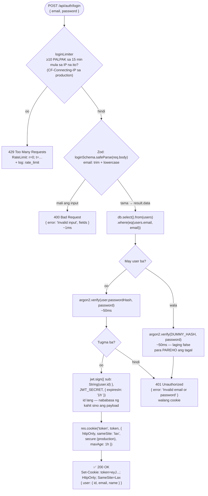

# 04 — Login flow

> 📅 Day 15 · Phase 4 (Register at login) · in-update sa Day 16 (JWT + httpOnly cookie) at Day 43 (rate limiting)
>
> **Code:** `backend/src/routes/auth.ts` · `backend/src/validations/auth.ts`
> **Subukan:** `backend/http/05-login.http`

## `POST /api/auth/login`



## Mga dapat pansinin

- **Iisang mensahe, iisang status (401)** para sa maling password at sa walang
  account. Kung magkaiba, malalaman ng attacker kung sino ang may account
  (**user enumeration**) — at iyon lang ang aatakihin, o gagamitin sa phishing.
- **Pareho rin ang ORAS.** Kahit pareho ang mensahe, ang bilis ng sagot ay
  nagsasabi ng totoo. Kaya may `DUMMY_HASH`: laging may isang `argon2.verify`.
  Sinukat (Day 15, 20× bawat isa, salitan):

  | Kaso | Median |
  |---|---|
  | 401 maling password (may account) | 52.3 ms |
  | 401 walang account (may `DUMMY_HASH`) | 52.3 ms |
  | 400 validation (walang hashing) — ganito kabilis kung WALANG `DUMMY_HASH` | 1.0 ms |

- **Butas pa rin: ang register.** Ang `409 Email already registered` ay nagsasabi
  kung may account ang email. Sa reference project, sinadya itong iwan (ang tanging
  tunay na ayos ay "email-first signup" na nagbabago ng UX), at nililimitahan na lang
  ng rate limiter (Phase 9).
## Ang JWT (Day 16)

```
eyJhbGciOiJIUzI1NiIs...  .  eyJzdWIiOiIzMiIsImlhdCI6...  .  Xk3f9aB...
 header                      payload                        signature
 {"alg":"HS256"}             {"sub":"32","iat":…,"exp":…}   pirma gamit ang JWT_SECRET
```

- **Nababasa ng kahit sino** ang header at payload (base64 lang). Kaya `sub` (id)
  lang — walang email, password o hash.
- **Hindi mapepeke:** sinubukan (Day 16) palitan ang `sub` ng `"999"` → `invalid
  signature`. Kailangan ang `JWT_SECRET` para makagawa ng tamang pirma — kaya kapag
  nanakaw ang secret, kaya nang gumawa ng token para sa kahit sinong user.
- **`httpOnly` cookie, hindi `localStorage`:** hindi ito mababasa ng JavaScript sa
  browser, kaya hindi manakaw ng XSS; kusa rin itong ipinapadala ng browser.
- ⏳ **Day 17:** babasahin ng middleware ang cookie at `jwt.verify` para sa
  `GET /api/auth/me`.
