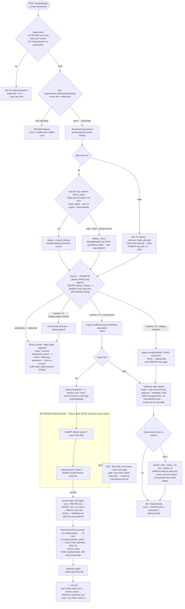

# 04 — Login flow

> 📅 Day 15 · Phase 4 (Register at login) · in-update sa Day 16 (JWT + httpOnly cookie) Day 43 (rate limiting), Day 48 (audit log), Day 51 (refresh token), Day 56 (RS256), Day 63 (per-account lockout), Day 64 (device cookies), Day 67 (atomic na bilang), Day 68 (transaction bago ang cookies) at Day 71 (bilang para sa walang account)
>
> **Code:** `backend/src/routes/auth.ts` · `backend/src/validations/auth.ts` · `backend/src/lib/loginLockout.ts` (Day 67)
> **Subukan:** `backend/http/05-login.http` · `backend/http/21-lockout.http` (lockout) · `22-device-cookies.http` · `23-user-enumeration.http`

## `POST /api/auth/login`


```mermaid
flowchart TD
    Req(["POST /api/auth/login<br/>{ email, password }"]) --> RL{"loginLimiter<br/>≥10 PALPAK sa 15 min<br/>mula sa IP na ito?<br/>(CF-Connecting-IP sa production)"}
    RL -->|"oo"| C429["429 Too Many Requests<br/>RateLimit: r=0; t=…<br/>+ log: rate_limit"]
    RL -->|"hindi"| Zod{"Zod: loginSchema.safeParse(req.body)<br/>email: trim + lowercase"}
    Zod -->|"mali ang input"| C400["400 Bad Request<br/>{ error: 'Invalid input', fields }<br/>~1ms"]
    Zod -->|"tama → result.data"| Find["db.select().from(users)<br/>.where(eq(users.email, email))"]
    Find --> Has{"May user ba?"}
    Has -->|"oo"| Which{"Day 64: may valid na device_token<br/>PARA SA ACCOUNT NA ITO?<br/>(hash tugma · user_id tugma · hindi expired)"}
    Which -->|"oo"| DevC["bilang = trusted_devices<br/>(sariling bilang ng browser na ito)"]
    Which -->|"wala · peke · ibang account"| AccC["bilang = users<br/>(pinaghahatian ng LAHAT ng walang cookie — pati ang attacker)"]
    DevC --> Reserve{"Day 67 — RESERVE (atomic, BAGO ang argon2):<br/>UPDATE bilang = bilang + 1<br/>WHERE hindi naka-lock RETURNING bilang"}
    AccC --> Reserve
    Reserve -->|"walang row → naka-lock"| C423["🔒 423 Locked · Retry-After: segundo<br/>{ error: 'Account temporarily locked…' }<br/>KAHIT TAMA ang password — hindi na sinusuri<br/>audit: login_failed (reason: locked)"]
    Reserve -->|"numero &gt; 5<br/>(sabay-sabay na hula)"| Over["i-lock (kung hindi pa) — walang argon2"]
    Over --> C423
    Reserve -->|"numero 1–5 · walang account"| VDummy
    Reserve -->|"numero 1–5 · may account"| VReal["argon2.verify(user.passwordHash, password)<br/>~50ms"]
    Has -->|"wala"| UnkC["Day 71: bilang = unknown_login_attempts<br/>(SHA-256 ng email — para PAREHO ang 401 ×5 → 423)"]
    UnkC --> Reserve
    VDummy["argon2.verify(DUMMY_HASH, password)<br/>~50ms — laging false<br/>para PAREHO ang tagal"]
    VReal --> Ok{"Tugma ba?"}
    Ok -->|"oo"| Reset["bilang na ginamit = 0 · locked_until = NULL<br/>(sunod-sunod na mali lang ang binibilang)"]
    Reset --> TxR
    subgraph LTX["🔒 TRANSACTION (Day 68) — lahat o wala, BAGO ang kahit anong cookie"]
        TxR["INSERT refresh token (7 araw, SHA-256)"] --> TxD["walang device cookie? → INSERT trusted device (Day 64)"]
    end
    LTX -.->|"pumalya"| C500["500 · WALANG Set-Cookie · hindi naka-login<br/>(dati: may token cookie kahit 500 — nahuli ng transactions.test.ts)"]
    TxD -->|"commit"| Sign["access token: jwt.sign({ sub }, PRIVATE key,<br/>{ RS256, 15m, iss, aud }) — lib/jwt.ts (Day 56)<br/>id lang — nababasa ng kahit sino ang payload"]
    Sign --> Cookie["PAGKATAPOS ng commit: res.cookie('token', …, 15 min)<br/>res.cookie('refresh_token', …, 7 araw, Path=/api/auth) (Day 51)<br/>+ device_token (Path=/api/auth/login, 180 araw) kung bago"]
    Cookie --> AudOk["audit(req, login)<br/>→ audit_logs (Day 48)"]
    AudOk --> C200["✅ 200 OK<br/>Set-Cookie: token=eyJ... · refresh_token=...<br/>HttpOnly; SameSite=Lax<br/>{ user: { id, email, name } }"]
    Ok -->|"hindi"| AudFail["audit(req, login_failed)<br/>target = ang account (kung mayroon) · metadata: email<br/>HINDI ang password · sa DALAWANG kaso → pareho pa rin ang tagal"]
    VDummy --> AudFail
    AudFail --> Count{"Ang numero mula sa reserve"}
    Count -->|"&lt; 5"| C401
    Count -->|"ika-5"| Lock["locked_until = now() + 15 min · bilang = 0<br/>WHERE hindi pa naka-lock → audit: account_locked<br/>(isang beses lang, kahit sabay)"]
    Lock --> C401["401 Unauthorized<br/>{ error: 'Invalid email or password' }<br/>walang cookie"]
```

## Mga dapat pansinin

- **Iisang mensahe, iisang status (401)** para sa maling password at sa walang
  account. Kung magkaiba, malalaman ng attacker kung sino ang may account
  (**user enumeration**) — at iyon lang ang aatakihin, o gagamitin sa phishing.
- **Pareho rin ang ORAS.** Kahit pareho ang mensahe, ang bilis ng sagot ay
  nagsasabi ng totoo. Kaya may `DUMMY_HASH`: laging may isang `argon2.verify`.
  Sinukat (Day 15, 20× bawat isa, salitan):

  | Kaso | Median |
  |---|---|
  | 401 maling password (may account) | 52.3 ms |
  | 401 walang account (may `DUMMY_HASH`) | 52.3 ms |
  | 400 validation (walang hashing) — ganito kabilis kung WALANG `DUMMY_HASH` | 1.0 ms |

- **Butas pa rin: ang register.** Ang `409 Email already registered` ay nagsasabi
  kung may account ang email. Sa reference project, sinadya itong iwan (ang tanging
  tunay na ayos ay "email-first signup" na nagbabago ng UX), at nililimitahan na lang
  ng rate limiter (Phase 9).
## Per-account lockout (Day 63)

- **Bakit hindi sapat ang IP rate limit?** Bawat IP ang bilang nito. Ang attacker na may 1000 IP (botnet, proxy) ay may
  10 × 1000 hula bawat 15 minuto. Ang lockout ay bawat **account**: 5 lang, gaano man karami ang IP.
- **423 kahit tama ang password.** Kung 200 ang tamang password habang naka-lock, malalaman ng attacker kung tumama siya
  (200 vs 423), kaya walang silbi ang lock.
- **Sunod-sunod lang ang binibilang:** balik sa 0 sa tamang login. At 0 ulit pagka-lock, para 5 subok ulit pagkatapos ng 15 minuto (hindi 1).
- **⚠️ Tatlong alam na kahinaan, bawat isa ay may nakaplanong araw:**
  1. ~~**Kayang i-lock ng kahit sino ang account mo**~~ → **naayos sa Day 64** (device cookies, tingnan sa ibaba).
  2. ~~**Sabay na hula**~~ → **naayos sa Day 67** (reserve-then-verify, `lib/loginLockout.ts`). Dati: 20 sabay na maling password → 20 nasuri,
     hindi na-lock. Ngayon: **eksaktong 5 × 401, 15 × 423, isang `account_locked`** (`concurrency.test.ts`, diagram 20).
  3. ~~**Ang 423 ay nagsasabing may account ang email**~~ → **naayos sa Day 71**: may sariling bilang na rin ang email na walang account
     (`unknown_login_attempts`, hash lang), kaya pareho ang 401 ×5 → 423 at ang `Retry-After` (`enumeration.test.ts`, `23-user-enumeration.http`).
     Ang ORAS ay susukatin sa Day 72. Ang natitirang butas: register → 409.

## Device cookies — laban sa lockout DoS (Day 64)

- **Ang problema ng Day 63:** kahit sino na alam ang email mo ay kayang i-lock ang account mo nang walang katapusan
  (5 maling password bawat 15 minuto). Ang depensa mismo ang naging atake.
- **Ang ayos (OWASP):** ang browser na nakapag-login nang tama ay may `device_token` cookie. Ang maling password mula roon ay
  binibilang sa **sariling bilang ng device**. Ang lahat ng WALANG valid na cookie para sa account na ito (bagong browser, attacker,
  pekeng cookie, cookie ng ibang account) ay naghahati sa **bilang ng account**. Kaya: **nala-lock pa rin ang attacker pagkatapos ng 5,
  pero ang browser na lagi mong ginagamit ay hindi.**
- **Hindi ito login.** Kailangan pa rin ang password. Pinipili lang ng cookie kung aling bilang ang gagamitin.
- **`Path=/api/auth/login`:** ang login lang ang tumatanggap nito. Hash lang ang naka-save.
- **Change/reset password:** binabawi ang tiwala ng LAHAT ng device (hal. ang nanakaw na laptop), at pinagkakatiwalaan ang browser na gumawa nito.
- **Ang biktima sa BAGONG device** ay naka-lock pa rin. Ang labasan: **reset password**, na tinatanggal din ang lock ng account (diagram 18).
- Sinubukan sa totoong browser (dev): unang login → may cookie → logout → 5 mali mula sa curl → **ang browser ko: Profile ✅** ·
  bagong browser: "Account temporarily locked" ✅.

## Ang JWT (Day 16 · RS256 mula Day 56)

```
eyJhbGciOiJSUzI1NiIs...  .  eyJzdWIiOiIzMiIsImlhdCI6...  .  Xk3f9aB...
 header                      payload                                              signature
 {"alg":"RS256"}             {"sub":"32","iat","exp","iss":"auth-learning-api",   pirma gamit ang PRIVATE key
                              "aud":"auth-learning-web"}                          (sinusuri gamit ang PUBLIC key)
```
*(Day 16–55: `{"alg":"HS256"}`, pirma gamit ang iisang `JWT_SECRET`. Tingnan ang D-012 at D-024.)*

- **Nababasa ng kahit sino** ang header at payload (base64 lang). Kaya `sub` (id)
  lang — walang email, password o hash.
- **Hindi mapepeke:** sinubukan (Day 16) palitan ang `sub` ng `"999"` → `invalid
  signature`. Kailangan ang PRIVATE key para makagawa ng tamang pirma (Day 56; dati ang `JWT_SECRET`) — kaya kapag
  nanakaw ito, kaya nang gumawa ng token para sa kahit sinong user. Ang public key ay pang-suri lang.
- **`httpOnly` cookie, hindi `localStorage`:** hindi ito mababasa ng JavaScript sa
  browser, kaya hindi manakaw ng XSS; kusa rin itong ipinapadala ng browser.
- ⏳ **Day 17:** babasahin ng middleware ang cookie at `jwt.verify` para sa
  `GET /api/auth/me`.
