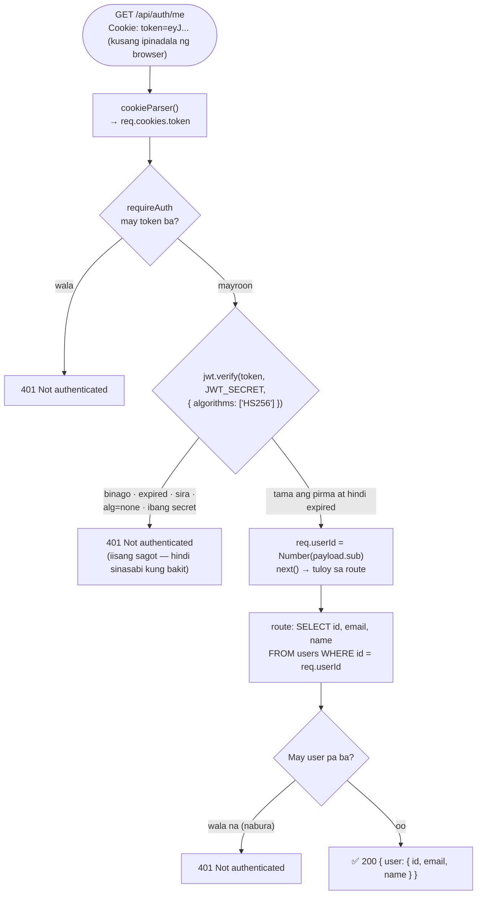

# 05 — Auth middleware (`requireAuth`)

> 📅 Day 17 · Phase 4 (Register at login)
>
> **Code:** `backend/src/middleware/requireAuth.js` · `backend/src/routes/auth.js` (`GET /api/auth/me`)
> **Subukan:** `backend/http/06-me.http`

## Paano sinusuri ang bawat protektadong request

## Mga dapat pansinin

- **Middleware = `(req, res, next)`.** `next()` → tuloy sa route; walang `next()` →
  hanggang dito lang (dapat may sagot, kung hindi nakabitin ang request — Day 06).
- **Isang beses isinulat, gamit ng marami:** `router.get('/auth/me', requireAuth, ...)`.
  Sa Day 18 (logout) at Phase 10 (admin) — idadagdag lang ang `requireAuth`.
- **Import sa itaas!** Ginagamit ang `requireAuth` habang nilo-load ang file
  (`router.get(...)`), kaya kapag nakalimutan ang import, hindi na nagsisimula ang
  BUONG server (`ReferenceError` — nangyari sa Day 17).
- **Sinubukan (Day 17), lahat 401:** walang cookie, binagong `sub`, sirang token,
  expired, `alg: none`, ibang secret, at nabura na ang user.
- **Galing sa database ang user**, hindi sa token — kaya laging bago ang data, at
  nahuhuli ang user na nabura na kahit may valid pang token.
- **401 vs 403:** 401 = "hindi kita kilala" (authentication — ngayon).
  403 = "kilala kita, pero bawal ka rito" (authorization — Phase 10, admin).
