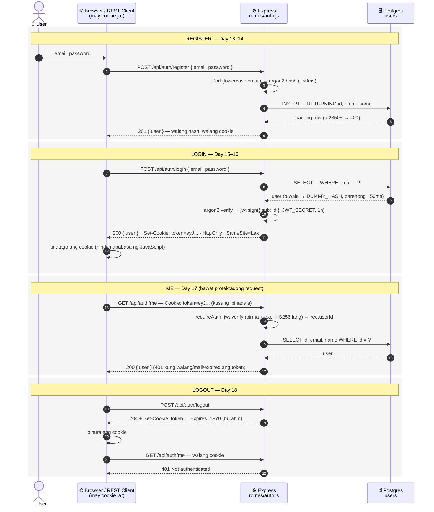

# 06 — Buong auth flow (sequence)

> 📅 Day 18 · Phase 4 (Register at login)
>
> **Code:** `backend/src/routes/auth.js` · `backend/src/middleware/requireAuth.js`
> **Subukan:** `04-register.http` → `05-login.http` → `06-me.http` → `07-logout.http`

**Sequence diagram** = sino ang nakikipag-usap kanino, at sa anong pagkakasunod —
basahin mula taas pababa. (Ang flowchart ay para sa mga desisyon sa loob ng isang
request; ito ay para sa buong kuwento, request pagkatapos ng request.)

## Mga dapat pansinin

- **Isang beses lang ipinapadala ang password** — sa login. Pagkatapos, ang cookie
  na ang nagpapakilala sa iyo sa bawat request.
- **Hindi nagtatanong ang server sa database kung "naka-login" ka** — sinusuri lang
  nito ang pirma ng token (stateless). Mabilis, pero may kapalit ⬇️
- **⚠️ Limitasyon:** sa browser lang nabubura ang cookie sa logout. Ang token na
  nakopya bago mag-logout ay valid pa hanggang mag-expire (sinubukan, Day 18: 200).
  Lulutasin ng refresh tokens sa database — Phase 11 (Day 51–52), D-012.
