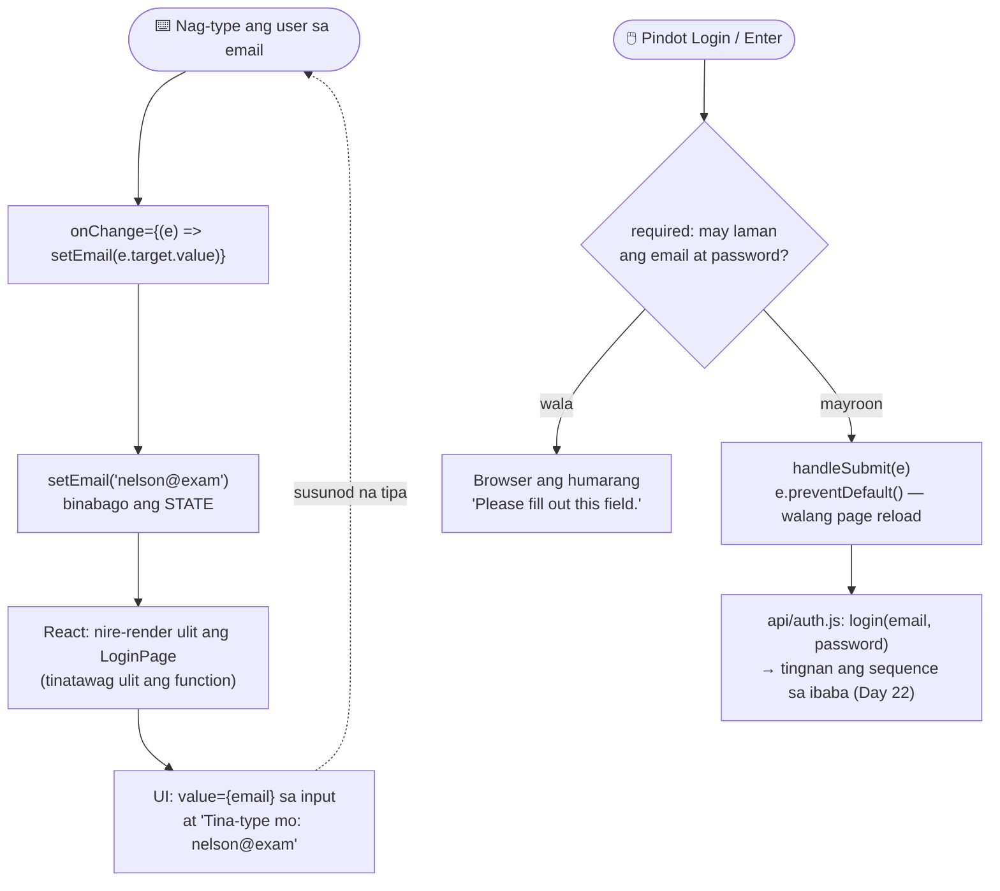
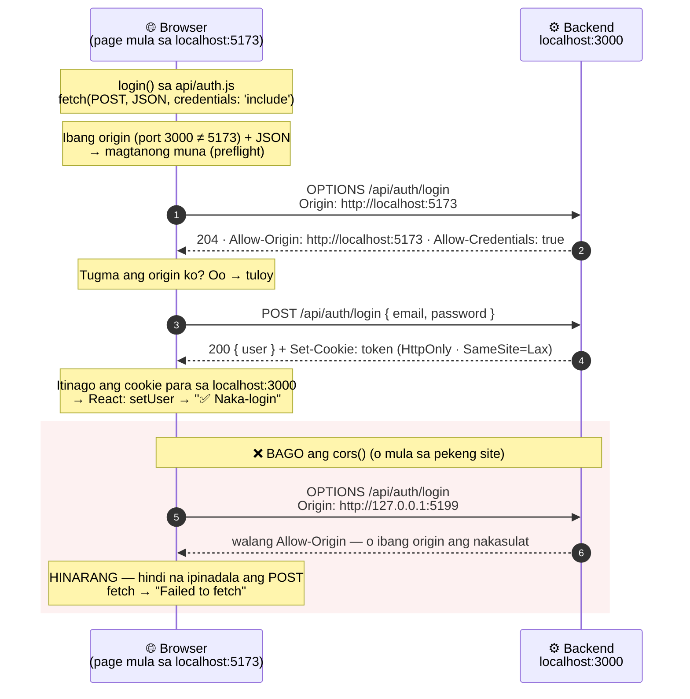
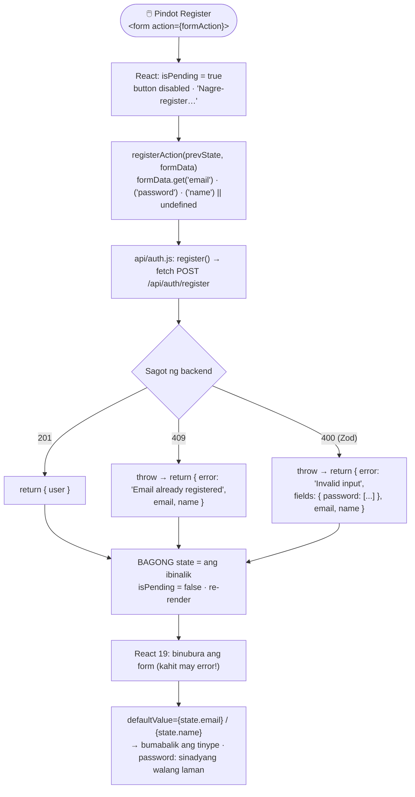
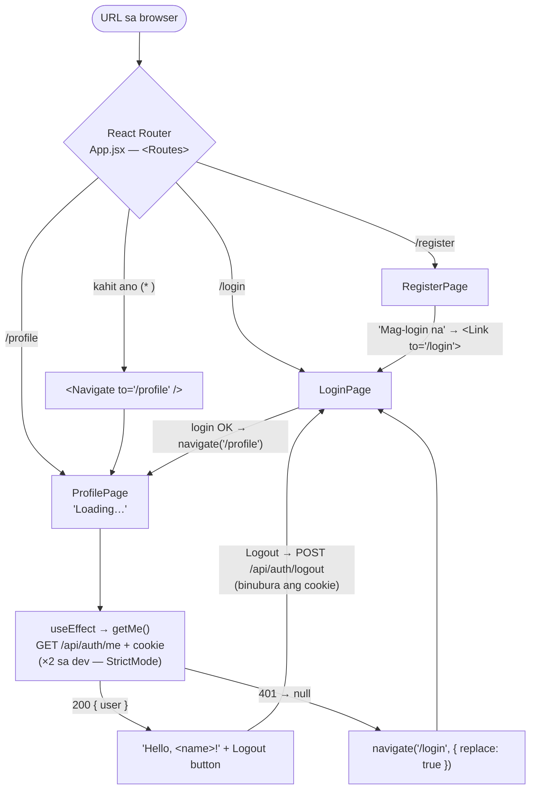

# 07 — Frontend ↔ backend

> 📅 Day 21 · Phase 5 (Login page) · in-update sa Day 22 (fetch + CORS) Day 23 (React 19 `useActionState`) at Day 24 (React Router, protektadong page)
>
> **Code:** `frontend/src/App.jsx` (routes) · `frontend/src/pages/*.jsx` · `frontend/src/api/auth.js` · `backend/src/index.js` (cors)
> **Subukan:** sa browser (F12 → Network) · `backend/http/05-login.http` #6–#7 (preflight)

## Paano gumagana ang login form (state → re-render)

## Mga dapat pansinin

- **`setX(...)`, hindi `x = ...`.** Ang `setX` lang ang nagsasabi sa React na may
  nagbago at kailangang mag-render ulit.
- **Controlled input:** galing sa state ang `value` ng input — ang state ang
  "katotohanan", hindi ang input.
- **`e.preventDefault()`:** kung wala ito, nire-reload ng browser ang buong page
  (lumang paraan ng HTML form) at nawawala ang lahat ng state.
- **Hindi ipinapakita ang password** kahit saan sa page (sinubukan).

## Pagtawag sa backend: fetch + CORS (Day 22)

- **Ang browser ang humaharang, hindi ang server.** Kaya gumagana ang REST
  Client/curl kahit walang CORS — walang browser na nagpoprotekta roon.
- **`credentials` sa dalawang lugar:** `credentials: 'include'` sa fetch (ipadala
  at tanggapin ang cookie) + `credentials: true` sa `cors()` (payagan ito ng server).
  Kulang ang isa → walang cookie.
- **Isang tiyak na origin** mula sa `.env` (`CLIENT_URL`), hindi `*` — hindi rin ito
  papayagan ng browser kapag may cookie.
- **`app.use(cors(...))` bago ang lahat ng router** — para masagot ang `OPTIONS`.
- **`fetch` ay hindi nagtatapon ng error sa 401** — kaya tinitingnan ang `res.ok`.
  Nagtatapon lang ito kapag walang sagot (network o CORS) → "Failed to fetch".
- Sinubukan (Day 22): bago ang cors → "Failed to fetch"; pagkatapos → 200 +
  cookie `token` (HttpOnly, Lax); maling password → "Invalid email or password";
  pekeng site (127.0.0.1:5199) → hinarang.

## Register gamit ang React 19 `useActionState` (Day 23)

- **Ikumpara sa login (Day 21–22):** 4 na `useState`, `onChange` sa bawat input,
  `preventDefault`, at sariling error state → **1 `useActionState`**, walang
  `onChange`, walang `preventDefault`, at kusang `isPending`.
- **⚠️ Binubura ng React 19 ang form pagkatapos ng submit, kahit may error**
  (sinubukan) — kaya ibinabalik ang `email`/`name` sa state at `defaultValue`.
- **`formData.get('name') || undefined`** — ang walang laman na input ay `""`,
  na tatanggihan ni Zod (`min(1)`).
- Sinubukan sa browser (Day 23): 201 ✅ · 409 na nandoon pa ang email ✅ ·
  400 na may mensahe sa ilalim ng password ✅ · "Nagre-register…" + disabled ✅.

## Mga page at protektadong `/profile` (Day 24)

- **SPA:** iisang page — pinapalitan ng React Router ang component nang walang
  reload. `<Link>`, hindi `<a href>` (nire-reload ng `<a>` ang lahat).
- **`react-router`, hindi `react-router-dom`** — pinagsama na mula v7 (8.4 ang gamit).
- **🔐 UX lang ang redirect sa frontend.** Ang tunay na proteksyon ay ang
  `requireAuth` ng backend — kahit alisin ang redirect, 401 pa rin ang `/me`, kaya
  walang data na maipapakita.
- **Refresh ng `/profile`:** naka-login pa rin — nasa cookie ang session, hindi sa
  React state.
- Sinubukan (Day 24, totoong browser): /profile nang hindi naka-login → /login ·
  register → "Mag-login na" → login → /profile "Hello, Flow Test!" · refresh →
  naka-login pa rin · logout → /login, wala nang cookie · /profile at /abc → /login ·
  3 full page load lang sa buong flow (goto, reload, goto).
