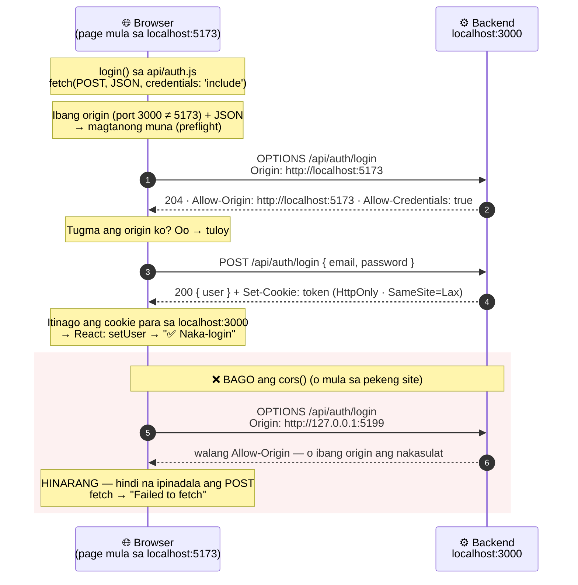

# 07 — Frontend ↔ backend

> 📅 Day 21 · Phase 5 (Login page) · in-update sa Day 22 (fetch + CORS)
>
> **Code:** `frontend/src/pages/LoginPage.jsx` · `frontend/src/api/auth.js` · `backend/src/index.js` (cors)
> **Subukan:** sa browser (F12 → Network) · `backend/http/05-login.http` #6–#7 (preflight)

## Paano gumagana ang login form (state → re-render)

## Mga dapat pansinin

- **`setX(...)`, hindi `x = ...`.** Ang `setX` lang ang nagsasabi sa React na may
  nagbago at kailangang mag-render ulit.
- **Controlled input:** galing sa state ang `value` ng input — ang state ang
  "katotohanan", hindi ang input.
- **`e.preventDefault()`:** kung wala ito, nire-reload ng browser ang buong page
  (lumang paraan ng HTML form) at nawawala ang lahat ng state.
- **Hindi ipinapakita ang password** kahit saan sa page (sinubukan).

## Pagtawag sa backend: fetch + CORS (Day 22)

- **Ang browser ang humaharang, hindi ang server.** Kaya gumagana ang REST
  Client/curl kahit walang CORS — walang browser na nagpoprotekta roon.
- **`credentials` sa dalawang lugar:** `credentials: 'include'` sa fetch (ipadala
  at tanggapin ang cookie) + `credentials: true` sa `cors()` (payagan ito ng server).
  Kulang ang isa → walang cookie.
- **Isang tiyak na origin** mula sa `.env` (`CLIENT_URL`), hindi `*` — hindi rin ito
  papayagan ng browser kapag may cookie.
- **`app.use(cors(...))` bago ang lahat ng router** — para masagot ang `OPTIONS`.
- **`fetch` ay hindi nagtatapon ng error sa 401** — kaya tinitingnan ang `res.ok`.
  Nagtatapon lang ito kapag walang sagot (network o CORS) → "Failed to fetch".
- Sinubukan (Day 22): bago ang cors → "Failed to fetch"; pagkatapos → 200 +
  cookie `token` (HttpOnly, Lax); maling password → "Invalid email or password";
  pekeng site (127.0.0.1:5199) → hinarang.
