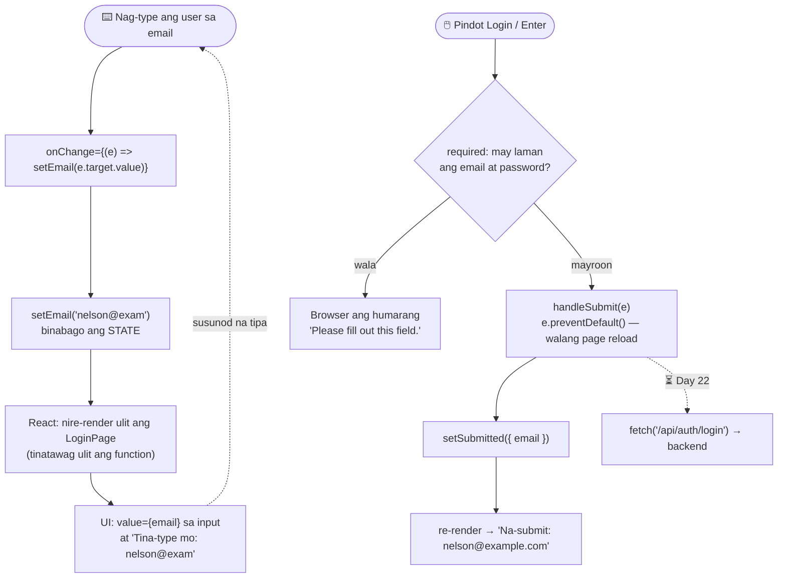

# 07 — Frontend ↔ backend

> 📅 Day 21 · Phase 5 (Login page) · **Bahagi 1: form state** — dadagdagan sa Day 22
> ng pagtawag sa backend (fetch + CORS)
>
> **Code:** `frontend/src/pages/LoginPage.jsx` · `frontend/src/App.jsx`

## Paano gumagana ang login form (state → re-render)

## Mga dapat pansinin

- **`setX(...)`, hindi `x = ...`.** Ang `setX` lang ang nagsasabi sa React na may
  nagbago at kailangang mag-render ulit.
- **Controlled input:** galing sa state ang `value` ng input — ang state ang
  "katotohanan", hindi ang input.
- **`e.preventDefault()`:** kung wala ito, nire-reload ng browser ang buong page
  (lumang paraan ng HTML form) at nawawala ang lahat ng state.
- **Walang request sa Network tab** kapag nag-submit (sinubukan, Day 21) — wala
  pang `fetch`. Iyan ang Day 22.
- **Hindi ipinapakita ang password** kahit saan sa page (sinubukan).
