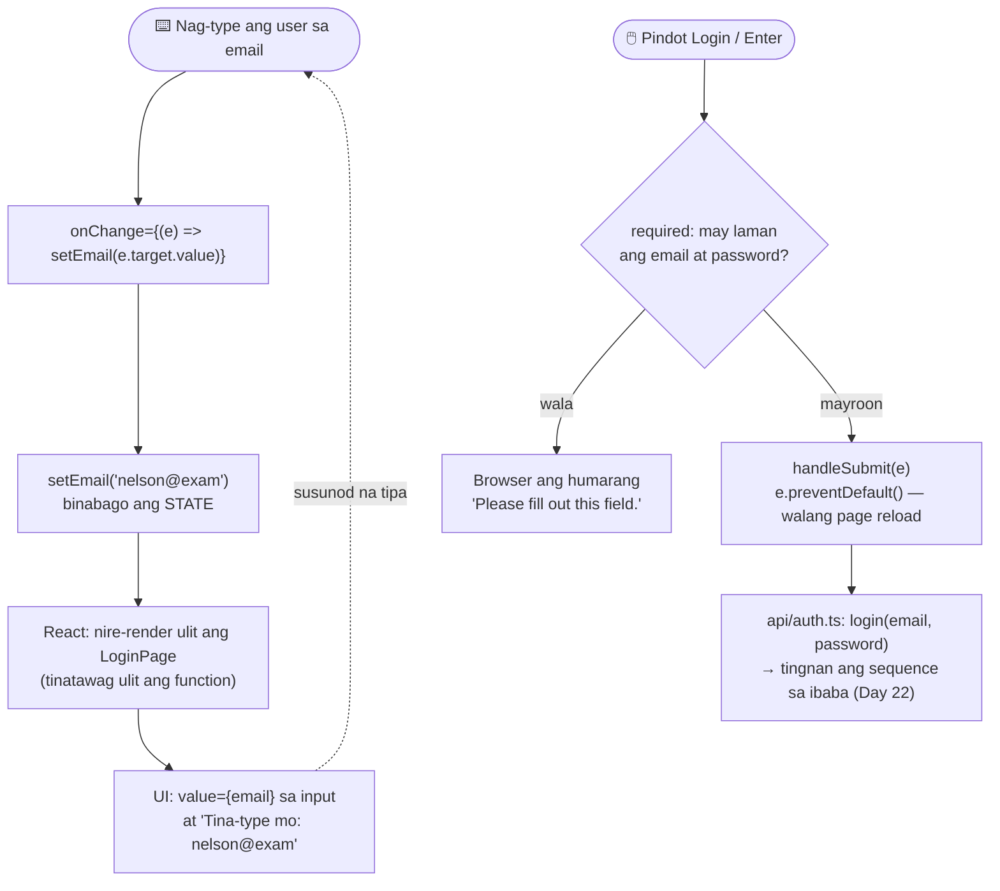
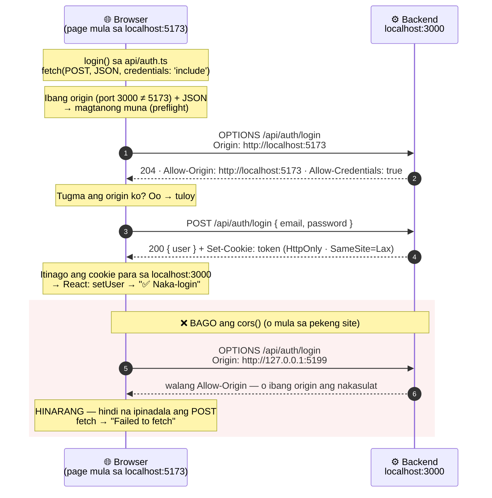
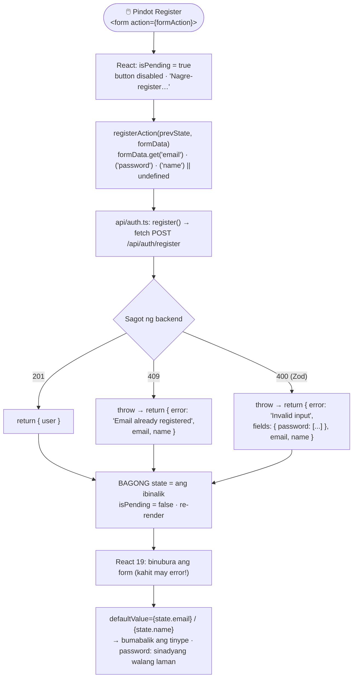
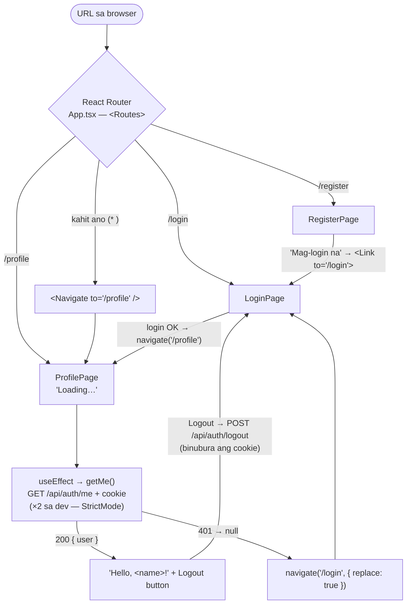
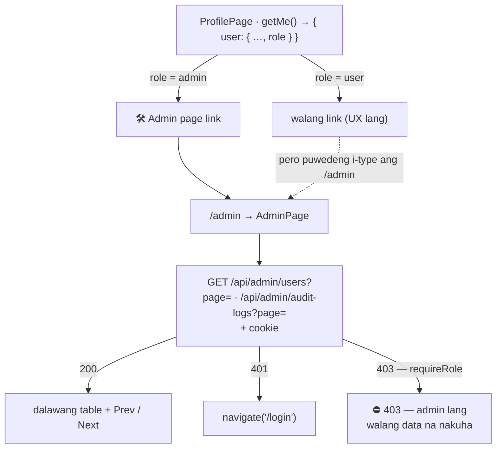
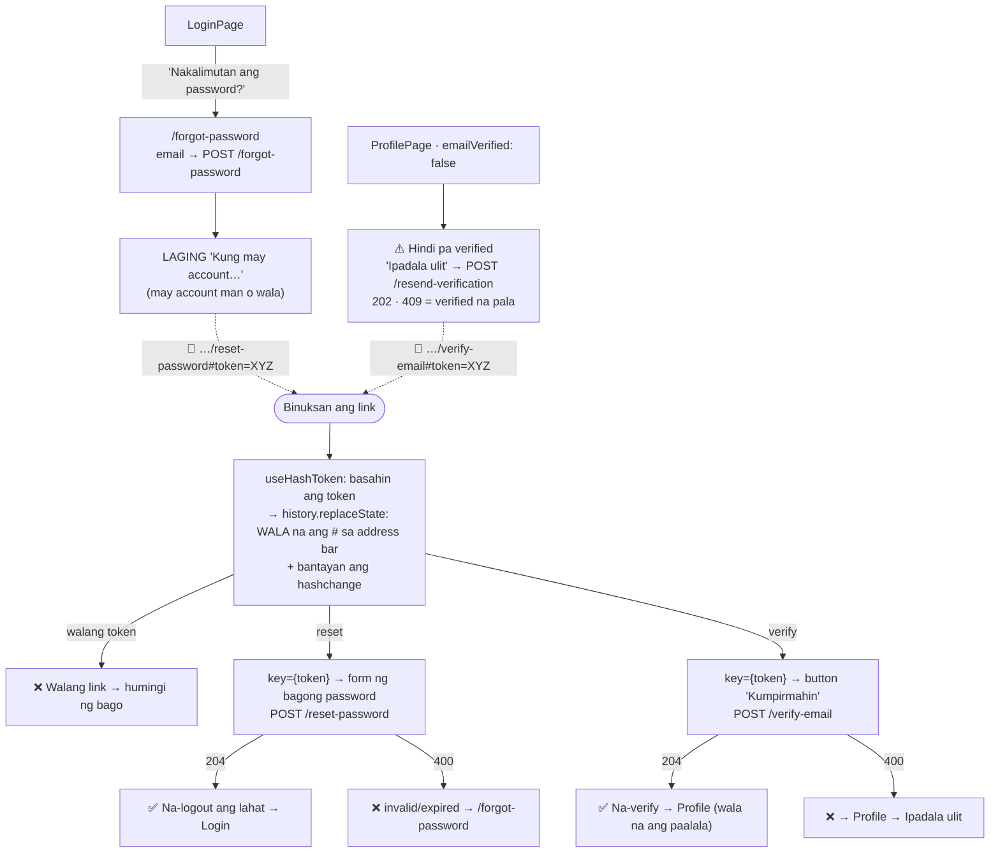

# 07 — Frontend ↔ backend

> 📅 Day 21 · Phase 5 (Login page) · in-update sa Day 22 (fetch + CORS) Day 23 (React 19 `useActionState`) Day 24 (React Router, protektadong page) Day 44 (CSRF: Origin check), Day 49 (admin page), Day 51 (refresh) at Day 61 (mga page mula sa email)
>
> **Code:** `frontend/src/App.tsx` (routes) · `frontend/src/pages/*.tsx` · `frontend/src/api/auth.ts` · `backend/src/index.ts` (cors)
> **Subukan:** sa browser (F12 → Network) · `backend/http/05-login.http` #6–#7 (preflight)

## Paano gumagana ang login form (state → re-render)

```mermaid
flowchart TD
    Type(["⌨️ Nag-type ang user sa email"]) --> OnChange["onChange={(e) => setEmail(e.target.value)}"]
    OnChange --> SetState["setEmail('nelson@exam')<br/>binabago ang STATE"]
    SetState --> Render["React: nire-render ulit ang LoginPage<br/>(tinatawag ulit ang function)"]
    Render --> UI["UI: value={email} sa input<br/>at 'Tina-type mo: nelson@exam'"]
    UI -.->|"susunod na tipa"| Type

    Submit(["🖱️ Pindot Login / Enter"]) --> Req{"required: may laman<br/>ang email at password?"}
    Req -->|"wala"| Block["Browser ang humarang<br/>'Please fill out this field.'"]
    Req -->|"mayroon"| Handle["handleSubmit(e)<br/>e.preventDefault() — walang page reload"]
    Handle --> Fetch["api/auth.ts: login(email, password)<br/>→ tingnan ang sequence sa ibaba (Day 22)"]
```

## Mga dapat pansinin

- **`setX(...)`, hindi `x = ...`.** Ang `setX` lang ang nagsasabi sa React na may
  nagbago at kailangang mag-render ulit.
- **Controlled input:** galing sa state ang `value` ng input — ang state ang
  "katotohanan", hindi ang input.
- **`e.preventDefault()`:** kung wala ito, nire-reload ng browser ang buong page
  (lumang paraan ng HTML form) at nawawala ang lahat ng state.
- **Hindi ipinapakita ang password** kahit saan sa page (sinubukan).

## Pagtawag sa backend: fetch + CORS (Day 22)

```mermaid
sequenceDiagram
    autonumber
    participant B as 🌐 Browser<br/>(page mula sa localhost:5173)
    participant S as ⚙️ Backend<br/>localhost:3000

    Note over B: login() sa api/auth.ts<br/>fetch(POST, JSON, credentials: 'include')
    Note over B: Ibang origin (port 3000 ≠ 5173) + JSON<br/>→ magtanong muna (preflight)
    B->>S: OPTIONS /api/auth/login<br/>Origin: http://localhost:5173
    S-->>B: 204 · Allow-Origin: http://localhost:5173 · Allow-Credentials: true
    Note over B: Tugma ang origin ko? Oo → tuloy
    B->>S: POST /api/auth/login { email, password }
    S-->>B: 200 { user } + Set-Cookie: token (HttpOnly · SameSite=Lax)
    Note over B: Itinago ang cookie para sa localhost:3000<br/>→ React: setUser → "✅ Naka-login"

    rect rgba(220,80,80,0.08)
    Note over B,S: ❌ BAGO ang cors() (o mula sa pekeng site)
    B->>S: OPTIONS /api/auth/login<br/>Origin: http://127.0.0.1:5199
    S-->>B: walang Allow-Origin — o ibang origin ang nakasulat
    Note over B: HINARANG — hindi na ipinadala ang POST<br/>fetch → "Failed to fetch"
    end
```

- **Ang browser ang humaharang, hindi ang server.** Kaya gumagana ang REST
  Client/curl kahit walang CORS — walang browser na nagpoprotekta roon.
- **`credentials` sa dalawang lugar:** `credentials: 'include'` sa fetch (ipadala
  at tanggapin ang cookie) + `credentials: true` sa `cors()` (payagan ito ng server).
  Kulang ang isa → walang cookie.
- **Isang tiyak na origin** mula sa `.env` (`CLIENT_URL`), hindi `*` — hindi rin ito
  papayagan ng browser kapag may cookie.
- **`app.use(cors(...))` bago ang lahat ng router** — para masagot ang `OPTIONS`.
- **`fetch` ay hindi nagtatapon ng error sa 401** — kaya tinitingnan ang `res.ok`.
  Nagtatapon lang ito kapag walang sagot (network o CORS) → "Failed to fetch".
- Sinubukan (Day 22): bago ang cors → "Failed to fetch"; pagkatapos → 200 +
  cookie `token` (HttpOnly, Lax); maling password → "Invalid email or password";
  pekeng site (127.0.0.1:5199) → hinarang.
- **Hinaharang ng CORS ang pagbasa ng sagot, hindi ang lahat ng pagpapadala.** Ang HTML form o
  `no-cors` fetch mula sa pekeng site ay **nakakarating** pa rin sa server. Kaya may
  **Origin check** sa server (Day 44, `middleware/csrf.ts`): ang POST ay dapat may
  `Origin: http://localhost:5173` (production: `https://nelson1869.com`), kung hindi ay 403.
  Kusang inilalagay ng browser ang `Origin`, kaya **walang binago sa frontend**.
  Tingnan ang diagram 12.

## Register gamit ang React 19 `useActionState` (Day 23)

```mermaid
flowchart TD
    Sub(["🖱️ Pindot Register<br/>&lt;form action={formAction}&gt;"]) --> Pend["React: isPending = true<br/>button disabled · 'Nagre-register…'"]
    Pend --> Act["registerAction(prevState, formData)<br/>formData.get('email') · ('password') · ('name') || undefined"]
    Act --> Api["api/auth.ts: register() → fetch POST /api/auth/register"]
    Api --> Res{"Sagot ng backend"}
    Res -->|"201"| Ok["return { user }"]
    Res -->|"409"| E409["throw → return { error: 'Email already registered',<br/>email, name }"]
    Res -->|"400 (Zod)"| E400["throw → return { error: 'Invalid input',<br/>fields: { password: [...] }, email, name }"]
    Ok --> New["BAGONG state = ang ibinalik<br/>isPending = false · re-render"]
    E409 --> New
    E400 --> New
    New --> Reset["React 19: binubura ang form (kahit may error!)"]
    Reset --> DV["defaultValue={state.email} / {state.name}<br/>→ bumabalik ang tinype · password: sinadyang walang laman"]
```

- **Ikumpara sa login (Day 21–22):** 4 na `useState`, `onChange` sa bawat input,
  `preventDefault`, at sariling error state → **1 `useActionState`**, walang
  `onChange`, walang `preventDefault`, at kusang `isPending`.
- **⚠️ Binubura ng React 19 ang form pagkatapos ng submit, kahit may error**
  (sinubukan) — kaya ibinabalik ang `email`/`name` sa state at `defaultValue`.
- **`formData.get('name') || undefined`** — ang walang laman na input ay `""`,
  na tatanggihan ni Zod (`min(1)`).
- Sinubukan sa browser (Day 23): 201 ✅ · 409 na nandoon pa ang email ✅ ·
  400 na may mensahe sa ilalim ng password ✅ · "Nagre-register…" + disabled ✅.

## Mga page at protektadong `/profile` (Day 24)

```mermaid
flowchart TD
    URL(["URL sa browser"]) --> R{"React Router<br/>App.tsx — &lt;Routes&gt;"}
    R -->|"/login"| L["LoginPage"]
    R -->|"/register"| G["RegisterPage"]
    R -->|"/profile"| P["ProfilePage<br/>'Loading…'"]
    R -->|"kahit ano (* )"| N["&lt;Navigate to='/profile' /&gt;"] --> P
    L -->|"login OK → navigate('/profile')"| P
    G -->|"'Mag-login na' → &lt;Link to='/login'&gt;"| L
    P --> Eff["useEffect → getMe()<br/>GET /api/auth/me + cookie<br/>(×2 sa dev — StrictMode)"]
    Eff -->|"200 { user }"| Show["'Hello, &lt;name&gt;!' + Logout button"]
    Eff -->|"401 → null"| Back["navigate('/login', { replace: true })"] --> L
    Show -->|"Logout → POST /api/auth/logout<br/>(binubura ang cookie)"| L
```

- **SPA:** iisang page — pinapalitan ng React Router ang component nang walang
  reload. `<Link>`, hindi `<a href>` (nire-reload ng `<a>` ang lahat).
- **`react-router`, hindi `react-router-dom`** — pinagsama na mula v7 (8.4 ang gamit).
- **🔐 UX lang ang redirect sa frontend.** Ang tunay na proteksyon ay ang
  `requireAuth` ng backend — kahit alisin ang redirect, 401 pa rin ang `/me`, kaya
  walang data na maipapakita.
- **Refresh ng `/profile`:** naka-login pa rin — nasa cookie ang session, hindi sa
  React state.
- Sinubukan (Day 24, totoong browser): /profile nang hindi naka-login → /login ·
  register → "Mag-login na" → login → /profile "Hello, Flow Test!" · refresh →
  naka-login pa rin · logout → /login, wala nang cookie · /profile at /abc → /login ·
  3 full page load lang sa buong flow (goto, reload, goto).

## Admin page — itinatago ang link, pero ang BACKEND ang bantay (Day 49)

> 📅 Day 49 · Phase 10 · **Code:** `frontend/src/pages/AdminPage.tsx` · `frontend/src/api/admin.ts` ·
> `ProfilePage.tsx` (link) · backend: `routes/admin.ts` (bantay) → `controllers/admin.controller.ts` → `services/admin.service.ts` (Day 76), `middleware/requireRole.ts`

```mermaid
flowchart TD
    Me["ProfilePage · getMe() → { user: { …, role } }"] -->|"role = admin"| Link["🛠️ Admin page link"]
    Me -->|"role = user"| NoLink["walang link (UX lang)"]
    Link --> Admin["/admin → AdminPage"]
    NoLink -.->|"pero puwedeng i-type ang /admin"| Admin
    Admin --> Fetch["GET /api/admin/users?page= · /api/admin/audit-logs?page=<br/>+ cookie"]
    Fetch -->|"200"| Tables["dalawang table + Prev / Next"]
    Fetch -->|"401"| Login["navigate('/login')"]
    Fetch -->|"403 — requireRole"| Denied["⛔ 403 — admin lang<br/>walang data na nakuha"]
```

- **Ang pagtago ng link ay UX, hindi security.** Kayang i-type ng kahit sino ang `/admin`, o baguhin ang
  JavaScript sa DevTools. Walang data na lalabas, dahil 403 ang sagot ng API (`requireRole`, Day 46).
- **Walang "admin check" sa AdminPage mismo.** Ang sagot ng backend (200/401/403) ang nagpapasya kung ano ang ipapakita.
- **`ignore` sa `useEffect`:** kapag mabilis na pinindot ang Next, ang lumang sagot na huling dumating ay hindi papalit sa bago.
- **Malapad na table sa phone:** `.table-wrap { overflow-x: auto }`. Ang table ang nag-i-scroll, hindi ang buong page.
- **Day 51 — `apiFetch`:** kapag 401 (expired ang 15-minutong access token), isang `POST /api/auth/refresh` →
  inuulit ang request. **Isang refresh lang** kahit sabay na nag-401 ang dalawang listahan (single-flight).
  Sinubukan: binura ang `token` cookie → Admin page: 4 na 401 → **1** refresh → 200 lahat.
- Sinubukan (Day 49, totoong browser, 390px):
  - admin → may link, 2 table, Next → "Page 2 of 6", 0 JS error;
  - user → walang link, `/admin` → "⛔ 403";
  - walang login → `/login`.

## Mga page mula sa link sa email (Day 61)

> 📅 Day 61 · Phase 12 · **Code:** `frontend/src/pages/ForgotPasswordPage.tsx` · `ResetPasswordPage.tsx` · `VerifyEmailPage.tsx` ·
> `ProfilePage.tsx` (paalala) · `hooks/useHashToken.ts` · `api/auth.ts` · backend: diagram 18 at 19

```mermaid
flowchart TD
    Login["LoginPage"] -->|"'Nakalimutan ang password?'"| Forgot["/forgot-password<br/>email → POST /forgot-password"]
    Forgot --> Same["LAGING 'Kung may account…'<br/>(may account man o wala)"]
    Same -.->|"📧 …/reset-password#token=XYZ"| Open(["Binuksan ang link"])
    Prof["ProfilePage · emailVerified: false"] --> Banner["⚠️ Hindi pa verified<br/>'Ipadala ulit' → POST /resend-verification<br/>202 · 409 = verified na pala"]
    Banner -.->|"📧 …/verify-email#token=XYZ"| Open
    Open --> Hook["useHashToken: basahin ang token<br/>→ history.replaceState: WALA na ang # sa address bar<br/>+ bantayan ang hashchange"]
    Hook -->|"walang token"| None["❌ Walang link → humingi ng bago"]
    Hook -->|"reset"| RForm["key={token} → form ng bagong password<br/>POST /reset-password"]
    Hook -->|"verify"| VBtn["key={token} → button 'Kumpirmahin'<br/>POST /verify-email"]
    RForm -->|"204"| RDone["✅ Na-logout ang lahat → Login"]
    RForm -->|"400"| RErr["❌ invalid/expired → /forgot-password"]
    VBtn -->|"204"| VDone["✅ Na-verify → Profile (wala na ang paalala)"]
    VBtn -->|"400"| VErr["❌ → Profile → Ipadala ulit"]
```

- **Tinatanggal ang token sa address bar** pagkabasa: hindi ito mapupunta sa history, sa screenshot, o sa Referer.
  Nasa `#` ito kaya hindi rin umaabot sa server logs ng Cloudflare Pages (Day 59).
- **Button ang verify, hindi kusa pagbukas ng page.** Sa dev, dalawang beses tumatakbo ang `useEffect` (StrictMode):
  magtatagumpay ang una, 400 ang pangalawa, at magulo ang ipapakita. May mga email scanner din na nagbubukas ng link bago pa ang tao.
- **`hashchange` + `key={token}`** (nahanap ng browser test): kapag nag-paste ng bagong link sa tab na bukas pa ang page,
  `#` lang ang nagbago, walang reload. Kung wala ang pagbabantay, ang LUMANG token pa rin ang ginagamit, kaya lumang error ang lumalabas.
  Ang `key` ang nagbibigay ng bagong form (malinis na state) sa bawat bagong token. Sinubukan: tinanggal ang listener → bumagsak ang test.
- **Soft (D-026):** paalala lang ang banner. Walang page na humaharang sa hindi pa verified.
- Sinubukan (Day 61, Playwright, dev): 15 check — banner · resend → bagong link · lumang link → error · walang # sa URL ·
  verify → wala na ang banner · parehong mensahe kahit walang account · maikling password → error · bagong password → login OK ·
  gamit na ang link → error · page na walang token.
