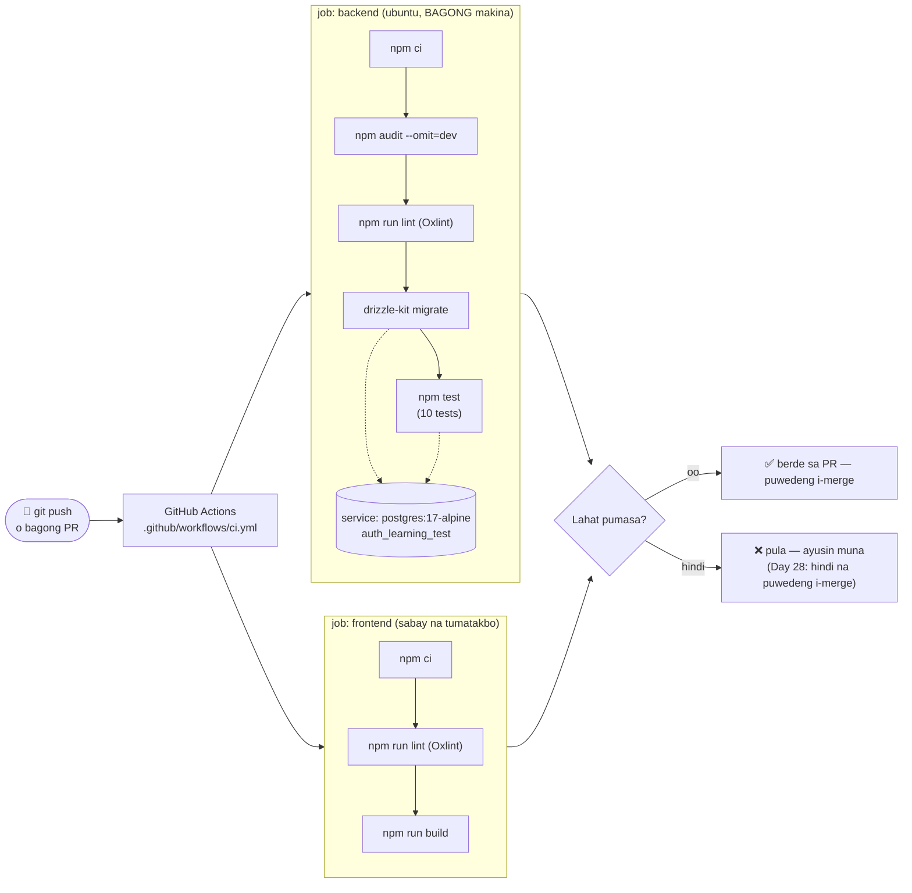

# 08 — CI pipeline (GitHub Actions)

> 📅 Day 27 · Phase 6 (Tests at CI)
>
> **Code:** `.github/workflows/ci.yml` · `backend/src/test/setup.js` · `backend/vitest.config.js`
> **Subukan:** gumawa ng PR → tingnan ang "Checks" sa PR, o ang tab na **Actions** sa GitHub

## Mga dapat pansinin

- **Bagong malinis na makina bawat run** — walang `.env`, walang lumang
  `node_modules`, walang naiwang data. Kaya ito ang tunay na patunay, hindi ang
  "gumagana sa PC ko".
- **Walang `.env.test` sa CI** (gitignored). Galing sa `env:` ng workflow ang
  `DATABASE_URL`, `JWT_SECRET`, `CLIENT_URL` — mga halagang pang-CI lang, hindi
  totoong secret. Kaya `try { process.loadEnvFile(...) } catch {}` sa `setup.js`
  (nahuli bago pa mag-push: `ENOENT ... '.env.test'` → lahat ng test ay pumalya).
- **Pananggalang pa rin:** tumatanggi ang tests kapag hindi `*_test` ang database.
- **`npm ci`**, hindi `npm install` — eksaktong versions mula sa `package-lock.json`.
- Sinubukan bago i-push (Day 27): `actionlint` walang error; at isang malinis na
  kopya ng repo (walang `.env`/`node_modules`) + bagong database → lahat ng hakbang
  ng dalawang job ay pumasa.
