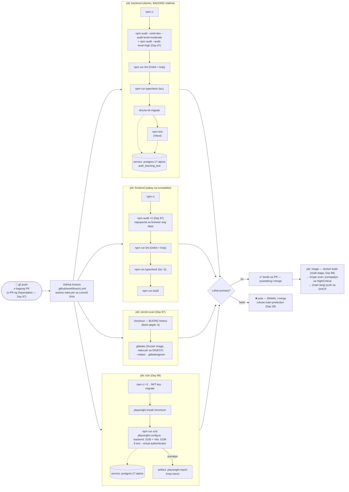

# 08 — CI pipeline (GitHub Actions)

> 📅 Day 27 · Phase 6 (Tests at CI) · in-update sa Day 28 (branch protection), Phase 7 (type-check), Day 87 (supply chain), Day 88 (container scanning) at Day 99 (E2E)
>
> **Code:** `.github/workflows/ci.yml` · `.github/dependabot.yml` · `.gitleaksignore` · `backend/src/test/setup.ts` · `backend/vitest.config.ts`
> **Subukan (Day 87–88):** `backend/http/31-supply-chain.http` · `32-container-scanning.http`
> **Subukan:** gumawa ng PR → tingnan ang "Checks" sa PR, o ang tab na **Actions** sa GitHub

```mermaid
flowchart LR
    Dev(["👤 git push<br/>o bagong PR<br/>(o PR ng Dependabot — Day 87)"]) --> GH["GitHub Actions<br/>.github/workflows/ci.yml<br/>actions naka-pin sa commit SHA"]
    GH --> BE
    GH --> FE
    GH --> SS
    GH --> E2E
    subgraph BE["job: backend (ubuntu, BAGONG makina)"]
        direction TB
        PG[("service: postgres:17-alpine<br/>auth_learning_test")]
        B1["npm ci"] --> B2["npm audit --omit=dev --audit-level=moderate<br/>+ npm audit --audit-level=high (Day 87)"] --> B3["npm run lint (Oxlint + knip)"] --> B3b["npm run typecheck (tsc)"] --> B4["drizzle-kit migrate"] --> B5["npm test<br/>(Vitest)"]
        B4 -.-> PG
        B5 -.-> PG
    end
    subgraph FE["job: frontend (sabay na tumatakbo)"]
        direction TB
        F1["npm ci"] --> F1b["npm audit ×2 (Day 87)<br/>napupunta sa browser ang deps"] --> F2["npm run lint (Oxlint + knip)"] --> F2b["npm run typecheck (tsc -b)"] --> F3["npm run build"]
    end
    subgraph SS["job: secret-scan (Day 87)"]
        direction TB
        S1["checkout — BUONG history<br/>(fetch-depth: 0)"] --> S2["gitleaks (Docker image, naka-pin sa DIGEST)<br/>--redact · .gitleaksignore"]
    end
    subgraph E2E["job: e2e (Day 99)"]
        direction TB
        EPG[("service: postgres:17-alpine")]
        E1["npm ci ×2 · JWT key · migrate"] --> E2["playwright install chromium"] --> E3["npm run e2e<br/>playwright.config.ts: backend :3100 + Vite :5199<br/>8 test · virtual authenticator"]
        E3 -.-> EPG
        E3 -->|"pumalya"| E4["artifact: playwright-report<br/>(may trace)"]
    end
    BE --> R{"Lahat pumasa?"}
    FE --> R
    SS --> R
    E2E --> R
    R -->|"oo"| OK["✅ berde sa PR — puwedeng i-merge"]
    OK --> IMG["job: image — docker build (multi-stage, Day 88)<br/>→ Grype scan: pumapalya sa High/Critical<br/>→ (main lang) push sa GHCR"]
    R -->|"hindi"| NO["❌ pula — BAWAL i-merge<br/>ruleset main-protection (Day 28)"]
```

## Mga dapat pansinin

- **Bagong malinis na makina bawat run** — walang `.env`, walang lumang
  `node_modules`, walang naiwang data. Kaya ito ang tunay na patunay, hindi ang
  "gumagana sa PC ko".
- **Walang `.env.test` sa CI** (gitignored). Galing sa `env:` ng workflow ang
  `DATABASE_URL`, `CLIENT_URL` — mga halagang pang-CI lang, hindi
  totoong secret. Ang `JWT_PRIVATE_KEY` (Day 56) ay bagong RSA key sa BAWAT run (`openssl genpkey` → `$GITHUB_ENV`). Kaya `try { process.loadEnvFile(...) } catch {}` sa `setup.js`
  (nahuli bago pa mag-push: `ENOENT ... '.env.test'` → lahat ng test ay pumalya).
- **Pananggalang pa rin:** tumatanggi ang tests kapag hindi `*_test` ang database.
- **`npm ci`**, hindi `npm install` — eksaktong versions mula sa `package-lock.json`.
- Sinubukan bago i-push (Day 27): `actionlint` walang error; at isang malinis na
  kopya ng repo (walang `.env`/`node_modules`) + bagong database → lahat ng hakbang
  ng dalawang job ay pumasa.

## Supply chain (Day 87) — Desisyon: D-029

- **Ang panganib:** ang code natin ay maliit na bahagi lang ng tumatakbo. Daan-daang package ang isinulat ng ibang tao,
  at bawat isa ay puwedeng may butas, o maging malisyoso (ninakaw na account ng maintainer, pekeng version).
- **`npm audit`, dalawang antas, backend AT frontend:** production → pumapalya kahit **moderate**; lahat (kasama ang dev tools) → **high**.
  Tinanggap: 4 na moderate sa dev ng backend = iisang esbuild advisory via drizzle-kit (dev server lang; ang "fix" ay downgrade).
- **gitleaks sa BUONG history:** ang secret na binura sa sumunod na commit ay nasa history pa rin, at **public ang repo**.
  Sinubukan: pekeng token na idinagdag tapos binura → exit 1. Ang unang scan (361 commit): 1 false positive (`argon2.verify`) → `.gitleaksignore`.
- **Naka-pin sa hindi nababagong reference:** gitleaks bilang Docker image na may `@sha256:` digest; ang mga action sa commit SHA.
  Ang tag (`v7`, `v8.30.1`) ay puwedeng ilipat sa ibang code — nangyari ito sa trivy-action noong 2026-03 (aral ng reference).
- **Dependabot** (`.github/dependabot.yml`): lingguhan, npm ×2, actions, Docker base image, at mga image sa `devops/`.
  **cooldown 7 araw:** hindi agad nagmumungkahi ng bagong labas na version (ang mga malisyosong version ay kadalasang inaalis sa loob ng ilang araw).
- **GitHub (Settings):** secret scanning + push protection = **naka-on** (Day 87, libre sa public repo). Dependabot alerts = naka-off (desisyon ni Nelson).
- **Container scanning (Day 88, D-030):** Grype sa built image, bago ang push. Ang image na naka-deploy noon (single stage) ay papalya (zlib High);
  ang multi-stage ay pumapasa. Nakikita ng scanner ang Alpine packages, ang npm packages, **at ang `node` binary** (sinuri gamit ang syft).

## Branch protection (Day 28)

Ruleset **`main-protection`** (active, target: default branch, walang bypass):
restrict deletions · block force pushes · **PR required** (0 approvals) ·
**required checks: `backend`, `frontend`**.

- Gumagana lang sa GitHub Free kapag **public** ang repo (D-016).
- Patunay: PR #33 na may `expect(1 + 1).toBe(3)` → CI: `1 failed | 10 passed` →
  ❌ `backend` → hindi puwedeng i-merge. Isinara nang hindi mine-merge.
- **Walang bypass** — kasama si Nelson. Iyan ang punto: "never break main".
