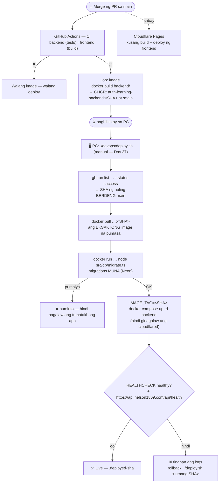

# 09 — CD pipeline (pull-based deploy)

> 📅 Day 37 · Phase 8 · **Code:** `.github/workflows/ci.yml` (job `image`) · `devops/deploy.sh` ·
> `devops/docker-compose.prod.yml` · `backend/src/db/migrate.ts` · **Desisyon:** D-020

## Mula merge hanggang live

## Mga dapat pansinin

- **Pull, hindi push:** ang PC ang humihila ng image. Walang self-hosted runner, kaya walang
  code mula sa labas (hal. PR ng ibang tao sa public repo) na kusang tumatakbo sa PC (D-020).
- **Eksaktong commit:** ang dine-deploy ay ang image na binuo ng CI para sa SHA na iyon —
  hindi "kung ano ang nasa working copy". Parehong prinsipyo sa reference (item 22), ibang paraan.
- **Migrations sa loob ng image** (`drizzle-orm` migrator, prod dependency) — walang hiwalay
  na "migrate" image na puwedeng maging luma (aral ng reference: stale migrate image, #21).
- **Rollback:** `./devops/deploy.sh <lumang SHA>` — nasa GHCR pa ang lumang image.
  ⚠️ Hindi binabawi ang migration — ang schema ay dapat laging tugma sa luma AT bagong code.
- **Manual muna, tapos automate:** isang command ngayon; sa susunod, timer na nagpapatakbo nito.
