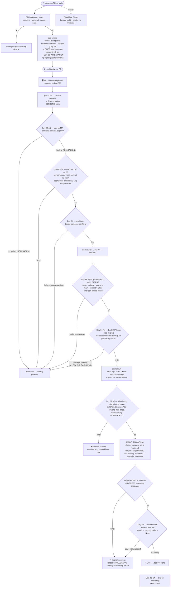

# 09 — CD pipeline (pull-based deploy)

> 📅 Day 37 · Phase 8 · in-update sa Day 80 (liveness sa HEALTHCHECK, readiness sa deploy) · Day 82–84 (monitoring, pre-flight) · Day 85 (graceful shutdown) · Day 89 (ligtas na CD) · Day 91 (backup bago mag-migrate) · **Code:** `.github/workflows/ci.yml` (job `image`) · `devops/deploy.sh` ·
> `devops/docker-compose.prod.yml` · `backend/src/db/migrate.ts` · `backend/src/db/verifyMigrations.ts` · **Desisyon:** D-020, D-031

## Mula merge hanggang live

```mermaid
flowchart TD
    Merge(["👤 Merge ng PR sa main"]) --> CI["GitHub Actions — CI<br/>backend · frontend · secret-scan"]
    CI -->|"❌"| Stop["Walang image — walang deploy"]
    CI -->|"✅"| Img["job: image<br/>docker build (label: revision=&lt;SHA&gt;) → Grype (Day 88)<br/>→ GHCR: auth-learning-backend:&lt;SHA&gt;<br/>→ Day 89: ATTESTATION ng digest (Sigstore/OIDC)"]
    Merge -.->|"sabay"| Pages["Cloudflare Pages<br/>kusang build + deploy ng frontend"]
    Img --> Wait(["⏳ naghihintay sa PC"])
    Wait --> Deploy["🖥️ PC: ./devops/deploy.sh<br/>(manual — Day 37)"]
    Deploy --> Pick["gh run list … --status success<br/>→ SHA ng huling BERDENG main"]
    Pick --> A{"Day 89 (a) — mas LUMA ba kaysa sa naka-deploy?"}
    A -->|"oo, walang ROLLBACK=1"| X["❌ huminto — walang ginalaw"]
    A -->|"hindi (o ROLLBACK=1)"| B{"Day 89 (b) — ang devops/ sa PC<br/>ay pareho ng nasa commit na iyon?<br/>(compose, monitoring, ang script mismo)"}
    B -->|"hindi"| X
    B -->|"oo"| Pre{"Day 84 — pre-flight:<br/>docker compose config -q"}
    Pre -->|"kulang ang devops/.env"| X
    Pre -->|"OK"| Pull["docker pull …:&lt;SHA&gt; → DIGEST"]
    Pull --> C{"Day 89 (c) — gh attestation verify DIGEST<br/>signer = ci.yml · source = main · commit = SHA<br/>· hindi self-hosted runner"}
    C -->|"hindi mapatunayan"| X
    C -->|"✅"| Bk{"Day 91 (e) — BACKUP bago mag-migrate<br/>database/backups/backup.sh pre-deploy-&lt;sha&gt;"}
    Bk -->|"pumalya (walang ALLOW_NO_BACKUP=1)"| X
    Bk -->|"💾 ok"| Mig["docker run IMAGE@DIGEST node src/db/migrate.ts<br/>migrations MUNA (Neon)"]
    Mig --> D{"Day 89 (d) — lahat ba ng migration sa image<br/>ay NASA database? (at walang mas bago,<br/>maliban kung ROLLBACK=1)"}
    D -->|"hindi"| Abort["❌ huminto — hindi nagalaw ang tumatakbong app"]
    D -->|"oo"| Up["IMAGE_TAG=&lt;SHA&gt; docker compose up -d backend<br/>Day 85: ang LUMANG container ay SIGTERM → graceful shutdown"]
    Up --> Health{"HEALTHCHECK healthy?<br/>(LIVENESS — walang database)"}
    Health -->|"oo"| Ready{"Day 80 — READINESS mula sa internet:<br/>tunnel → bagong code → Neon"}
    Health -->|"hindi"| Fail["❌ tingnan ang logs<br/>rollback: ROLLBACK=1 ./deploy.sh &lt;lumang SHA&gt;"]
    Ready -->|"200 ready"| Live["✅ Live — .deployed-sha"]
    Live --> Mon["Day 82–84 — step 7: monitoring<br/>HINDI fatal"]
    Ready -->|"503 · walang sagot"| Fail
```

## Mga dapat pansinin

- **Pull, hindi push:** ang PC ang humihila ng image. Walang self-hosted runner, kaya walang
  code mula sa labas (hal. PR ng ibang tao sa public repo) na kusang tumatakbo sa PC (D-020).
- **Eksaktong commit:** ang dine-deploy ay ang image na binuo ng CI para sa SHA na iyon.
  ⚠️ **Hanggang Day 88, kalahati lang ito ang totoo:** ang IMAGE ay galing sa CI, pero ang compose, monitoring at cloudflared config
  ay galing sa **working copy** ng PC — kahit anong branch ang naka-checkout (sinubukan: `stop_grace_period` 99s sa working copy
  ang gagamitin, habang 10s sa commit). **Day 89:** tumatanggi ang deploy kapag iba ang `devops/` sa commit (insidente #18 ng reference).
- **Attestation (Day 89):** ang tag `:<SHA>` ay pangalan lang — kahit sinong may `packages:write` ay puwedeng ilipat ito.
  Ang attestation ay nilagdaang patunay (Sigstore, OIDC ng GitHub — walang key na iniimbak) na ang DIGEST na ito ay binuo ng `ci.yml`
  mula sa commit na ito sa `main`. Sinusuri ito ng deploy bago mag-migrate; tumatakbo ang migrate sa **digest**, hindi sa tag.
- **Migrations, SINUSURI (Day 89):** pagkatapos ng `migrate()`, ikinukumpara ang journal ng image sa `drizzle.__drizzle_migrations`.
  **Nahuli:** ang drizzle ay nag-a-apply lang ng migration na mas BAGO ang timestamp kaysa sa huling na-apply — ang migration mula sa
  matagal na branch ay **tahimik na nilalaktawan**, at "applied" pa rin ang sinasabi. Ngayon: exit 1, hindi ni-restart ang backend.
- **Migrations sa loob ng image** (`drizzle-orm` migrator, prod dependency) — walang hiwalay
  na "migrate" image na puwedeng maging luma (aral ng reference: stale migrate image, #21).
- **Pre-flight (Day 84):** binabasa ng Compose ang BUONG file, kaya ang kulang na variable ng monitoring sa `devops/.env`
  ay magpapapalya pati sa `up backend`. Kaya sinusuri ito bago mag-pull at mag-migrate.
- **Rollback:** `ROLLBACK=1 ./devops/deploy.sh <lumang SHA>` — nasa GHCR pa ang lumang image. Kailangan ang `ROLLBACK=1` (Day 89)
  para hindi ito mangyari nang hindi sinasadya, at para payagan ang database na mas bago kaysa sa image.
  ⚠️ Hindi binabawi ang migration — ang schema ay dapat laging tugma sa luma AT bagong code.
  Ang mga image bago ang Day 89 ay walang attestation: dagdag na `ALLOW_UNATTESTED=1`.
- **Manual muna, tapos automate:** isang command ngayon; sa susunod, timer na nagpapatakbo nito.
