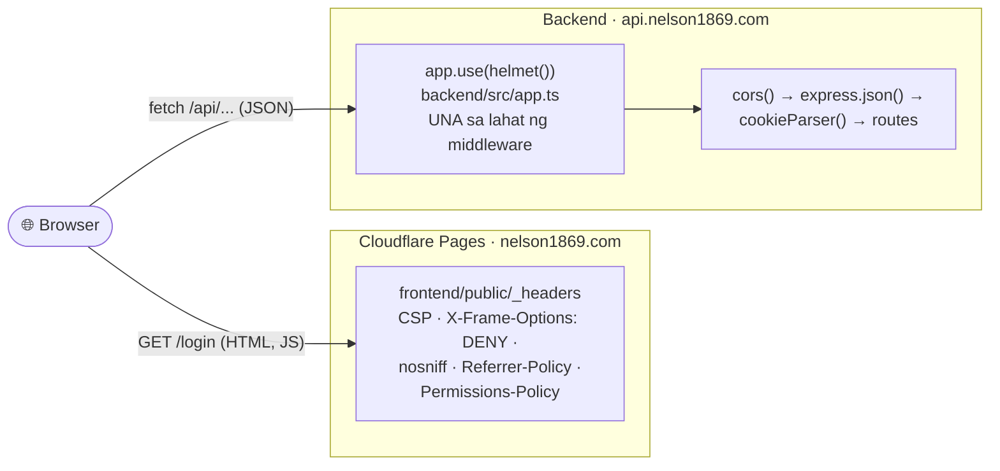
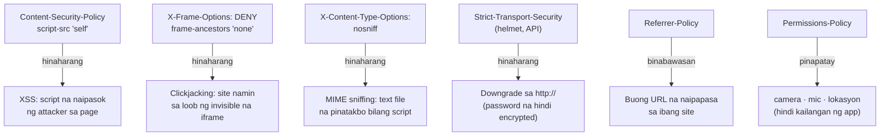
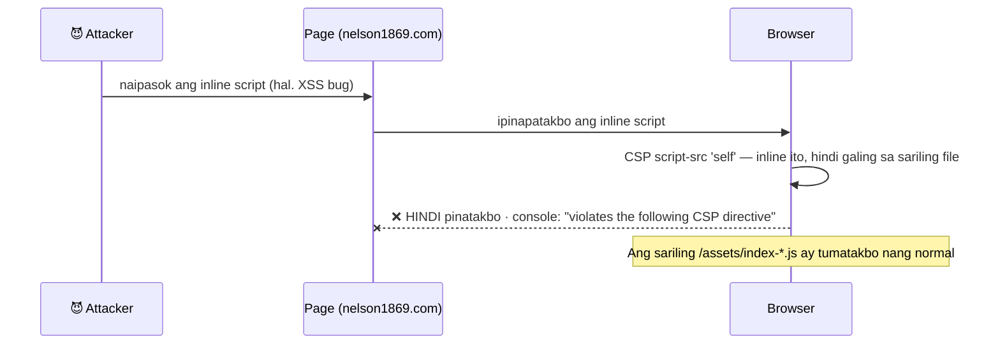

# 10 — Security headers (helmet + CSP)

> 📅 Day 39 · Phase 9 (Pangunahing hardening) · **Code:** `backend/src/app.ts` (`helmet()`) ·
> `frontend/public/_headers` · test: `backend/src/routes/security.test.ts`
> **Subukan:** `backend/http/09-security-headers.http` · `backend/http/prod/01-production.http` (#7–8)

## Saan galing ang bawat header

Dalawang magkaibang server, kaya dalawang magkaibang lugar ng headers:

- **Ang frontend ang may mahalagang CSP.** Doon tumatakbo ang JavaScript, kaya doon
  may silbi ang "anong script ang puwedeng tumakbo".
- **Sa API, helmet ang bahala.** Nagdadagdag ito ng HSTS, nosniff, CSP at iba pa, at
  **inaalis ang `X-Powered-By: Express`** (hindi na alam ng attacker kung anong server
  ang gamit namin).
- **Nauuna ang `helmet()`** para may headers kahit ang mga sagot na hindi umaabot sa
  route (hal. 404, 429).

## Anong atake ang hinaharang ng bawat header

## Kapag may naipasok na script (sinubukan, Day 39)

## Mga dapat pansinin

- **Walang `'unsafe-inline'` sa `script-src`.** Walang inline script ang Vite build,
  kaya hindi ito kailangan. Kapag idinagdag ito, wala nang silbi ang CSP laban sa XSS.
- **`connect-src`** ang listahan ng mga puwedeng tawagan ng `fetch`: sarili, ang API,
  at ang Cloudflare Web Analytics.
- **Nahuli ng production ang hindi nakita sa preview:** sinisingit ng Cloudflare ang
  Web Analytics beacon (`static.cloudflareinsights.com`) sa custom domain lang. Hinarang
  ito ng CSP, kaya **eksaktong host lang** ang idinagdag (PR #53), hindi ang buong `https:`.
- **Ang reference** (`server/src/app.ts`) ay may `helmet()` rin, at may hiwalay na
  mas maluwag na CSP para sa `/api-docs` (kailangan ng Swagger UI ang inline scripts).
  Wala pa kaming Swagger, kaya hindi pa kailangan iyon.
