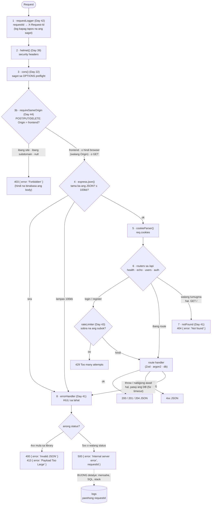
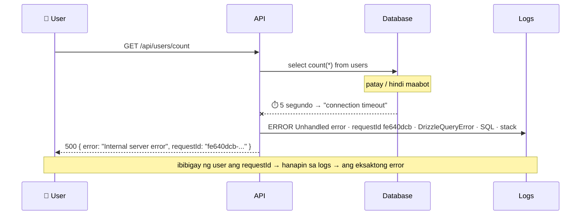

# 11 — Middleware pipeline (ang pagkakasunod sa `app.ts`)

> 📅 Day 41 · Phase 9 (Pangunahing hardening) · kasama ang Day 39 (helmet), Day 42 (logging), Day 43 (rate limit), Day 44 (CSRF)
> **Code:** `backend/src/app.ts` · `backend/src/middleware/errorHandler.ts` · `backend/src/db/index.ts` (timeout)
> **Subukan:** `backend/http/11-errors.http` · test: `backend/src/routes/errors.test.ts`

## Ang daan ng bawat request

Mahalaga ang **pagkakasunod**: dinadaanan ang bawat `app.use(...)` mula itaas pababa.

## Ang 500: ano ang nakikita ng user at ano ang nasa log

## Mga dapat pansinin

- **4 na parameter** `(err, req, res, next)` ang error handler — iyon ang palatandaan ni Express.
  Kaya ito ay nasa **dulo**: ang mga error mula sa itaas ay "lumalaktaw" diretso rito.
- **Express 5**: kusang napupunta rito ang nabigong `await` sa route. Hindi na kailangan ng
  `try/catch` sa bawat route (ang `try/catch` sa register ay para lang gawing 409 ang duplicate email).
- **Hindi kailanman ibinabalik ang `err.message` sa 5xx.** Ang mensahe ni Drizzle ay may SQL at
  pangalan ng table. Ito ang inayos ng reference sa commit na `fix(errors)`.
- **Hindi ibinabalik ang URL sa 404.** Ang reference ay `Route not found: GET /...`, na nag-e-echo ng input ng client.
- **Bago ang Day 41, nakabitin nang walang hanggan** ang request kapag patay ang DB. Ang dahilan:
  `connectionTimeoutMillis` = 0 ang default ng `pg`. Ngayon: 5 segundo → 500 + log.
