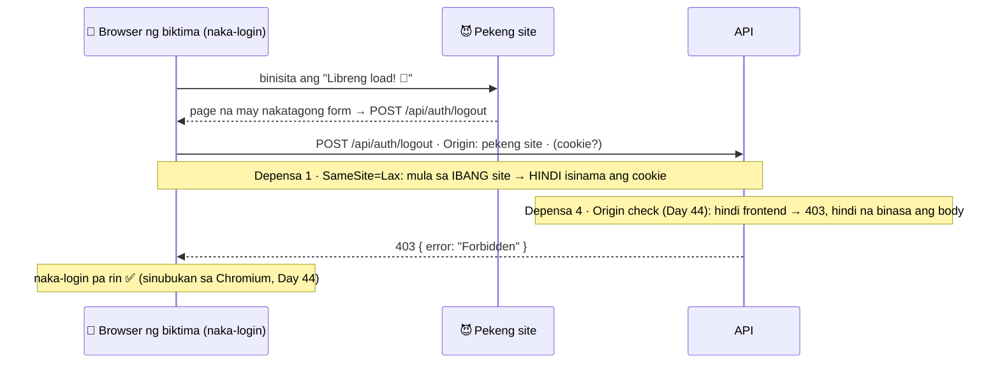
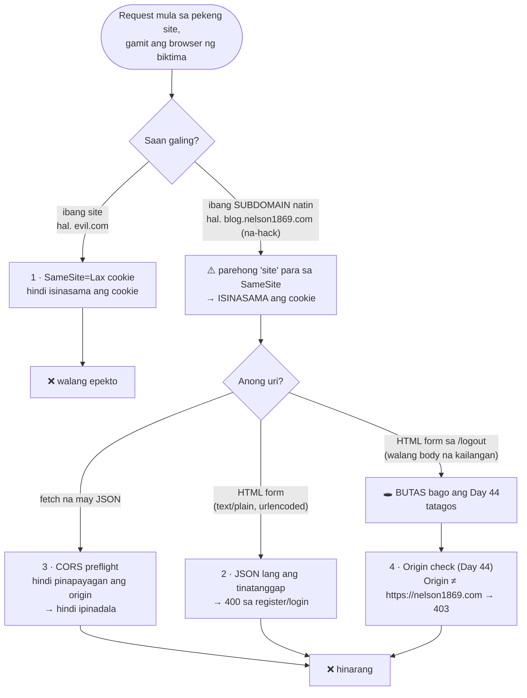

# 12 — CSRF (Cross-Site Request Forgery)

> 📅 Day 44 · Phase 9 (Pangunahing hardening) · **Desisyon:** D-022
> **Code:** `backend/src/middleware/csrf.ts` · `backend/src/app.ts` · cookie: `backend/src/routes/auth.ts` (`COOKIE_OPTIONS`)
> **Subukan:** `backend/http/12-csrf.http` · test: `backend/src/middleware/csrf.test.ts`

## Ang atake

Naka-login ka sa `nelson1869.com` (may cookie). Binuksan mo ang ibang site. Ang site na iyon ay nagpapadala
ng request sa API **gamit ang browser mo**, at kusang isinasama ng browser ang cookie. Kaya CSRF ang tawag:
may "pekeng" request na mukhang galing sa iyo.

## Ang apat na depensa, at ang butas na isinara ng Origin check

## Mga dapat pansinin

- **Nakakarating sa server ang CSRF request.** Ang CORS ay humaharang lang sa *pagbasa* ng sagot
  at sa mga "hindi simpleng" request (hal. JSON). Ang HTML form ay laging naipapadala.
- **Site vs origin:**
  - **Site** = domain + TLD (`nelson1869.com`). Ito ang tinitingnan ng SameSite.
  - **Origin** = scheme + buong host + port (`https://nelson1869.com`). Ito ang tinitingnan ng Origin check at ng CORS.
  - Kaya ang `blog.nelson1869.com` ay parehong **site**, pero ibang **origin**.
- **Hindi kayang pekein ang `Origin` sa browser.** Kusa itong inilalagay ng browser, at hindi ito mababago ng
  JavaScript. Kaya itong pekein ng curl, pero ang curl ay walang cookie ng biktima, kaya walang CSRF.
- **Walang `Origin` = pinapayagan** (curl, REST Client, tests). Pero kapag may `Sec-Fetch-Site: cross-site`,
  browser iyon kahit walang `Origin` → 403.
- **Karaniwang pagkakamali:** `origin.endsWith('nelson1869.com')`. Papasok diyan ang `blog.nelson1869.com`
  at pati ang `evilnelson1869.com`. Eksaktong paghahambing ang ginagamit natin, at may test para dito.
- **Kaiba sa reference:** double-submit token (`csrf-csrf`) ang gamit ng reference. Bakit Origin check sa amin: D-022.
