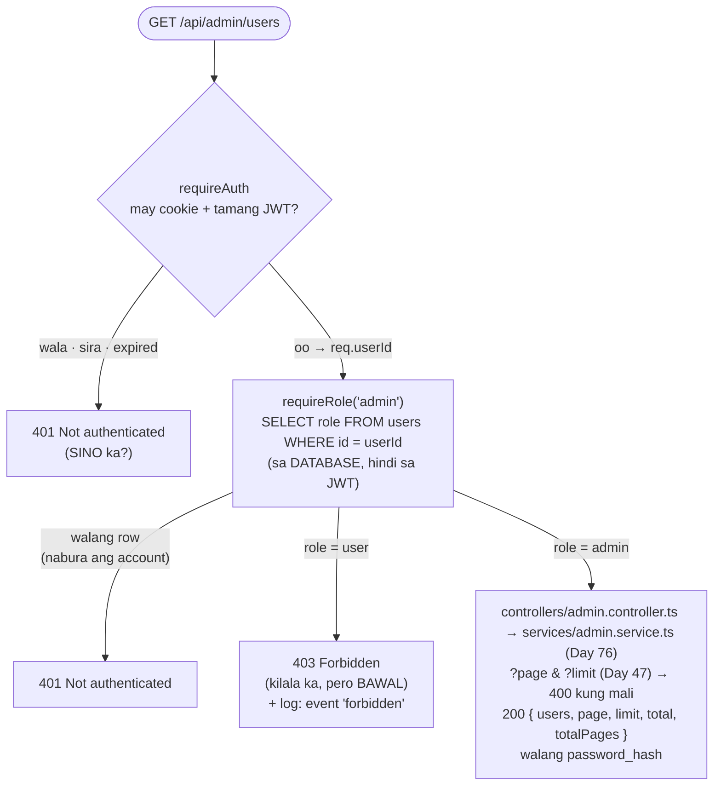
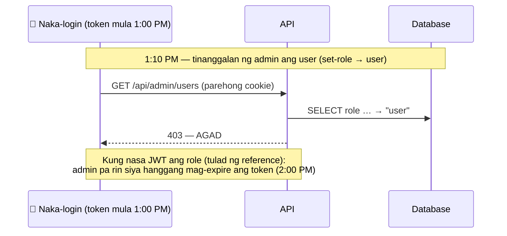

# 13 — RBAC: 401 vs 403 (sino ka vs ano ang pinapayagan sa iyo)

> 📅 Day 46 · Phase 10 (Roles at admin)
> **Code:** `backend/src/routes/admin.ts` (ang bantay) · `controllers/admin.controller.ts` · `services/admin.service.ts` (Day 76) · `backend/src/middleware/requireAuth.ts` · `backend/src/middleware/requireRole.ts`
> **Subukan:** `backend/http/13-admin-rbac.http` · test: `backend/src/routes/admin.test.ts`

**RBAC** = Role-Based Access Control: ang pinapayagan sa iyo ay nakadepende sa role mo (`user` o `admin`).

## Ang desisyon sa bawat `/api/admin/*` request

## Bakit sa database ang role, hindi sa JWT

## Mga dapat pansinin

- **Authentication (401) muna, saka authorization (403).** Hindi masasabi kung bawal ka kung hindi pa alam kung sino ka.
- **Isang lugar lang ang bantay:** `router.use('/admin', requireAuth, requireRole('admin'))` sa `routes/admin.ts`.
  Ang bagong admin route ay kusang protektado, kaya hindi ito makakalimutan.
- **401, hindi 404, para sa hindi naka-login** kahit sa `/api/admin/wala-ganito`. Hindi nalalaman ng estranghero kung anong admin routes ang mayroon.
- **Ang 403 ay hindi nagsasabi kung anong role ang kailangan** (ang reference ay nagsasabi).
- **Itinatala ang 403** (`event: "forbidden"`, may `userId` at `requestId`), dahil posibleng may sumusubok.
- **Kapalit:** isang maliit na query bawat admin request. Sa admin routes lang ito, kaya maliit ang gastos.
