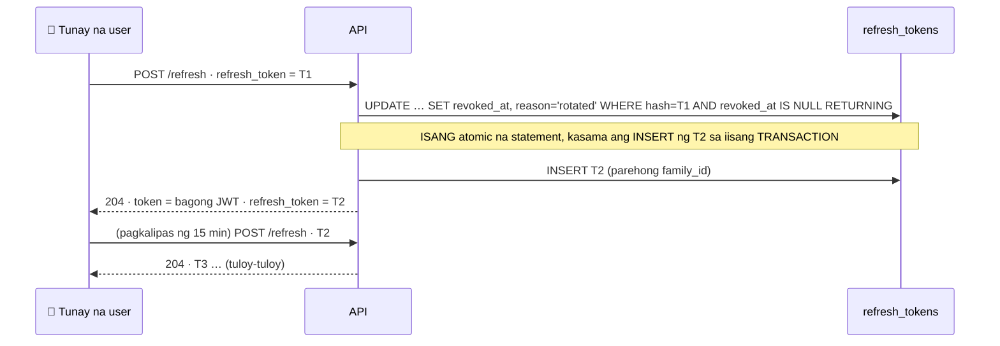
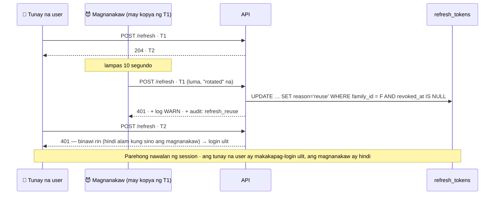
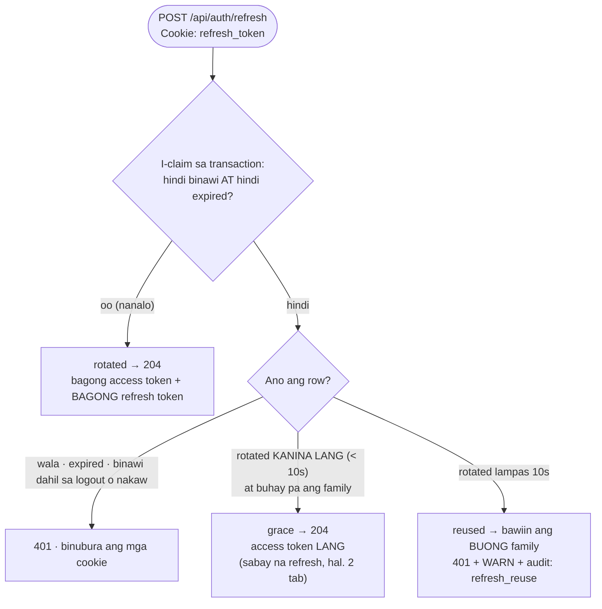

# 14 — Refresh token rotation at reuse detection

> 📅 Day 52 · Phase 11 (Mas ligtas na sessions)
> **Code:** `backend/src/lib/session.ts` (`rotateRefreshToken`) · `backend/src/routes/auth.ts` (`/auth/refresh`)
> **Subukan:** `backend/http/16-refresh-tokens.http` · test: `backend/src/routes/rotation.test.ts`

## Normal: bawat refresh ay may BAGONG refresh token

## Nakaw: ginamit ulit ang lumang token → bawiin ang BUONG family

## Ang desisyon sa bawat `POST /api/auth/refresh`

## Mga dapat pansinin

- **Bakit ang buong family?** Kapag ginamit ang lumang token, dalawang tao ang may hawak nito, at hindi alam ng server
  kung sino ang tunay. Ang tanging ligtas: patayin ang session ng pareho. Ang tunay na user ay makakapag-login ulit; ang magnanakaw, hindi.
- **Family lang, hindi lahat ng session ng user.** Ang ibang login (hal. ang laptop kapag ang phone ang nanakaw) ay hindi ginagalaw.
- **Reuse interval (10s):** walang ganito ang reference ("no refresh grace window"). Kapalit: may 10 segundong palugit
  ang magnanakaw na access token lang ang makukuha, walang bagong refresh token.
- **Race condition na nahuli ng test (Day 52):** kung hiwalay ang claim at ang INSERT ng bagong token, nakikita ng mga
  sabay na request na "walang aktibong token sa family" → itinuturing na nakaw → na-logout ang user. Inayos: iisang transaction.
