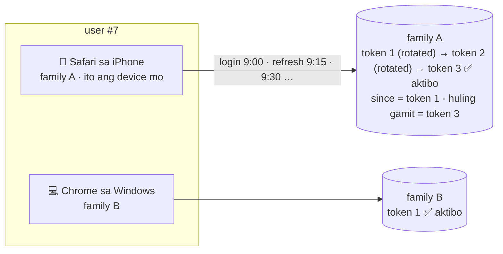
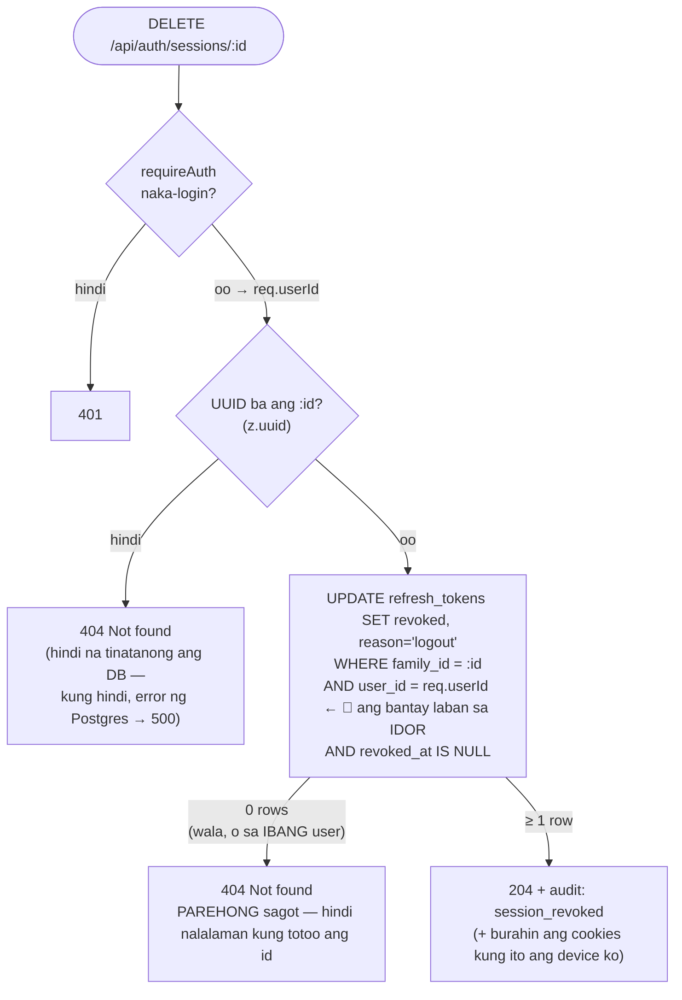

# 15 — Mga device ko (sessions) at IDOR

> 📅 Day 54 · Phase 11 (Mas ligtas na sessions)
> **Code:** `backend/src/lib/session.ts` (`listSessions`, `revokeSession`) · `backend/src/routes/auth.ts` ·
> `frontend/src/pages/SessionsPage.tsx`
> **Subukan:** `backend/http/17-sessions.http` · test: `backend/src/routes/sessions.test.ts`

## Isang session = isang login = isang family

## DELETE /api/auth/sessions/:id — at ang IDOR

## Mga dapat pansinin

- **IDOR = Insecure Direct Object Reference.** Ang id ay galing sa URL, kaya kayang palitan ng kahit sino. Hindi sapat na
  "naka-login ka". Dapat **sa iyo** ang bagay. Kaya nasa `WHERE` mismo ang `user_id = req.userId`, hindi sa hiwalay na check.
- **404, hindi 403.** Ang 403 ay nagsasabing "totoo ang id, pero hindi sa iyo", na impormasyon para sa attacker.
- **Hindi agad nala-logout ang device.** Binabawi ang refresh token, pero ang access token (JWT) nito ay gagana pa nang ≤ 15 minuto
  (Day 53: stateless).
- **Hula lang ang pangalan ng device** ("Safari sa iPhone"), mula sa User-Agent na kayang pekein. Para sa pagkilala lang ito, hindi security.
