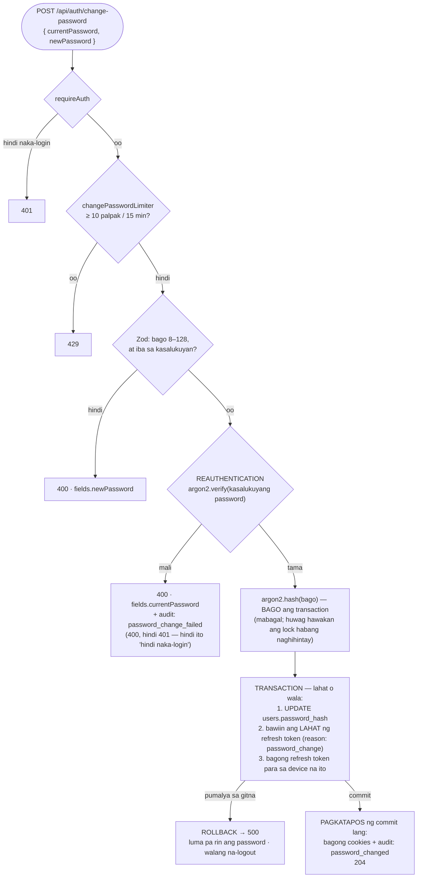

# 16 — Change password (reauthentication + i-logout ang lahat)

> 📅 Day 55 · Phase 11 (Mas ligtas na sessions)
> **Code:** `backend/src/routes/auth.ts` (`/auth/change-password`) · `backend/src/lib/session.ts` (`revokeAllSessions`) ·
> `frontend/src/pages/ChangePasswordPage.tsx`
> **Subukan:** `backend/http/18-change-password.http` · test: `change-password.test.ts`, `change-password-rollback.test.ts`

## Mga dapat pansinin

- **Reauthentication:** kailangan ang kasalukuyang password, kahit naka-login na. Kung may nakanakaw ng session (hal. naiwang
  bukas na laptop), hindi niya mapapalitan ang password at hindi niya maaagaw ang account.
- **"High-risk event":** pagkatapos palitan ang password, lahat ng session ay maaaring galing sa magnanakaw, kaya **lahat ay binabawi**.
  Pagkatapos, bagong session para sa device na nagpalit.
- **Transaction:** kung hiwalay ang mga hakbang at pumalya sa gitna, puwedeng maiwan ang pinakamasamang estado: bagong password,
  pero buhay pa ang session ng magnanakaw. May test na pumapalya sa huling hakbang at sinusuring **walang nagbago**.
- **Mga cookie at audit PAGKATAPOS ng commit:** kung nag-rollback, walang dapat maipadala.
- **Natitirang limitasyon:** ang access token (JWT) ng ibang device ay gagana pa nang ≤ 15 minuto (Day 53). Ang reference ay may `tokenVersion`
  para rito; nasa backlog natin ito.
