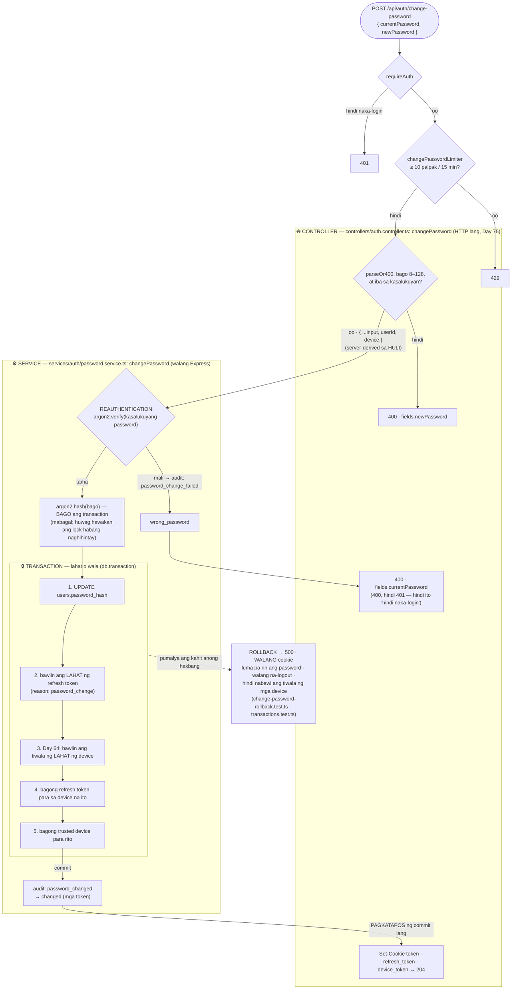
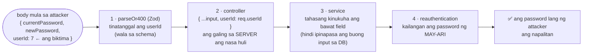

# 16 — Change password (reauthentication + i-logout ang lahat)

> 📅 Day 55 · Phase 11 (Mas ligtas na sessions)
> **Code:** `backend/src/services/auth/password.service.ts` (`changePassword`, Day 75) · `controllers/auth.controller.ts` (HTTP) · `backend/src/lib/session.ts` (`revokeAllSessions`) ·
> `frontend/src/pages/ChangePasswordPage.tsx`
> **Subukan:** `backend/http/18-change-password.http` · test: `change-password.test.ts`, `change-password-rollback.test.ts`

## Mga dapat pansinin

- **Reauthentication:** kailangan ang kasalukuyang password, kahit naka-login na. Kung may nakanakaw ng session (hal. naiwang
  bukas na laptop), hindi niya mapapalitan ang password at hindi niya maaagaw ang account.
- **"High-risk event":** pagkatapos palitan ang password, lahat ng session ay maaaring galing sa magnanakaw, kaya **lahat ay binabawi**.
  Pagkatapos, bagong session para sa device na nagpalit.
- **Transaction:** kung hiwalay ang mga hakbang at pumalya sa gitna, puwedeng maiwan ang pinakamasamang estado: bagong password,
  pero buhay pa ang session ng magnanakaw. May test na pumapalya sa huling hakbang at sinusuring **walang nagbago**.
- **Mga cookie at audit PAGKATAPOS ng commit:** kung nag-rollback, walang dapat maipadala.
- **Natitirang limitasyon:** ang access token (JWT) ng ibang device ay gagana pa nang ≤ 15 minuto (Day 53). Ang reference ay may `tokenVersion`
  para rito; nasa backlog natin ito.

## Mass assignment: apat na depensa (Day 77)

> **Subukan:** `backend/http/24-mass-assignment.http` · test: `backend/src/routes/mass-assignment.test.ts`

| Sinira (pansubok, Day 77) | Ligtas pa ba? |
|---|---|
| 1 lang (raw na body mula sa `parseOr400`) | ✅ oo: ang spread (2) at ang service (3) pa rin ang nagbabantay. Bumagsak lang ang unit test ng `parseOr400` |
| 2 lang (baligtad ang spread) | ✅ oo: tinatanggal ni Zod (1) ang `userId` |
| 1 + 2 | ❌ **napalitan ang password ng biktima**, pero sa test lang (parehong password). Kapag iba ang password ng biktima: **400 "Incorrect password"** (4) |
| 1 + 3 (register: `values({ ...input })`) | ❌ **naging admin** ang attacker |
| 1 + 2 (login: device mula sa body) | ❌ ang IP sa "Mga device ko" ay galing sa attacker |

**Aral:** walang iisang depensa na sapat kapag nagkamali ang code. Kaya may ilang layer: kailangang magkamali ang **dalawa** bago magtagumpay ang atake.
