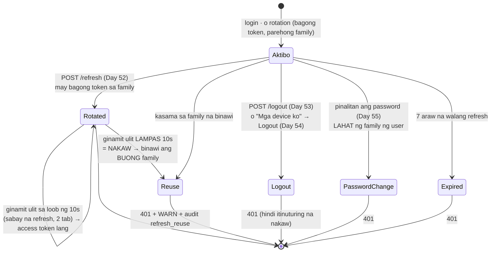
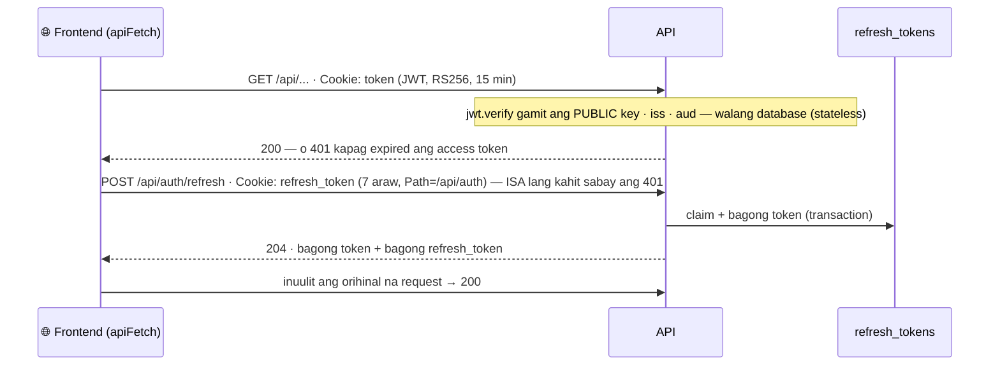

# 17 — Ang buhay ng isang session (Phase 11 sa isang tingin)

> 📅 Day 57 · Phase 11 review (buod ng Day 51–56)
> **Code:** `backend/src/lib/session.ts` · `backend/src/lib/jwt.ts` · `services/auth/session.service.ts` + `controllers/auth.controller.ts` (Day 75) · `frontend/src/api/auth.ts` (`apiFetch`)
> **Subukan:** `backend/http/16`–`18` · detalye: diagram 14 (rotation), 15 (mga device), 16 (change password)

## Isang refresh token: mula sa login hanggang sa katapusan

Bawat hilera sa `refresh_tokens` ay may isa sa mga estadong ito (`revoked_at`, `revoke_reason`, `expires_at`):

## Ang dalawang token sa bawat request

## Mga dapat pansinin

- **Stateless ang access token, stateful ang refresh token.** Mabilis ang access token dahil walang database, pero hindi ito mababawi,
  kaya 15 minuto lang. Ang refresh token ay nasa database, kaya kayang bawiin (logout, device, password, nakaw).
- **Bakit ang buong family kapag nakaw?** Ang rotation ay nangangahulugang isang beses lang magagamit ang bawat token. Kapag ginamit nang dalawang beses,
  siguradong may kopya ang ibang tao, at hindi alam ng server kung sino ang tunay, kaya ang ligtas ay patayin ang buong login.
- **Hindi ginagalaw ang ibang family.** Ang isang device na nanakawan ay hindi nagla-logout ng ibang device. Pinalitan ng password lang ang lahat.
- **Napatunayan (Day 56):** kahit palitan ang buong paraan ng pagpirma (HS256 → RS256), hindi kailangang mag-login ulit,
  dahil ang refresh token ang nagbibigay ng bagong access token.
