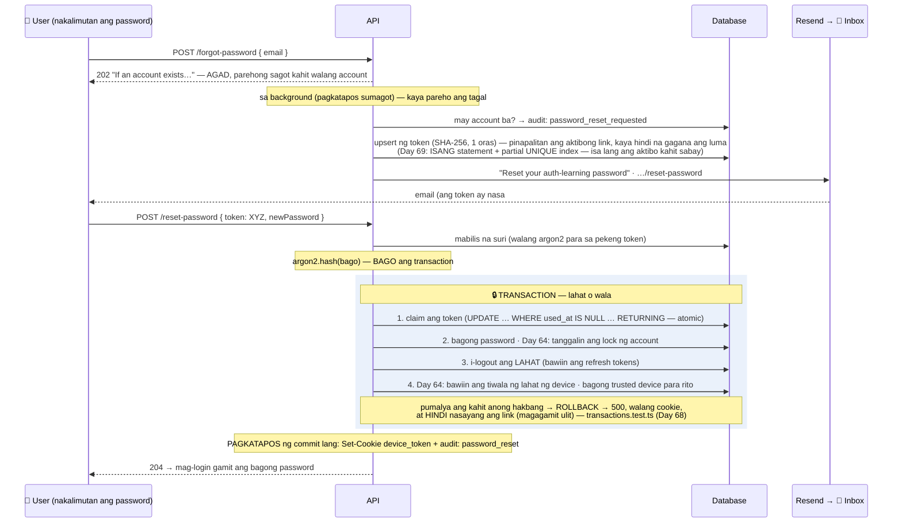

# 18 — Password reset

> 📅 Day 59 · Phase 12 (Email)
> **Code:** `backend/src/services/auth/password.service.ts` (`requestPasswordReset`, `resetPassword`, Day 76) · `controllers/auth.controller.ts` (sumasagot muna, cookie) · `lib/verificationTokens.ts` ·
> `lib/background.ts` · `lib/email.ts` (`passwordResetEmail`)
> **Frontend (Day 61):** `/forgot-password` · `/reset-password` — diagram 07
> **Subukan:** `backend/http/19-password-reset.http` · test: `backend/src/routes/password-reset.test.ts`

## Ang buong daloy

## Mga dapat pansinin

- **Parehong sagot, parehong tagal.** Kung sasabihin ng server na "walang ganitong account", malalaman ng attacker kung sino ang may account
  (user enumeration, Day 15). Kaya sumasagot muna, at saka gumagawa sa background. Sinukat: 1.8ms vs 1.7ms.
- **Single-use:** ang claim ay isang `UPDATE … WHERE used_at IS NULL AND expires_at > now() RETURNING`. Kapag sabay ang dalawang paggamit
  ng parehong link, isa lang ang mananalo (may test).
- **Isang aktibong link lang:** ang bagong request ay nagpapawalang-bisa sa luma, kaya ang pinakabagong email lang ang gagana.
- **`#token=` hindi `?token=`:** hindi ipinapadala ng browser ang fragment sa server, kaya hindi ito lalabas sa logs ng Cloudflare Pages,
  sa Referer, o sa analytics.
- **Lahat ng session ay nala-logout.** Kung may nakapasok gamit ang lumang password, tapos na siya.
- **Walang auto-login:** pagkatapos ng reset, mag-login gamit ang bagong password.
- **Kapalit (background sa memory):** kapag namatay ang server habang nagpapadala, mawawala ang email. Sa hinaharap: isang tunay na queue.
