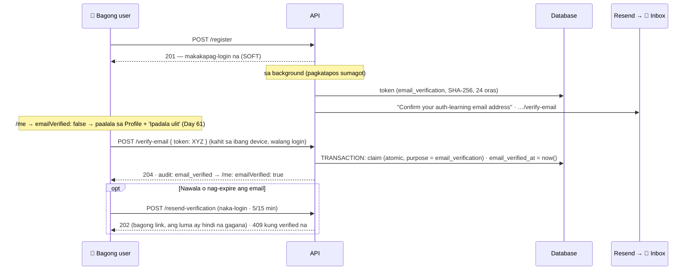

# 19 — Email verification (soft)

> 📅 Day 60 · Phase 12 (Email) · **Desisyon:** D-026
> **Code:** `backend/src/services/auth/verification.service.ts` (`verifyEmail`, `checkResendVerification`, mga email — Day 74–76) · `controllers/auth.controller.ts` · `controllers/auth.controller.ts` (register) · `lib/verificationTokens.ts` · `lib/email.ts`
> **Frontend (Day 61):** paalala sa Profile · `/verify-email` — diagram 07
> **Subukan:** `backend/http/20-verify-email.http` · test: `backend/src/routes/verify-email.test.ts`

## Mga dapat pansinin

- **Bakit may verification?** Walang sumusuri kung totoo ang email noong register. Kaya:
  - puwedeng i-register ng iba ang email mo;
  - ang reset email sa pekeng address ay magba-bounce, at masisira ang reputasyon ng domain (Day 58).
- **Soft (D-026):** makakapag-login pa rin ang hindi pa verified. Walang nasisira sa mga dating account. Puwedeng gawing mas mahigpit sa hinaharap
  (hal. verified lang ang makakagawa ng mahahalagang bagay).
- **Parehong table ng reset (`verification_tokens`), ibang `purpose`.** Ang reset token ay **hindi** magagamit pang-verify (may test), dahil nasa claim mismo ang purpose.
- **24 oras** (reset: 1 oras): mas mababa ang panganib, dahil hindi nito kayang palitan ang password.
- **`#token=`**, isang beses lang, at isang aktibong link bawat user, gaya ng Day 59.
