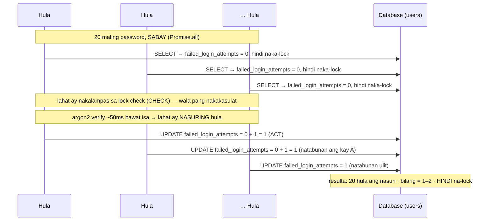
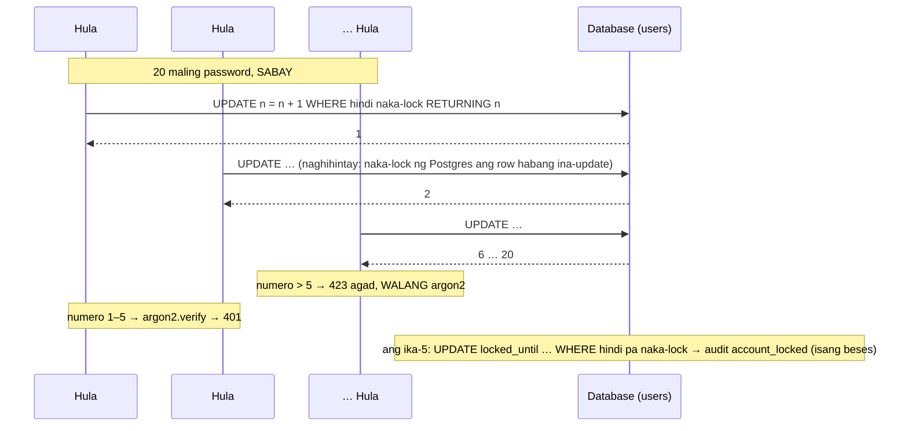

# 20 — Race conditions (TOCTOU)

> 📅 Day 66 · Phase 14 (Tama kahit sabay-sabay) · in-update sa Day 67 (ang ayos: atomic SQL)
> **Code:** `backend/src/routes/auth.ts` (`/auth/login`) · `backend/src/lib/loginLockout.ts` (Day 67: reserve-then-verify)
> **Subukan:** hindi kayang magpadala ng sabay na request ang `.http` — ang **test** ang patunay: `backend/src/routes/concurrency.test.ts`

## Ang bug: "basahin → +1 sa JavaScript → isulat" (lockout, Day 63–66)

## Ang ayos (Day 67): reserve-then-verify

## Sinukat (`concurrency.test.ts`)

| Bilang | | Nasuring hula (401) | 423 | Na-lock? | `account_locked` sa audit |
|---|---|---|---|---|---|
| account | Day 66 (bug) | 20 / 20 | 0 | ❌ (bilang = 2) | — |
| device | Day 66 (bug) | 20 / 20 | 0 | ❌ (bilang = 1) | — |
| account | **Day 67** | **5** | **15** | ✅ | **1** |
| device | **Day 67** | **5** | **15** | ✅ (ang device lang) | — |

## Mga dapat pansinin

- **TOCTOU = time-of-check to time-of-use.** May puwang sa pagitan ng pagsuri ("hindi pa naka-lock") at ng paggamit ("+1").
  Sa puwang na iyon, puwedeng magbago ang totoong estado dahil sa ibang request.
- **Bakit nakakalusot ang lahat?** Mabilis ang SELECT (~1ms), pero mabagal ang `argon2.verify` (~50ms). Kaya natatapos ang lahat ng SELECT bago pa
  may makapagsulat. Ang mabagal na hakbang sa gitna ang nagpapalaki sa puwang.
- **Bakit hindi nahuli ng Day 63 tests?** Sunod-sunod ang mga iyon: isang request, sagot, saka ang susunod. Walang puwang na maabot.
- **Ang test ay tahasang sumusukat sa bug** ("higit sa 5 ang nasuri"): pumapasa ito habang may bug, at **babagsak kapag naayos na**.
  Sinubukan: kapag sunod-sunod ang 20 request, bumagsak ito ("expected 5 to be greater than 5"). Kaya ang race lang ang makakapagpapasa rito.
- **Hindi `it.fails`:** pumapasa iyon sa KAHIT ANONG error (hal. bumagsak ang register o nag-ECONNRESET), kaya puwedeng pumasa sa maling dahilan.
- **Mga ligtas na (patunay, hindi ayos):** register (INSERT agad, ang UNIQUE ang bantay → 1 × 201, 19 × 409), mga link sa email
  (`UPDATE … WHERE used_at IS NULL … RETURNING` → 1 × 204), refresh rotation (Day 52). Sinira ang bawat isa → bumagsak ang test.
- **Sa production ngayon:** ang IP rate limit (10 bawat IP) pa rin ang humaharang sa sabay na hula mula sa iisang IP. Ang panganib ay mula sa maraming IP.
- **Ang ayos (Day 67):** ang "+1" at ang "naka-lock ba?" ay nasa **iisang SQL statement**, at ginagawa ito **BAGO** ang argon2.
  Ang database ang pumipili ng pagkakasunod: naka-lock ang row habang ina-update, kaya ang bawat request ay may sariling numero.
  Hindi sapat na ilipat lang ang +1 sa SQL: kung pagkatapos pa rin ng argon2, 20 pa rin ang masusuri (bawat isa ay nakalampas na sa check).
- **Ang pattern para sa susunod na code:** huwag kailanman "SELECT muna, tapos UPDATE" para sa bagay na binibilang o isang beses lang
  magagamit. Ilagay ang kondisyon sa `WHERE`, at gamitin ang `RETURNING` para malaman kung ikaw ang nanalo.
- **Ang proseso ng test:** sa Day 66, sinukat ng test ang bug (pumasa). Sa Day 67, **bumagsak ito gaya ng inaasahan** ("expected 5 to be
  greater than 5"), at binaligtad. Sinira ulit ang ayos (walang "lampas 5 → 423"; lock na walang "hindi pa naka-lock") → bumagsak ang test.
