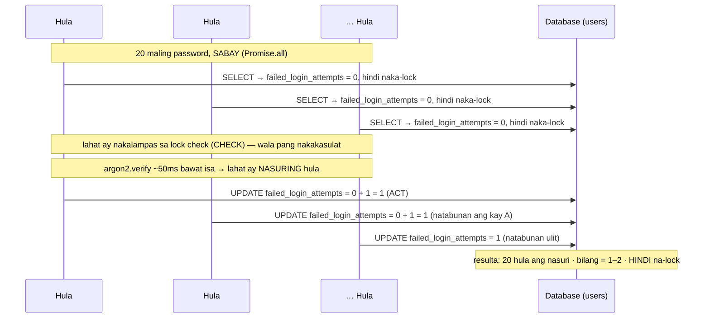
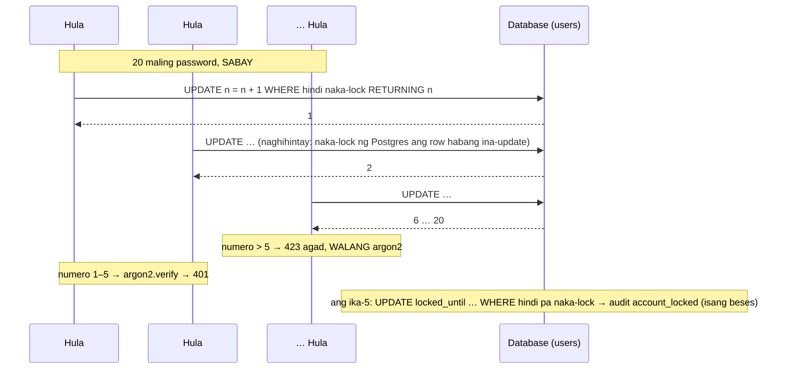
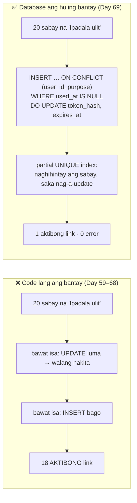

# 20 — Race conditions (TOCTOU)

> 📅 Day 66 · Phase 14 (Tama kahit sabay-sabay) · in-update sa Day 67 (ang ayos: atomic SQL) at Day 69 (unique constraint bilang huling bantay)
> **Code:** `backend/src/routes/auth.ts` (`/auth/login`) · `backend/src/lib/loginLockout.ts` (Day 67: reserve-then-verify)
> **Subukan:** hindi kayang magpadala ng sabay na request ang `.http` — ang **test** ang patunay: `backend/src/routes/concurrency.test.ts`

## Ang bug: "basahin → +1 sa JavaScript → isulat" (lockout, Day 63–66)

## Ang ayos (Day 67): reserve-then-verify

## Sinukat (`concurrency.test.ts`)

| Bilang | | Nasuring hula (401) | 423 | Na-lock? | `account_locked` sa audit |
|---|---|---|---|---|---|
| account | Day 66 (bug) | 20 / 20 | 0 | ❌ (bilang = 2) | — |
| device | Day 66 (bug) | 20 / 20 | 0 | ❌ (bilang = 1) | — |
| account | **Day 67** | **5** | **15** | ✅ | **1** |
| device | **Day 67** | **5** | **15** | ✅ (ang device lang) | — |

## Mga dapat pansinin

- **TOCTOU = time-of-check to time-of-use.** May puwang sa pagitan ng pagsuri ("hindi pa naka-lock") at ng paggamit ("+1").
  Sa puwang na iyon, puwedeng magbago ang totoong estado dahil sa ibang request.
- **Bakit nakakalusot ang lahat?** Mabilis ang SELECT (~1ms), pero mabagal ang `argon2.verify` (~50ms). Kaya natatapos ang lahat ng SELECT bago pa
  may makapagsulat. Ang mabagal na hakbang sa gitna ang nagpapalaki sa puwang.
- **Bakit hindi nahuli ng Day 63 tests?** Sunod-sunod ang mga iyon: isang request, sagot, saka ang susunod. Walang puwang na maabot.
- **Day 66: tahasang sinukat ng test ang bug** ("higit sa 5 ang nasuri"). Pumasa ito habang may bug, at bumagsak noong naayos (Day 67).
  Sinubukan noon: kapag sunod-sunod ang 20 request, bumagsak ito ("expected 5 to be greater than 5"). Kaya ang race lang ang nakapagpapasa rito.
- **Hindi `it.fails`:** pumapasa iyon sa KAHIT ANONG error (hal. bumagsak ang register o nag-ECONNRESET), kaya puwedeng pumasa sa maling dahilan.
- **Mga ligtas na noong Day 66 (patunay, hindi ayos):** register (INSERT agad, ang UNIQUE ang bantay → 1 × 201, 19 × 409), ang PAGGAMIT ng link sa email
  (`UPDATE … WHERE used_at IS NULL … RETURNING` → 1 × 204), refresh rotation (Day 52). Sinira ang bawat isa → bumagsak ang test.
  Pero ang PAGGAWA ng link ("isa lang ang aktibo") ay hindi ligtas. Nahuli noong Day 69 (tingnan sa ibaba).
- **Sa production bago ang Day 67:** ang IP rate limit (10 bawat IP) lang ang humaharang sa sabay na hula mula sa iisang IP, at bukas ito sa maraming IP.
  Ngayon: 5 bawat account, gaano man karami ang IP (sinukat sa production: 8 sabay → 5 × 401, 3 × 423).
- **Ang ayos (Day 67):** ang "+1" at ang "naka-lock ba?" ay nasa **iisang SQL statement**, at ginagawa ito **BAGO** ang argon2.
  Ang database ang pumipili ng pagkakasunod: naka-lock ang row habang ina-update, kaya ang bawat request ay may sariling numero.
  Hindi sapat na ilipat lang ang +1 sa SQL: kung pagkatapos pa rin ng argon2, 20 pa rin ang masusuri (bawat isa ay nakalampas na sa check).
- **Ang pattern para sa susunod na code:** huwag kailanman "SELECT muna, tapos UPDATE" para sa bagay na binibilang o isang beses lang
  magagamit. Ilagay ang kondisyon sa `WHERE`, at gamitin ang `RETURNING` para malaman kung ikaw ang nanalo.
- **Ang proseso ng test:** sa Day 66, sinukat ng test ang bug (pumasa). Sa Day 67, **bumagsak ito gaya ng inaasahan** ("expected 5 to be
  greater than 5"), at binaligtad. Sinira ulit ang ayos (walang "lampas 5 → 423"; lock na walang "hindi pa naka-lock") → bumagsak ang test.

## Unique constraint bilang huling bantay (Day 69)

Ang "isang aktibo lang" ay dating ginagawa ng **code**: "UPDATE ang luma, tapos INSERT ang bago", dalawang statement.

| Sinukat (20 sabay na "Ipadala ulit") | Aktibong link | Pumalya sa background | Email |
|---|---|---|---|
| Luma, walang index (Day 59–68) | **18** | — (hindi sinukat) | — (hindi sinukat) |
| Luma, **may index** (eksperimento) | 1 ✅ | **17** (23505) | 3 |
| **Bago: upsert + index** (Day 69) | 1 ✅ | 0 | 20 (ang huli lang ang gagana) |

- **Ang index lang ay sapat na para sa invariant** (pangalawang row): kahit mali ang code, tumatanggi ang database. Iyon ang "huling bantay".
  Pero ang tinanggihan ay **error**: 17 background task ang pumalya. Kaya kasama ng index ang **code na tugma** sa patakaran (upsert).
- **Partial index** (`WHERE used_at IS NULL`): ang mga nagamit o lumang link ay hindi kasama, kaya puwedeng marami.
- **Refresh family** (`UNIQUE (family_id) WHERE revoked_at IS NULL`): walang binagong code. Ang rotation ay laging binabawi muna ang luma sa
  parehong transaction. Bantay lang ito para sa bug sa hinaharap (sinubukan: tinatanggihan ang pangalawang aktibo; tinanggal ang index → pumasa ang pangalawa).
- **Migration 0011:** bago gawin ang index, nililinis ang mga dati nang doble (iniiwan ang pinakabago). Sinubukan gamit ang sadyang doble,
  sa parehong command ng deploy (`src/db/migrate.ts`): 3 → 1, 2 → 1.
