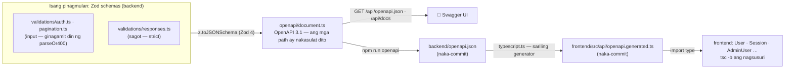
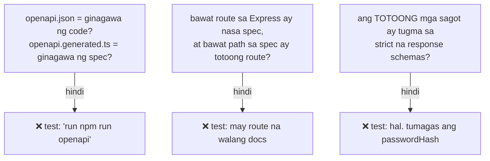

# 21 — API documentation: mula sa Zod hanggang sa frontend

> 📅 Day 78 · Phase 16 (Malinis na architecture) · **Desisyon:** D-027 (at D-019, nalutas)
> **Code:** `backend/src/openapi/document.ts` (spec) · `backend/src/openapi/typescript.ts` (generator) · `backend/src/validations/responses.ts` ·
> `backend/src/routes/docs.ts` · `backend/src/scripts/openapi.ts` · `frontend/src/api/openapi.generated.ts`
> **Subukan:** `backend/http/25-openapi.http` · sa browser: `http://localhost:3000/api/docs/` · test: `backend/src/openapi/openapi.test.ts`

## Ang tatlong bantay (para hindi maging luma ang docs)

| Sinira (pansubok, Day 78) | Nahuli ng |
|---|---|
| binago ang schema (`name` max 100 → 101), hindi ni-regenerate | ❌ drift test ng `openapi.json` |
| bagong route na walang docs | ❌ route test |
| `passwordHash` sa sagot ng `/me` | ❌ contract test |
| in-edit nang kamay ang `openapi.generated.ts` | ❌ drift test ng mga type |
| inalis ang `emailVerified` sa backend + `npm run openapi` | ❌ **frontend** `tsc`: `ProfilePage.tsx` (kung saan ito ginagamit) |

## Mga dapat pansinin

- **Isang pinagmulan.** Ang Zod schema na sumusuri sa input (`parseOr400`) ay siya ring nagiging docs at type ng frontend. Walang kopyang maiiwan.
- **Ang mga sagot ay may schema na rin** (`responses.ts`, `z.strictObject`), kaya sinusubok ang **totoong** sagot, hindi lang ang nakasulat.
- **Bakit sariling generator?** Kailangan ng `openapi-typescript` ang TypeScript 5, pero TypeScript 7 ang project (D-027). Pumapalya ang generator sa hindi kilalang keyword, sa halip na manghula.
- **Mga limitasyon:** hindi naisasalin ang `.refine()` (hal. "iba ang bagong password") at ang mga transform (trim, lowercase). Nasa `description` ang mga iyon.
- **Public ang docs.** Walang lihim dito: ang mga endpoint ay nakikita na rin sa frontend. Ang "Try it out" na POST mula sa `/api/docs` sa production ay 403, dahil iba ang Origin (Day 44).
