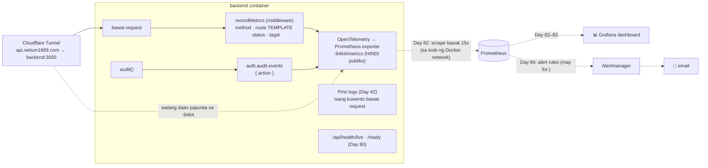

# 22 — Observability: logs, metrics, health, alerts

> 📅 Day 81 · Phase 17 (Observability) · ia-update sa Day 82–85 · **Desisyon:** D-028
> **Code:** `backend/src/lib/metrics.ts` · `backend/src/middleware/metrics.ts` · `backend/src/lib/audit.ts` (auditEvents) · `backend/src/index.ts`
> **Subukan:** `backend/http/27-metrics.http` · test: `backend/src/lib/metrics.test.ts`

*(Putol-putol na linya = gagawin pa sa Day 82–84.)*

## Logs vs metrics

| | Logs (Day 42) | Metrics (Day 81) |
|---|---|---|
| Ano | isang kuwento bawat request: sino, ano, bakit, requestId | mga numero sa paglipas ng oras: ilan, gaano kabilis, ilang error |
| Gastos | lumalaki sa bawat request | halos pareho kahit milyon ang request |
| Para saan | imbestigasyon ("bakit pumalya ang request ni Ana?") | dashboard at **alert** ("tumaas ang 5xx sa 5%") |

## Ang mga metric (eksaktong pangalan sa Prometheus)

| Metric | Mga label | Halimbawa ng tanong |
|---|---|---|
| `http_server_request_duration_bucket` / `_sum` / `_count` | `http_request_method`, `http_route`, `http_response_status_code` | Ilang 5xx bawat minuto? Gaano kabagal ang login (p95)? |
| `auth_audit_events_total` | `action` | Ilang `account_locked` o `refresh_reuse` ngayong oras? |

- **Walang `_seconds` sa pangalan:** hindi idinadagdag ng exporter ang unit. Ang unit ay segundo (`unit: 's'`).
- **🔐 Cardinality:** ang label ay ang **route template** (`/api/auth/sessions/:id`) o `unmatched`, **hindi** ang totoong URL. Kung URL ang label,
  ang bawat id at bawat random na path ng attacker ay magiging bagong serye, at lalaki ito nang walang hangganan. May test para rito.
- **Hindi publiko:** `METRICS_PORT` (default 9464), hiwalay sa 3000. Ang tunnel ay papunta lang sa `backend:3000`
  (sinubukan: `https://api.nelson1869.com/metrics` → 404).
- **Hindi fatal:** kapag hindi mabuksan ang metrics port, ERROR sa log pero **tuloy ang app** (nahuli noong Day 81: dati, namamatay ang buong server).
