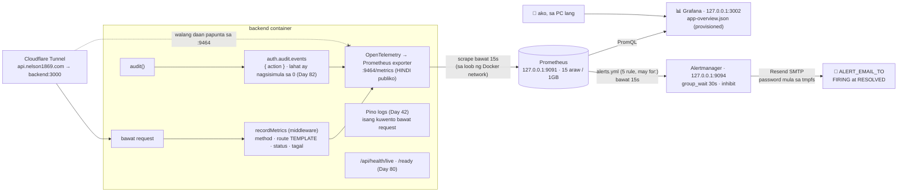
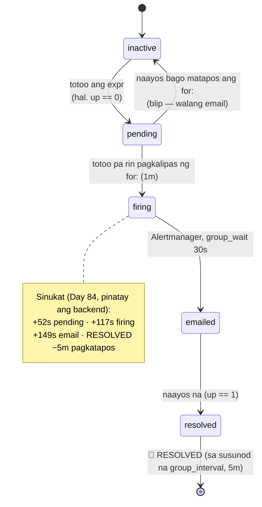

# 22 — Observability: logs, metrics, health, alerts

> 📅 Day 81 · Phase 17 (Observability) · Day 82–83: Prometheus + Grafana · Day 84: Alertmanager · **Desisyon:** D-028
> **Code:** `backend/src/lib/metrics.ts` · `backend/src/middleware/metrics.ts` · `backend/src/lib/audit.ts` (auditEvents) · `backend/src/index.ts`
> **Config:** `devops/monitoring/` · `devops/docker-compose.prod.yml` (prometheus, grafana)
> **Subukan:** `backend/http/27-metrics.http` · `28-prometheus-queries.http` · `29-alerts.http` · rules: `devops/monitoring/prometheus/alerts.test.yml` · test: `backend/src/lib/metrics.test.ts`

*(Ang putol-putol na linya: walang daan mula sa tunnel papunta sa metrics.)*

## Logs vs metrics

| | Logs (Day 42) | Metrics (Day 81) |
|---|---|---|
| Ano | isang kuwento bawat request: sino, ano, bakit, requestId | mga numero sa paglipas ng oras: ilan, gaano kabilis, ilang error |
| Gastos | lumalaki sa bawat request | halos pareho kahit milyon ang request |
| Para saan | imbestigasyon ("bakit pumalya ang request ni Ana?") | dashboard at **alert** ("tumaas ang 5xx sa 5%") |

## Ang mga metric (eksaktong pangalan sa Prometheus)

| Metric | Mga label | Halimbawa ng tanong |
|---|---|---|
| `http_server_request_duration_bucket` / `_sum` / `_count` | `http_request_method`, `http_route`, `http_response_status_code` | Ilang 5xx bawat minuto? Gaano kabagal ang login (p95)? |
| `auth_audit_events_total` | `action` | Ilang `account_locked` o `refresh_reuse` ngayong oras? |

- **Walang `_seconds` sa pangalan:** hindi idinadagdag ng exporter ang unit. Ang unit ay segundo (`unit: 's'`).
- **🔐 Cardinality:** ang label ay ang **route template** (`/api/auth/sessions/:id`) o `unmatched`, **hindi** ang totoong URL. Kung URL ang label,
  ang bawat id at bawat random na path ng attacker ay magiging bagong serye, at lalaki ito nang walang hangganan. May test para rito.
- **Hindi publiko:** `METRICS_PORT` (default 9464), hiwalay sa 3000. Ang tunnel ay papunta lang sa `backend:3000`
  (sinubukan: `https://api.nelson1869.com/metrics` → 404).
- **Hindi fatal:** kapag hindi mabuksan ang metrics port, ERROR sa log pero **tuloy ang app** (nahuli noong Day 81: dati, namamatay ang buong server).

## Prometheus + Grafana (Day 82–83)

- **Lahat ay nasa code, walang click sa UI:** ang scrape config, ang datasource at ang dashboard ay mga file sa `devops/monitoring/`
  (provisioning). Kapag nabura ang volume ng Grafana, babalik ang lahat sa susunod na boot.
- **🔐 127.0.0.1 lang** ang dalawang port. Walang password ang Prometheus; ang Grafana ay may admin password (sa `devops/.env`),
  walang sign-up at walang anonymous.
- **Ang dashboard (8 panel; + 2 retention panel sa Day 90):** up · requests/s · 5xx % · p95 · requests/s ayon sa status · p95 ayon sa route · security events · mga route na may 4xx/5xx.
  Ang mga query ay nasa `backend/http/28-prometheus-queries.http`.

### 🐛 Dalawang nahuli sa dashboard
| Nakita | Bakit | Ayos |
|---|---|---|
| 5xx panel: "No data" sa halip na 0% | walang 5xx → walang serye → `sum()` ng wala ay wala | `… or vector(0)` |
| Isang totoong `login_failed`, pero `increase(…[5m])` = **0** | ang serye ay "ipinapanganak" sa 1 sa unang event; walang naunang sample na paghahambingan ang `increase()` | sinisimulan sa 0 ang bawat audit action pagka-start (may test) |

Ang pangalawa ay mahalaga sa Day 84: kung hindi naayos, ang **unang** `account_locked` pagkatapos ng bawat deploy ay hindi mag-a-alert.
Hindi ito naayos para sa HTTP metrics (walang hangganan ang kombinasyon ng route × status), kaya ang unang request ng isang
bagong kombinasyon ay hindi nabibilang sa `rate()`. Ayos lang iyon para sa mga rate na tinitingnan bilang trend.

## Alerts (Day 84)

| Alert | Kailan | `for:` | Bakit |
|---|---|---|---|
| `AppDown` | `up == 0` | 1m | patay ang backend (o hindi ma-scrape) |
| `HighErrorRate` | 5xx > 5% | 5m | may bug o down ang database |
| `HighLatency` | p95 > 1s | 10m | mabagal ang Neon o puno ang CPU |
| `RefreshTokenReuse` | kahit 1 sa 10m | wala | 🔐 posibleng ninakaw na token (Day 53) |
| `ManyAccountLockouts` | ≥ 3 sa 15m | wala | 🔐 posibleng password guessing |

- **Inhibit:** kapag `AppDown`, hindi na ipinapadala ang `HighErrorRate`/`HighLatency` (iisang problema, iisang email).
- **Mga test ng rule (promtool):** ang timing (ang 30s na blip ay hindi dapat mag-alert), ang mga threshold, at ang aral ng Day 82
  (ang counter na "ipinanganak" sa 1 ay hindi kailanman mag-a-alert). Sinira ang bawat rule, at bumagsak ang tamang test.
- **⚠️ Hindi nito nakikita:** kapag patay ang **buong PC** (o ang Docker), patay rin ang Prometheus at Alertmanager, kaya **walang email**.
  At kapag patay ang **tunnel** pero buhay ang backend, `up == 1` pa rin. Kailangan ng bantay na nasa **labas** ng PC para doon (backlog).
