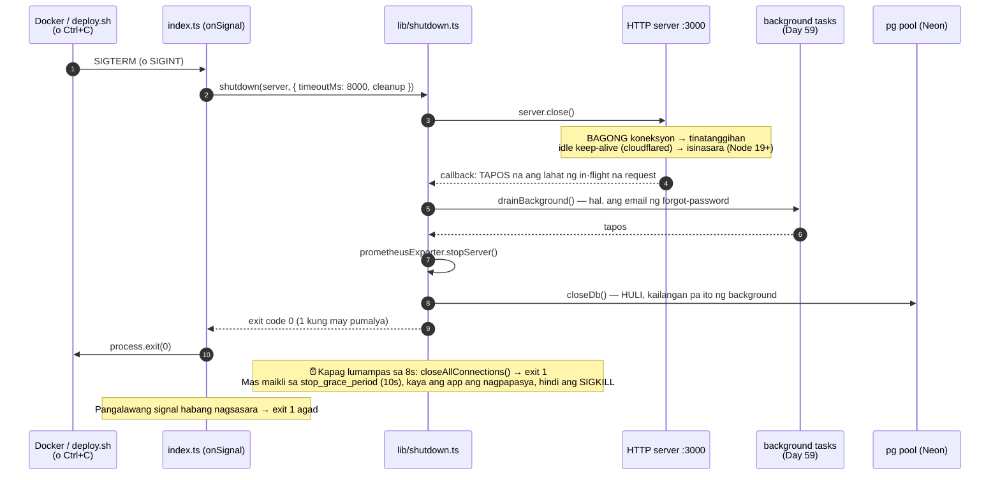

# 23 — Graceful shutdown: tapusin muna ang trabaho bago mamatay

> 📅 Day 85 · Phase 17 (Observability)
> **Code:** `backend/src/lib/shutdown.ts` · `backend/src/index.ts` (onSignal) · `backend/src/db/index.ts` (closeDb) · `devops/docker-compose.prod.yml` (stop_grace_period)
> **Subukan:** `backend/http/30-graceful-shutdown.http` · test: `backend/src/lib/shutdown.test.ts`

## Ang pagkakasunod (sa bawat deploy, `docker stop`, o Ctrl+C)

## Bakit ito kailangan: ang node ay PID 1

Sa loob ng container, ang `node src/index.ts` ay **PID 1**. Ang PID 1 ay hindi sakop ng karaniwang "mamatay sa SIGTERM":
kapag **walang handler**, hindi pinapansin ang signal. Kaya naghihintay ang Docker hanggang sa limit, at saka **SIGKILL**.

| Sinukat (parehong image, lokal) | `docker stop` | exit code | ang request na tumatakbo |
|---|---|---|---|
| **Bago** (walang handler) | 14.6s | **137** (SIGKILL) | napuputol |
| **Ngayon** | **1.3s** (≈1ms ang app; ang iba ay Docker) | **0** | **200**, hinihintay (2.5s kung 2s ang request) |

- **Hindi pa ito zero-downtime.** Iisa lang ang backend: habang pinapalitan ng `deploy.sh` ang container, walang sumasagot (cloudflared → 502).
  Ang nagawa: walang **napuputol** na request o email, at mas maikli ang puwang. Para sa tunay na zero-downtime, kailangan ng dalawang instance (backlog).
