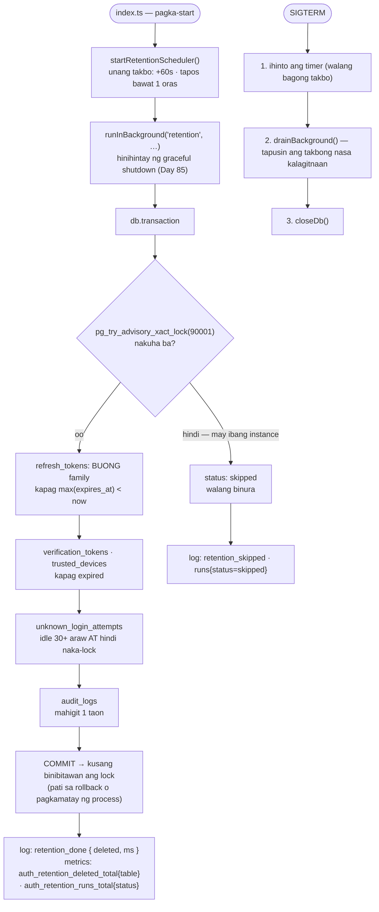

# 24 — Data retention: oras-oras na paglilinis ng lumang data

> 📅 Day 90 · Phase 18 (Production maturity) · **Desisyon:** D-032
> **Code:** `backend/src/services/retention.service.ts` · `backend/src/jobs/retentionScheduler.ts` · `backend/src/index.ts` (start + shutdown) · `backend/src/lib/metrics.ts`
> **Subukan:** `backend/http/34-retention.http` · test: `backend/src/services/retention.service.test.ts` · Grafana: 2 panel (Retention)

## Bakit BUONG family ang refresh tokens (hindi bawat token)

Hinahanap ng reuse detection (Day 52, `lib/session.ts`) ang **revoked** na row ng token na ipinakita. Kapag nabura ang row na iyon habang
buhay pa ang family, ang ninakaw na lumang token ay magiging **"invalid"** na lang, hindi **"reused"**, at **hindi na babawiin** ang family.
May test na nagre-replay ng ganoong token pagkatapos ng cleanup; bumabagsak ito kapag ginawang per-token ang patakaran.

## Mga dapat pansinin
- **Advisory lock na nakatali sa transaction:** kapag dalawang instance, isa lang ang naglilinis. Walang lock na maiiwan kahit mamatay ang process.
  Ang test ay deterministiko: HINAHAWAKAN nito ang lock sa ibang koneksyon (ang dalawang sabay na takbo ay kadalasang hindi nagsasabay).
- **Hindi naka-lock:** ang `unknown_login_attempts` na naka-lock pa ay hindi binubura, kaya hindi nabubura ang lock ng umaatake dahil lang sa paghihintay.
  **Tinanggap:** ang bilang ng email na totoong account (nasa `users`) ay hindi kailanman nag-e-expire; ang napakatiyagang attacker (≤4 na subok, maghintay ng 30 araw)
  ay puwedeng makakita ng pagkakaiba.
- **Sa loob ng app** (hindi hiwalay na cron/container): walang dagdag na bahagi. Ang kapalit: tumatakbo lang kapag buhay ang app.
