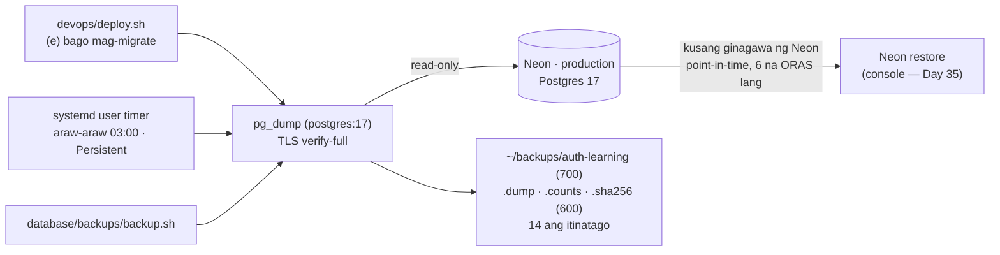
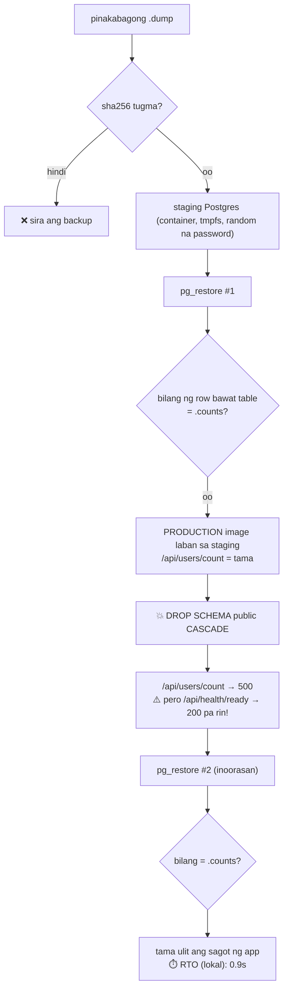

# 25 — Backup at restore drill: RPO at RTO

> 📅 Day 91 · Phase 18 (Production maturity) · **Desisyon:** D-033
> **Code:** `database/backups/backup.sh` · `restore-drill.sh` · `restore-drill-neon.sh` · `systemd/` · `devops/deploy.sh` (bantay e)
> **Subukan:** `KEEP_STAGING=1 database/backups/restore-drill.sh` + `backend/http/35-backup-drill.http`

## Saan nanggagaling ang mga backup

## Ang drill (hindi ginagalaw ang production)

## RPO at RTO

| | Ano ito | Sa atin (Day 91) |
|---|---|---|
| **RPO** — Recovery Point Objective | Gaano karaming data ang puwedeng MAWALA (gaano kaluma ang huling backup) | Neon: segundo (kung napansin sa loob ng 6 na oras) · sariling dump: **hanggang 24 oras** (araw-araw) · sa deploy: **0** kung migration ang sanhi |
| **RTO** — Recovery Time Objective | Gaano KATAGAL bago bumalik ang serbisyo | lokal na restore: **0.7s** (8MB) · Neon (staging branch, Day 93): **restore 9.4–9.9s · 18.9–20.1s hanggang tama ulit ang app** — sa DIREKTANG endpoint lang, hindi sa `-pooler` |

- **Ang "ready" ay hindi patunay na may data.** `SELECT 1` lang ang `/api/health/ready`: 200 pa rin ito nang burado ang lahat ng table.
  Ang bantay (d) ng deploy (Day 89) ang sumusuri ng schema.
- **🔐 May personal na data ang dump** (email, password hash, IP): 700/600, hindi sa repo, hindi sa cloud drive o chat.
- **⚠️ Nasa iisang PC ang mga dump.** Kapag nasira ang disk ng PC, kasama silang mawawala (pero nasa Neon pa ang production). Backlog: kopya sa ibang lugar, naka-encrypt.
