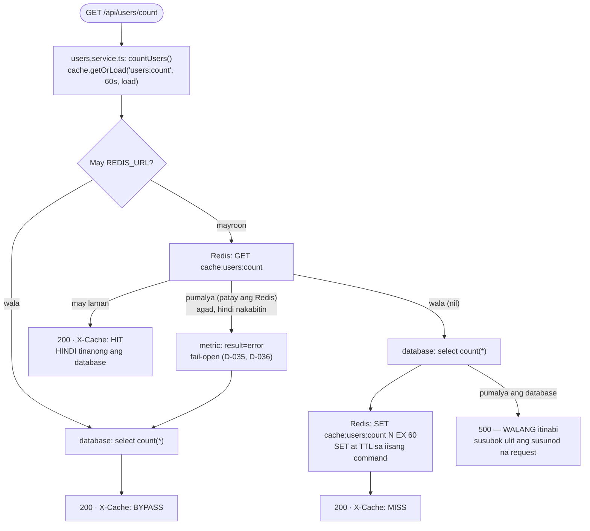
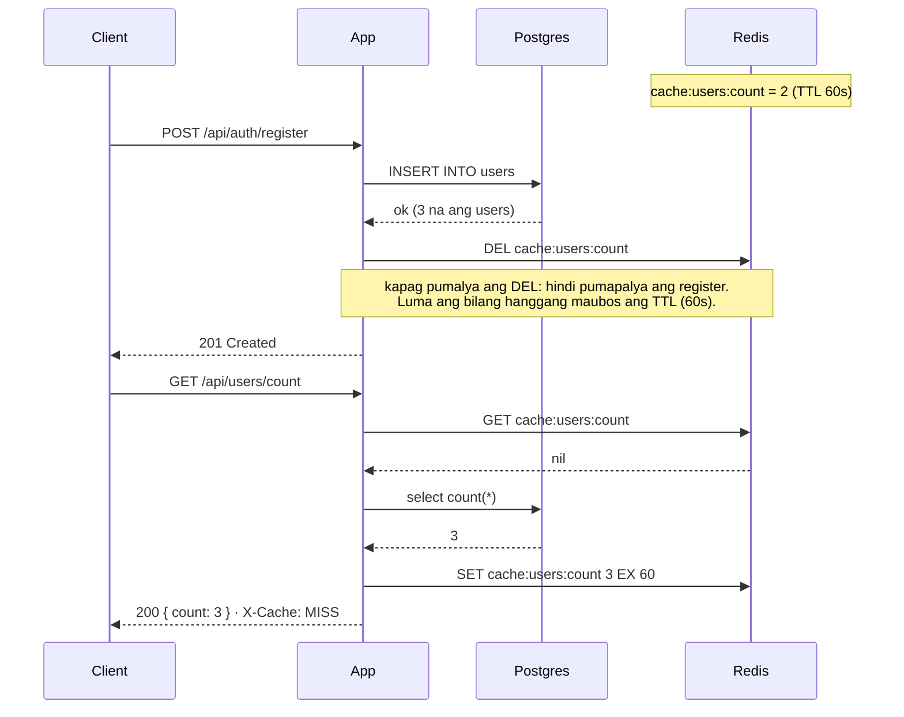
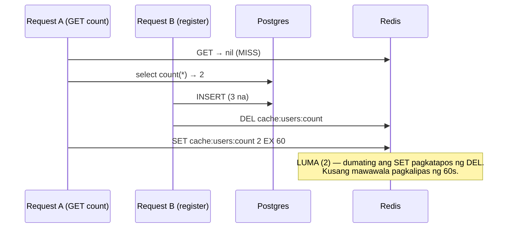

# 26 — Server cache (cache-aside): bilang ng users sa Redis

> 📅 Day 92b · Phase 18 (Production maturity) · **Desisyon:** D-036
> **Code:** `backend/src/lib/cache.ts` · `services/users.service.ts` · `services/auth/registration.service.ts` · `controllers/users.controller.ts`
> **Subukan:** `backend/http/37-cache.http` · test: `backend/src/lib/cache.test.ts` (totoong Redis)

## Pagbasa: `GET /api/users/count`

- **Cache-aside:** ang app ang nagpapasya. Redis muna; kapag wala, database, tapos itabi.
- **Laging may TTL (60s).** Ang susi na walang expiry ay mananatiling luma magpakailanman kapag may nakalimutang pagbura.
- **Sinukat (dev, 300 request bawat isa):** HIT 1.4ms · MISS 3.1ms (median). Ang pinakaunang MISS pagka-start ay ~500ms (binubuksan pa ang koneksyon sa database).

## Pagsulat: cache invalidation sa register

## Ang hindi inaayos ng pagbura (kaya may TTL)

Bihira ito (kailangang magsabay ang dalawang request sa loob ng ilang millisecond), at maliit ang pinsala: mali ng isa ang bilang nang hanggang 60 segundo.
Hindi ito sinubukang i-reproduce; **alam na limitasyon** ito ng cache-aside.

## 🔐 Ano ang puwede at HINDI puwedeng i-cache dito

| Data | Naka-cache? | Bakit |
|---|---|---|
| `GET /api/users/count` | ✅ `cache:users:count` | Pareho para sa lahat, bihirang magbago |
| `GET /api/auth/me`, sessions, audit logs | ❌ | Personal. Iisa ang susi para sa lahat → makikita ni B ang data ni A |
| Kung kailangan balang araw | susi na may user id: `cache:user:42:profile` | At burahin kapag nagbago ang data o nag-logout |

Tatlong magkakaibang cache sa project: **browser/CDN** (`Cache-Control`, Day 36b — `no-store` sa `/api/auth/*`), **server cache** (ito), at ang **bilang ng rate limiter** (`rl:*`, Day 92 — parehong Redis, ibang susi).
