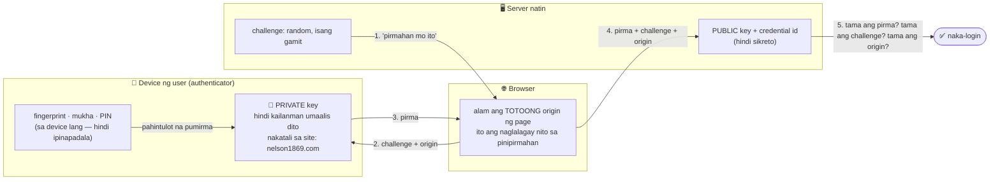
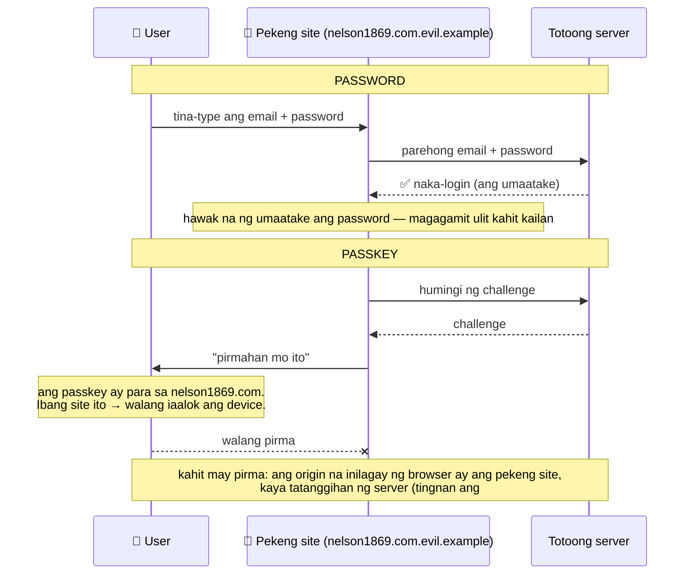

# 27 — Passkeys (WebAuthn): ang konsepto

> 📅 Day 94 · Phase 19 (Passkeys) · **Konsepto lang — wala pang endpoint**
> **Code (practice):** `backend/playground/02-passkey-concept.js` · **Subukan:** `cd backend && node playground/02-passkey-concept.js`
> Ang totoong mga flow (may library at database) ay darating sa Day 95–98, na may sariling diagram.

## Sino ang may hawak ng ano

## Password vs passkey sa isang pekeng site (phishing)

## Ang tatlong tanong ng server, at kung anong atake ang pinipigilan ng bawat isa

| Sinusuri ng server | Pinipigilan | Sa `02-passkey-concept.js` |
|---|---|---|
| Ang **challenge** ba ay ang ibinigay ko, at hindi pa nagagamit? | **Replay:** lumang sagot na ipinadala ulit | #2 → ❌ |
| Ang **origin** ba ay ang site ko? | **Phishing:** pirma mula sa pekeng site | #3 → ❌ |
| Tama ba ang **pirma** ayon sa public key na naka-save? | **Pagbabago** ng laman, at pirma ng **ibang key** | #4, #5 → ❌ |

Kumpara sa mga alam ko na: ang **RS256 JWT** (Day 56) ay parehong ideya — private key ang pumipirma, public key ang nagve-verify. Ang pagkakaiba: doon, ang **server** ang may private key; dito, ang **device ng user**.
