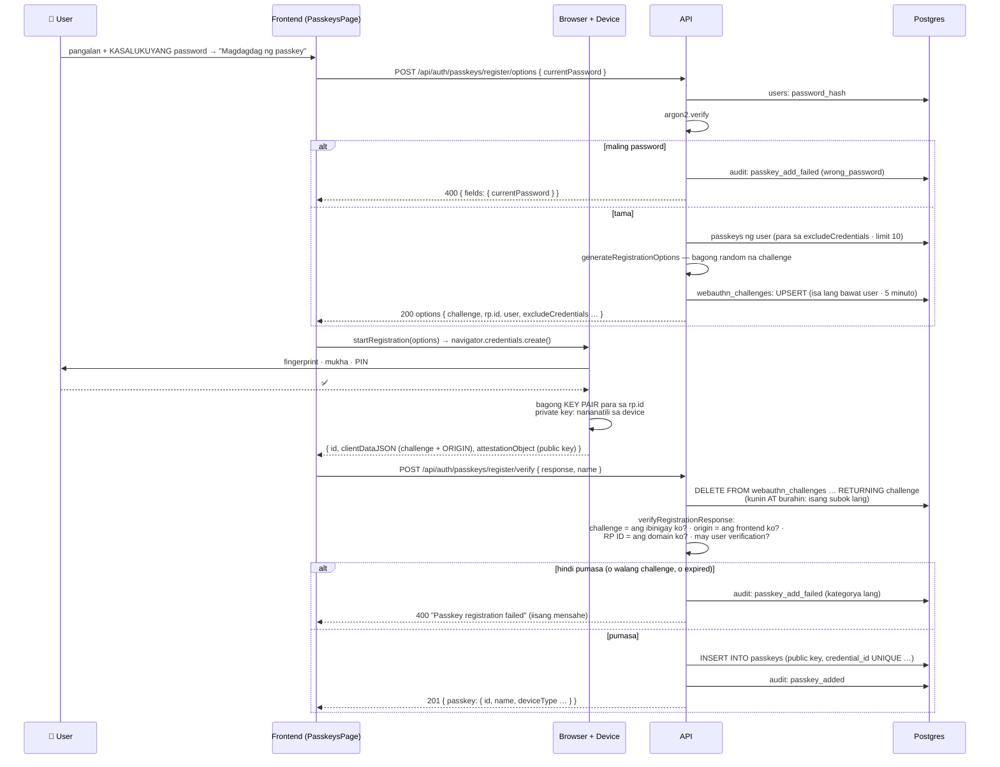
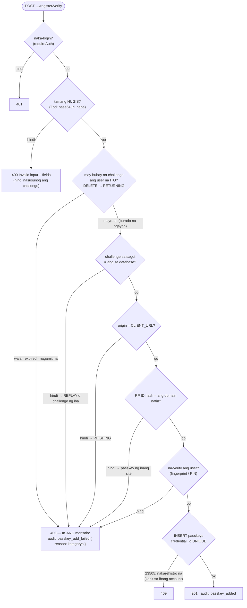

# 28 — Pagdagdag ng passkey (WebAuthn registration ceremony)

> 📅 Day 95–96 · Phase 19 (Passkeys) · **Desisyon:** D-037
> **Code:** `backend/src/services/auth/passkey.service.ts` · `lib/webauthn.ts` · `controllers/passkey.controller.ts` · `routes/auth.ts` · `db/schema.ts` (`passkeys`, `webauthn_challenges`)
> · frontend: `src/pages/PasskeysPage.tsx` · `src/api/auth.ts` (`addPasskey`)
> **Subukan:** `backend/http/38-passkeys.http` (options at mga pagtanggi) · ang buong flow: `http://localhost:5173/passkeys` · test: `backend/src/routes/passkeys.test.ts`
> **Ang ideya muna:** `27-webauthn-concept.md`

## Ang buong flow (naka-login na ang user)

## Ano ang sinusuri sa hakbang 2, at anong atake ang pinipigilan

## Mga desisyon sa likod ng flow (D-037)

| Tanong | Sagot | Bakit |
|---|---|---|
| Sapat na ba ang session para magdagdag? | **Hindi — kailangan ang kasalukuyang password** | Ang passkey ay bagong paraan ng pagpasok. Ang nakaw na session ay makakapagdagdag sana ng sarili niyang passkey, at mananatili kahit palitan ang password |
| Saan galing ang RP ID at origin? | **Hinango sa `CLIENT_URL`** | Walang hiwalay na env variable na maiiwang `localhost` sa production (nangyari sa reference) |
| Saan nakatago ang challenge? | **Database**, 5 minuto, isa bawat user | Opsyonal at fail-open ang Redis natin; ang challenge ay hindi puwedeng "mawala na lang" |
| Ilang subok bawat challenge? | **Isa** — burado na bago pa suriin | Walang paulit-ulit na panghuhula laban sa iisang challenge |
| Ano ang sinasabi sa client kapag pumalya? | **Iisang 400** | Ang dahilan ay nasa audit log (kategorya lang, hindi ang mensahe ng library — kasama roon ang challenge) |
| Ano ang naka-save? | **Public key**, credential id, counter, transports | Walang sikreto. Ang nakaw na database ay hindi makakapirma |

**Hindi pa kasama (Day 97–98):** ang login gamit ang passkey. Sa ngayon, nairerehistro pa lang.
