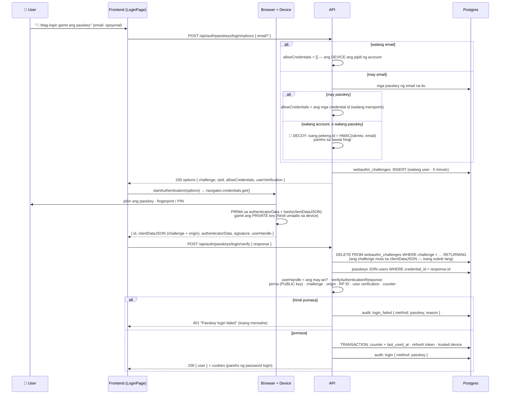
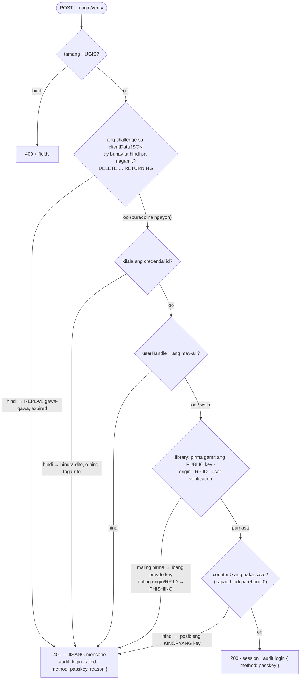

# 29 — Login gamit ang passkey (WebAuthn authentication ceremony) at ang decoy

> 📅 Day 97–98 · Phase 19 (Passkeys) · **Desisyon:** D-038
> **Code:** `backend/src/services/auth/passkey.service.ts` (`startPasskeyLogin`, `finishPasskeyLogin`) · `lib/webauthn.ts` (challenge, `decoyCredentialId`) · `controllers/passkey.controller.ts`
> · frontend: `src/pages/LoginPage.tsx` · `src/api/auth.ts` (`loginWithPasskey`)
> **Subukan:** `backend/http/39-passkey-login.http` · test: `backend/src/routes/passkey-login.test.ts` · **Bago ito:** `28-passkey-register.md`

## Ang buong flow

## Ang mga bantay sa hakbang 2

## 🔐 Ang decoy: ano ang ipinapakita sa labas

| Email sa options | `allowCredentials` | Ang makikita ng umaatake |
|---|---|---|
| (wala) | `[]` | — walang tinatanong tungkol sa kahit sino |
| May account **at** may passkey | ang mga totoong id | isang (o higit pang) id |
| May account pero **walang** passkey | 1 pekeng id (HMAC) | isang id — pareho ang hugis |
| **Walang** account | 1 pekeng id (HMAC) | isang id — pareho ang hugis, pareho sa pag-ulit |

**Ang hindi tinatakpan (D-038):** ang account na may **2+ passkey** ay may 2+ id, at ang decoy ay laging 1. Ang haba ng totoong id ay depende sa device (ang decoy ay laging 43 na titik).
Kaya ang pinakaligtas na paraan ay ang **walang email** — wala itong tinatanong tungkol sa kahit sino. Iyon ang default sa Login page.

## Bakit hindi hinaharang ng password lockout ang passkey
Ang lockout (Day 63) ay laban sa **panghuhula** ng password. Hindi nahuhulaan ang pirma ng private key. Kaya kapag naka-lock ang password dahil may nanghuhula, makakapasok pa rin ang totoong may-ari gamit ang passkey niya.
May sariling limit ang passkey login: 30 options at 10 palpak na verify bawat 15 minuto bawat IP.
