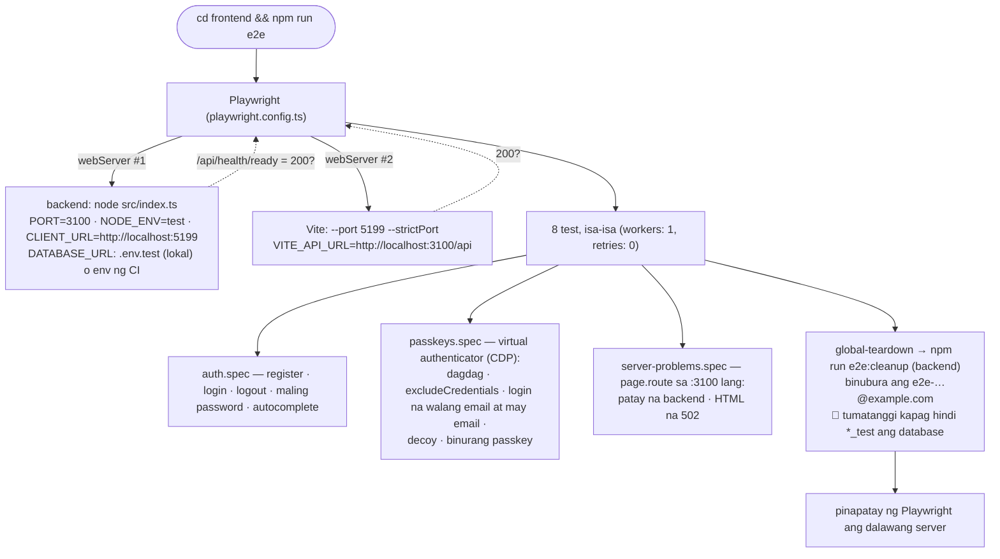

# 30 — E2E test (Playwright): ang buong system sa totoong browser

> 📅 Day 99 · Phase 19 (Passkeys) · **Desisyon:** D-039
> **Code:** `frontend/playwright.config.ts` · `frontend/e2e/*.spec.ts` · `frontend/e2e/helpers.ts` · `frontend/e2e/global-teardown.ts` · `backend/src/scripts/e2e-cleanup.ts` · `.github/workflows/ci.yml` (job `e2e`)
> **Subukan:** `cd frontend && npm run e2e` (kailangan: tumatakbo ang dev Postgres — `cd devops && docker compose up -d`)

## Ano ang pinapatakbo ng `npm run e2e`

## Bakit E2E, at hindi lang Vitest

| Kaya ng Vitest (backend) | Sa browser LANG (E2E) |
|---|---|
| ang API: status, body, database | ang nakikita ng user: mensahe, redirect, button |
| ang pirma ng passkey (software authenticator) | ang `navigator.credentials` mismo: ang browser ang naglalagay ng origin, nagtatago ng key, tumatanggi sa `excludeCredentials` |
| — | CORS, cookies sa pagitan ng dalawang port, CSRF (`Origin` mula sa browser) |
| — | ang frontend kapag patay ang backend |

**Ang kapalit:** mas mabagal (~15s para sa 8 test, kumpara sa 267 Vitest sa ~2 minuto — pero bawat E2E ay buong flow), at mas maraming puwedeng magkamali na hindi ang code (port, browser, timing).
Kaya kaunti at **mahalaga** lang ang mga E2E: ang mga flow na kapag nasira ay hindi makakapasok ang user.

## Sariling mga port
`3100` at `5199`, hindi `3000` at `5173`: hindi bumabangga sa dev server mo, o sa ibang project (nangyari noong Day 95). `reuseExistingServer: false`: laging bago, laging ang code ngayon.
